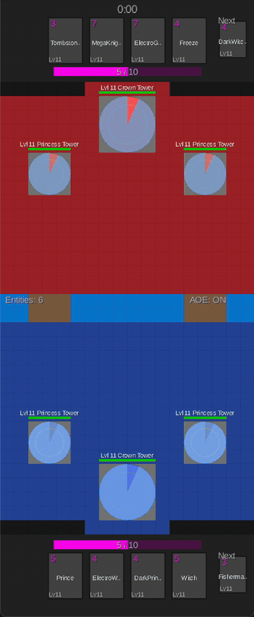

# crforge

[](LICENSE)
[](https://github.com/voonhous/crforge/actions/workflows/build-and-test.yml)
[](https://adoptium.net/)

A headless Clash Royale battle simulator built in Java, designed for reinforcement learning and AI
research. Deterministic tick-based engine with data-driven cards, a LibGDX debug visualizer,
and a Python Gymnasium integration via ZMQ bridge.

<p align="center">
  
</p>

## Features

- **Full combat**: melee, ranged, AOE, chain lightning, scatter projectiles, charge, dash, hook, reflect, shields, death spawn, burst attacks
- **Status effects**: stun, slow, rage, freeze with multiplier-based stacking
- **Level scaling**: rarity-based iterative growth matching the original game's formulas
- **Component-Entity-System**: entities hold data, systems hold logic
- **Community card data**: >100 troops, spells, and buildings loaded from JSON with automatic reference resolution

## Quick Start

**Requirements:** Java 17

```bash
# Build
export JAVA_HOME=$(/usr/libexec/java_home -v 17)
./gradlew build

# Run tests
./gradlew :core:test :data:test

# Run debug visualizer
./gradlew :desktop:run

# Run gym bridge server (default port 9876)
./gradlew :gym-bridge:run

# Run visualizer in AI mode (Python controls the game via ZMQ)
./gradlew :desktop:run --args="--ai-port 9876"
```

> **macOS:** The visualizer needs `-XstartOnFirstThread`. The Gradle task handles this; add it to VM options if running from an IDE.

### Python / RL Training

**Requirements:** Python 3.10+, Java bridge server running

```bash
pip install -e python/
python python/examples/run_episodes.py
```

```python
from crforge_gym import CRForgeEnv

env = CRForgeEnv()
obs, info = env.reset(seed=42)

while True:
    action = env.action_space.sample()
    obs, reward, terminated, truncated, info = env.step(action)
    if terminated or truncated:
        break

env.close()
```

## Modules

| Module       | Description                                                       |
|--------------|-------------------------------------------------------------------|
| `core`       | Headless simulation engine -- entities, systems, match logic      |
| `data`       | Card/unit/projectile config loading from JSON into typed objects  |
| `desktop`    | LibGDX debug visualizer for watching and interacting with matches |
| `gym-bridge` | ZMQ server + Python Gymnasium environment for RL training         |

`core` has no GUI dependencies. `data` depends on `core`. `desktop` and `gym-bridge` depend on
both.

## Docs

| Document                                                   | Description                                              |
|------------------------------------------------------------|----------------------------------------------------------|
| [Simulation & Entities](docs/simulation.md)                | Tick loop, entity lifecycle, entity types                |
| [Arena, Match & Economy](docs/arena-and-match.md)          | Arena layout, placement, win conditions, elixir, hand    |
| [Targeting, Combat & Abilities](docs/combat.md)            | Target locking, attack pipeline, 10 ability types        |
| [Card Data Schema](docs/schema.md)                         | JSON schema, loading pipeline, reference resolution      |
| [Python Gymnasium Bridge](python/README.md)                | ZMQ transport, observation/action spaces, rewards        |

See [docs/architecture.md](docs/architecture.md) for the full documentation index.

## Tools

| Tool                                                | Description                                                            |
|-----------------------------------------------------|------------------------------------------------------------------------|
| [Formation Visualizer](tools/formation_visualizer/) | Tkinter app for viewing and editing multi-unit spawn formation offsets |

## Code Style

This project uses [Google Java Format](https://github.com/google/google-java-format) enforced
via [Spotless](https://github.com/diffplug/spotless). Formatting is checked on build:

```bash
./gradlew spotlessApply
```

## Acknowledgements

This project was inspired by
[scholarlygaming's Clash Royale engine](https://www.reddit.com/r/ClashRoyale/comments/f21isa/effort_post_clash_royale_engine_development/),
the first somewhat complete open-source Clash Royale simulation engine.

## Disclaimer

This is an independent fan project created for educational and research purposes. It is **not**
affiliated with, endorsed by, or associated with Supercell. "Clash Royale", "Supercell", and related
names and imagery are trademarks of Supercell Oy. See [NOTICE](NOTICE) for full attribution.

## License

Licensed under the [Apache License 2.0](LICENSE).
