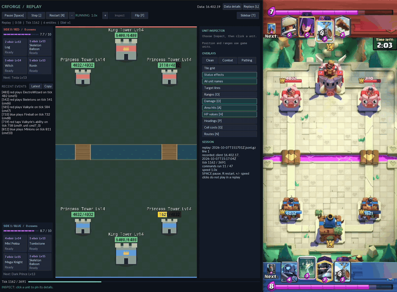

# crforge

[](LICENSE)
[](https://github.com/voonhous/crforge/actions/workflows/build-and-test.yml)
[](https://adoptium.net/)

A deterministic Clash Royale battle simulator in Java. Its battle core plays a battle in 50 ms steps on the game's own tables of one data version, and is held tick by tick to battles recorded in the game. A LibGDX debug visualizer plays battles by hand and replays recorded ones. A reinforcement learning environment will be rebuilt on the battle core.

<p align="center">
  
</p>

## Porting or reimplementing crforge

Porting crforge's logic to another language, by hand or by asking an AI assistant to rewrite it? Please put a comment at each ported function or module that names the crforge file and the commit you read, for example:

```rust
// Ported from crforge core/src/main/java/org/crforge/core/pathfinding/target/TargetingVisit.java @ <commit> (https://github.com/voonhous/crforge)
```

It is a request, not a license condition (crforge is Apache 2.0), and it is mostly for your benefit. crforge is held tick by tick to battles recorded in the game, and its rules get corrected whenever a recording shows them wrong. With the file and commit in your code, `git log <commit>..origin/battle_core -- <file>` lists every change to that logic since you read it (`battle_core` is the development branch), and the repository URL in the comment lets us find your port and tell you when we fix something it carries. To hear about fixes, watch the repository's releases (the release notes list behaviour corrections per mechanic), or open an issue to ask about one.

## Why a tick-accurate simulator

Clash Royale battles turn on small margins: a troop that retargets one step later, a projectile that lands one tick after a tower dies, a spell that catches a unit at the edge of its radius. A simulator that only approximates the game (hand-tuned stats, floating point time, mechanics guessed from videos) drifts from the real battle within seconds, and the drift compounds. An agent trained on such a simulator learns the simulator's quirks rather than the game, and results from different simulators cannot be compared.

The game itself is no substitute: it cannot be run headless, stepped, forked or replayed at the scale machine learning needs. A simulator that gives the same battle as the game, step for step, from the same inputs, can stand in for it: train and evaluate agents offline, label recorded replays, and run experiments anyone can reproduce.

The full match of the animation above: the replay viewer plays the simulated battle (left) beside the game's own replay of the same battle (right).

https://github.com/user-attachments/assets/83b3e12e-3aa6-45c2-ab4b-3997bd8bfcd6

## Goal

crforge aims to be that simulator for AI and ML research on Clash Royale: an open, deterministic and accurate 1v1 battle engine, with evolutions, heroes and champions in scope. Accuracy is measured, not assumed: every recorded reference battle is either matched tick for tick, or its first divergence or refusal is recorded. On top of the battle core, the plan is a reinforcement learning environment and tooling to learn from recorded replays.

## Features

- **The game's own data**: units, projectiles, buffs, area effects, actions and expressions are read from the game's tables, in their own units and under their own column names; a column or class the battle core does not model is refused, never guessed
- **Integer time**: every duration is whole milliseconds, stepped by exactly 50 per tick
- **Held to recorded battles**: the `conformance` module plays each recorded battle's scenario and compares every tick with the game's own trace, with no tolerance
- **Fidelity ledger**: every battle core class says which of its parts are settled and which are not (`./gradlew :core:fidelityReport`)
- **Replays**: the visualizer plays a replay file, or a crawl of them, on the data version it was recorded on

## Quick Start

**Requirements:** Java 17

```bash
# Build
export JAVA_HOME=$(/usr/libexec/java_home -v 17)
./gradlew build

# Run tests
./gradlew test

# Run debug visualizer
./gradlew :desktop:run
```

> **macOS:** The visualizer needs `-XstartOnFirstThread`. The Gradle task handles this; add it to VM options if running from an IDE.

The debug visualizer and the tests run the battle core, which needs the game tables. This repository does not ship them; the build makes them on your machine from the game's own files once you say where those come from, with the Gradle property `crforge.assetSource` (in `~/.gradle/gradle.properties`, or `-Pcrforge.assetSource=...`): `cdn` fetches them from the game's asset CDN (an opt-in, never a default), and a `file:` URI names a local copy ([Building the game tables](docs/game-tables.md#building-the-game-tables)). That is the only way the tables are found. It prints the tables folder, data version and content sha at startup, and its key map; see [Debug Visualizer](docs/architecture.md#debug-visualizer) for the full list, including the routing overlays (`G`, `N`).

## Modules

| Module        | Description                                                                                 |
|---------------|---------------------------------------------------------------------------------------------|
| `core`        | The battle core: a headless battle simulator on the game's tables                           |
| `desktop`     | LibGDX debug visualizer for watching and interacting with matches                           |
| `conformance` | Checks the battle core against recorded reference battles ([README](conformance/README.md)) |
| `tables`      | The table decoder: builds the game tables of a data version from the game's files           |

`core` has no GUI dependencies. `desktop` and `conformance` depend on `core` only, and `tables` on nothing in the project. The recorded battles live in a separate game data repository, at the commit `crforge-data.lock` names.

## Docs

| Document                                                     | Description                                                          |
|--------------------------------------------------------------|----------------------------------------------------------------------|
| [Architecture](docs/architecture.md)                         | Modules, packages, the 50 ms step and the debug visualizer           |
| [The Battle Core](docs/battle-core.md)                       | The step, the entity tick, what is covered and what is assumed       |
| [Troop Pathfinding](docs/pathfinding.md)                     | Routing grid, cell costs, routes and movement rules                  |
| [Game Tables and Reference Battles](docs/game-tables.md)     | The tables the battle core reads and the battles it is held to       |

See [docs/architecture.md](docs/architecture.md) for the full documentation index.

## Code Style

This project uses [Google Java Format](https://github.com/google/google-java-format) enforced
via [Spotless](https://github.com/diffplug/spotless). Formatting is checked on build:

```bash
./gradlew spotlessApply
```

## Acknowledgements

This project was inspired by
[scholarlygaming's Clash Royale engine](https://www.reddit.com/r/ClashRoyale/comments/f21isa/effort_post_clash_royale_engine_development/),
the first somewhat complete open-source Clash Royale simulation engine.

## Disclaimer

This is an independent fan project created for educational and research purposes. It is **not**
affiliated with, endorsed by, or associated with Supercell. "Clash Royale", "Supercell", and related
names and imagery are trademarks of Supercell Oy. See [NOTICE](NOTICE) for full attribution.

## License

Licensed under the [Apache License 2.0](LICENSE).
