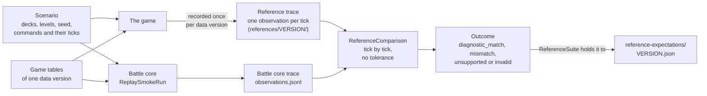

# conformance

Checks the battle core against recorded reference battles. Each reference battle is a scenario (a replay's decks, seed and commands) together with the game's own trace of it: one observation per tick of the RNG state, every live entity's id, side and position, each character's state and hit points, and each side's elixir and hand. This module plays the same scenario on the battle core, writes the same observations, and compares the two traces tick by tick with no tolerance.

Nothing here simulates the game itself or produces a reference. The references are fixed data in the game data repository, at the commit `crforge-data.lock` pins, under `references/<version>/`.

## How a case is checked



The scenario is the input and the trace is the output. Both sides play the same scenario on the same data version's tables: the reference trace is what the game did, the battle core trace is what crforge does. The first tick on which they differ names the field that differs, for example (illustrative values):

```text
tick  path                 reference  battle core
 765  $.entities[12].x       3717       3717       equal
 766  $.entities[12].x       3715       3715       equal
 767  $.entities[12].x       3713       3715       first divergence: mismatch at 767, $.entities[12].x
```

A trace belongs to the tables it was made with. When a new data version changes a column, a unit's damage for example, the game's trace of the same scenario changes too, so each data version has its own references and its own expectations file. The scenarios are reused, and the references are recorded again for the new version.

## What belongs here

- `ReplaySmokeRun`: runs one scenario on the battle core and writes `observations.jsonl`, `manifest.json` and, for a completed run, `COMPLETE`. Also the module's command line (`build/install/conformance/bin/conformance` after `installDist`).
- `SmokeObserver`, `SmokeSchema`: what one observation holds and the schemas a run can be made in.
- `ReferenceComparison`: the first-divergence comparison of a run's trace with a reference trace.
- `ReferenceSuite`: runs every case of a references folder and holds each outcome to `reference-expectations/<version>.json`.

## What does not belong here

- **Reading replays.** The replay mapping and building a replay's battle are battle core features (`org.crforge.core.battle.replay`), used by this module and by the desktop replay viewer alike.
- **Mechanic tests.** A test that builds a battle and asserts one behaviour belongs in `core/src/test`, beside the tests of the code it exercises. The shared test helper `Scenarios` is in `core/src/testFixtures`.
- **Anything the battle core depends on.** Dependencies run one way: this module depends on `core`, never the reverse.
- **Tolerances or special cases.** A comparison that forgives a difference hides it. Fix the battle core, or record the case's real outcome in the expectations file.

## Outcomes and expectations

Each case ends in one of four outcomes:

- `diagnostic_match`: every observation is equal.
- `mismatch`: the first observation and field that differ, with both values.
- `unsupported`: the battle core refused an input it has no mapping for.
- `invalid`: the run faulted, or a trace or a reference failed its checks.

The expectations file records the outcome every case has today, mismatches included. The test fails when any case's outcome changes, a case that newly matches included, so every gain and every regression shows up as a reviewed diff of that file. `diagnostic_match` is agreement with a recorded battle on the observation schema, not a release pass.

## Running

```bash
# Every reference battle of one data version (skipped without a references folder)
./gradlew :conformance:referenceTest \
  -Pcrforge.gameTables=<data checkout>/<version> \
  -Pcrforge.references=<data checkout>/references/<version>

# Rewrite the expectations from a full run, then review the diff with the change that moved them
./gradlew :conformance:updateReferenceExpectations \
  -Pcrforge.gameTables=<data checkout>/<version> \
  -Pcrforge.references=<data checkout>/references/<version>
```

`./gradlew test` runs this module's own unit tests but never the reference battles. The tables and the references must be of the same data version. CI runs the reference battles of the version the lock names (`version`), split into shards.

## Moving to a new data version

crforge works on one data version at a time, the lock's `version`.

1. Add the new version's tables and references to the game data repository and move `crforge-data.lock` to that commit and version. The unit tests read the lock's tables, so re-pin the values the new rows move, and let the battle core play the new version (`GameVersions`).
2. If the new version's replays differ, list them in `CommandTypes` and `ReplayFormat` (in `core`); until then its replays are refused as unsupported, never read by another version's rules.
3. Run `updateReferenceExpectations` to write `reference-expectations/<new version>.json`, review it with the change, and remove the old version's file.

See the reference battles paragraph of [docs/schema.md](../docs/schema.md) for the folder layout and the settings.
