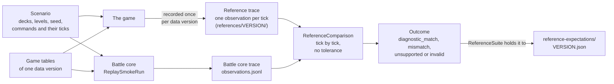

# conformance

Checks the battle core against recorded reference battles. Each reference battle is a scenario (a replay's decks, seed and commands) together with the game's own trace of it: one observation per tick of the RNG state, every live entity's id, side and position, each character's state and hit points, and each side's elixir and hand. This module plays the same scenario on the battle core, writes the same observations, and compares the two traces tick by tick with no tolerance.

Nothing here simulates the game itself or produces a reference. The references are fixed data in the game data repository, at the commit `crforge-data.lock` pins, under `references/<version>/`.

## How a case is checked


```mermaid
flowchart LR
  S["Scenario<br/>decks, levels, seed,<br/>commands and their ticks"]
  T["Game tables<br/>of one data version"]
  G["The game"]
  R["Reference trace<br/>one observation per tick<br/>(references/VERSION/)"]
  B["Battle core<br/>ReplaySmokeRun"]
  J["Battle core trace<br/>observations.jsonl"]
  C["ReferenceComparison<br/>tick by tick,<br/>no tolerance"]
  O["Outcome<br/>diagnostic_match, mismatch,<br/>unsupported or invalid"]
  E["reference-expectations/<br/>VERSION.json"]
  S --> G
  T --> G
  S --> B
  T --> B
  G -- "recorded once<br/>per data version" --> R
  B --> J
  R --> C
  J --> C
  C --> O
  O -- "ReferenceSuite holds it to" --> E
```

The scenario is the input and the trace is the output. Both sides play the same scenario on the same data version's tables: the reference trace is what the game did, the battle core trace is what crforge does. The first tick on which they differ names the field that differs, for example (illustrative values):

```text
tick  path                 reference  battle core
 765  $.entities[12].x       3717       3717       equal
 766  $.entities[12].x       3715       3715       equal
 767  $.entities[12].x       3713       3715       first divergence: mismatch at 767, $.entities[12].x
```

A trace belongs to the tables it was made with. When a new data version changes a column, a unit's damage for example, the game's trace of the same scenario changes too, so each data version has its own references and its own expectations file. The scenarios are reused, and the references are recorded again for the new version.

## What belongs here

- `ReplaySmokeRun`: runs one scenario on the battle core and writes `observations.jsonl`, `manifest.json` and, for a completed run, `COMPLETE`. Also the module's command line (`build/install/conformance/bin/conformance` after `installDist`).
- `SmokeObserver`, `SmokeSchema`: what one observation holds and the schemas a run can be made in.
- `ReferenceComparison`: the first-divergence comparison of a run's trace with a reference trace.
- `ReferenceSuite`: runs every case of a references folder and holds each outcome to `reference-expectations/<version>.json`.
- `CoverageScore`: plays a coverage set (below) and sums up how much of it the battle core reproduces.

## What does not belong here

- **Reading replays.** The replay mapping and building a replay's battle are battle core features (`org.crforge.core.battle.replay`), used by this module and by the desktop replay viewer alike.
- **Mechanic tests.** A test that builds a battle and asserts one behaviour belongs in `core/src/test`, beside the tests of the code it exercises. The shared test helpers `Scenarios`, `GameData` and `Shipped` are in `core/src/testFixtures`. No unit test hard-codes game data: a mechanic test writes its own rows, a test of a shipped row reads the raw column and does its own arithmetic, and a census asserts an invariant; the rule and its helpers are under [Tests and game data](../docs/battle-core.md#tests-and-game-data).
- **Recordings of the game.** References and any other recording live in the game data repository, never in crforge.
- **Anything the battle core depends on.** Dependencies run one way: this module depends on `core`, never the reverse.
- **Tolerances or special cases.** A comparison that forgives a difference hides it. Fix the battle core, or record the case's real outcome in the expectations file.

## Outcomes and expectations

Each case ends in one of four outcomes:

- `diagnostic_match`: every observation is equal.
- `mismatch`: the first observation and field that differ, with both values.
- `unsupported`: the battle core refused an input it has no mapping for.
- `invalid`: the run faulted, or a trace or a reference failed its checks.

The expectations file records the outcome every case has today, mismatches included. The test fails when any case's outcome changes, a case that newly matches included, so every gain and every regression shows up as a reviewed diff of that file. `diagnostic_match` is agreement with a recorded battle on the observation schema, not a release pass.

## Running

```bash
# Every reference battle of one data version (skipped without a references folder)
./gradlew :conformance:referenceTest \
  -Pcrforge.dataVersion=<version> \
  -Pcrforge.references=<data checkout>/references/<version>

# Rewrite the expectations from a full run, then review the diff with the change that moved them
./gradlew :conformance:updateReferenceExpectations \
  -Pcrforge.dataVersion=<version> \
  -Pcrforge.references=<data checkout>/references/<version>
```

The tables are the ones the build makes from the asset source (the Gradle property `crforge.assetSource`, for example `file://<data checkout>/cdn/`; see [Building the game tables](../docs/game-tables.md#building-the-game-tables)), for the data version `-Pcrforge.dataVersion` names.

`./gradlew test` runs this module's own unit tests but never the reference battles. The tables and the references must be of the same data version. CI runs the reference battles of every data version the lock lists in `compatible` that has them, each version split into shards and held to its own expectations file.

## Coverage

The reference battles are chosen cases, each held to its expected outcome. Coverage asks a wider question: of the game's real battles of a data version, how many does the battle core reproduce? A coverage set is a large sample of them, up to 10,000 battles of one data version, each with the game's own trace, in the layout of a references folder (a corpus listing under `corpora/` and its `battles/`). The sets are not in this repository or the game data repository: they live in the coverage dataset, and `coverage.lock` pins its revision and lists the data versions that have a set.

`CoverageScore` runs every battle of a set as `ReferenceSuite` runs a case and writes only totals, never a battle:

- `to_the_end`: the share of battles the battle core matches on every observation;
- `ticks_agreed`: the share of all the battles' ticks it matches before each battle's first divergence (all of a match, the ticks before the first divergent observation of a mismatch, none of an unsupported or invalid battle);
- `outcomes`: the battles in each outcome;
- `first_failures`: the most frequent first failures, a refusal by its kind (the battle's own object ids and command numbers left out) and a mismatch by the field that differed first, list indices left out (`$.entities[].hp`).

```bash
# The score of one data version's coverage set, unpacked into <set folder> (corpora/ and battles/)
./gradlew :conformance:coverageScore \
  -Pcrforge.dataVersion=<version> \
  -Pcrforge.coverage=<set folder>
# -> conformance/build/coverage/score-<version>.json and badge-<version>.json

# The same, part by part: each part file's battles give a tally, and the tallies sum up to the score
./gradlew :conformance:coverageScore ... -Pcrforge.coverage.part=<K>   # -> tally-<version>-<K>.json
./gradlew :conformance:coverageMerge -Pcrforge.coverage.tallies=<folder of the tallies>
```

A set is packed in part files of up to 1,000 battles. A tally holds the counts behind a score (battles, matches, agreed and recorded ticks, outcomes and every first failure), so the tallies of all parts sum to exactly the score one run over the whole set gives.

Coverage is a measurement, never a gate. CI scores every version `coverage.lock` lists on each run: one job per part file, each downloading only its part, then one job per version that sums the tallies (and gives no score when a part is missing), none of which can fail the run. After a push to `battle_core` it publishes each score and its shields.io badge (the badges at the top of the README) to the `badges` branch, and warns when a version's share of battles reproduced to the end dropped since the last published score. A first failure worth porting becomes a reference case, recorded and held to its outcome like any other.

## Moving to a new data version

crforge works on one data version at a time, the lock's `version`, and tests every data version of the client range it follows, the lock's `compatible`.

1. Add the new version's tables to the game data repository, record the new version's references there (the scenarios are reused), and move `crforge-data.lock` to that commit and version, adding the version to `compatible`; let the battle core play the new version (`GameVersions`). The unit tests read the lock's tables and hard-code no game data, so they need no edit unless the new version changes a behaviour the battle core must port, which is a change of its own.
2. If the new version's replays differ, list them in `CommandTypes` and `ReplayFormat` (in `core`); until then its replays are refused as unsupported, never read by another version's rules.
3. Run `updateReferenceExpectations` to write `reference-expectations/<new version>.json` and review it with the change. The older versions of the same client range stay in `compatible` with their files; when a required client update starts a new range, the old range's versions leave `compatible` and their files are removed.

See [Game tables and reference battles](../docs/game-tables.md) for the folder layout and the settings.
