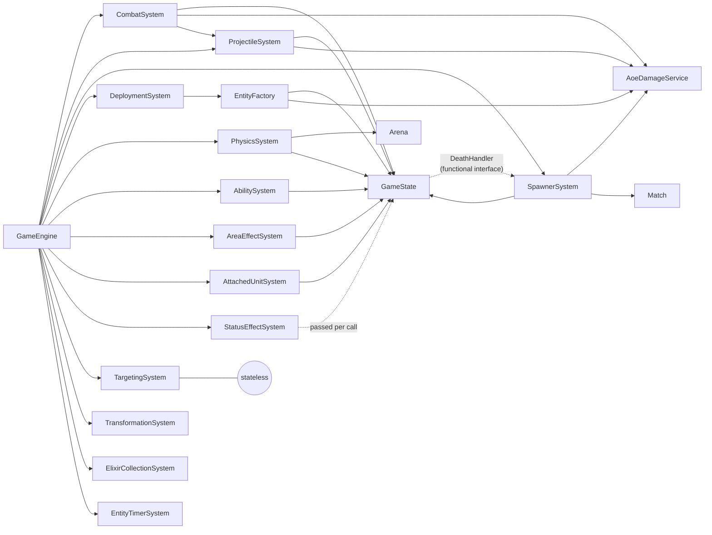

# crforge -- Architecture Overview

crforge is a deterministic tick-based Clash Royale simulator using Component-Entity-System (CES)
architecture. Entities hold data, systems hold logic, and the engine ticks at 30 FPS for
reproducible RL/AI training.

This page is an index into the detailed reference docs. Each sub-doc covers a focused area of the
codebase.

---

## System Dependencies

No circular dependencies between systems. Cross-system callbacks use functional interfaces wired at
construction time.



---

## Documentation Map

| Document | Description |
|----------|-------------|
| [Simulation Engine & Entities](simulation.md) | Tick loop, system execution order, entity lifecycle flowchart, entity types (Troop, Building, Tower, Projectile, AreaEffect) |
| [Arena, Match & Economy](arena-and-match.md) | Arena layout, tile types, placement validation, match timing, win conditions, elixir regen, deck/hand |
| [Targeting, Combat & Abilities](combat.md) | Two-phase target locking, attack pipeline, melee/ranged, damage calc, 10 ability types (charge, dash, hook, reflect, etc.) |
| [Physics & Status Effects](physics-and-effects.md) | Movement pipeline, lane pathfinding, river jump, knockback, collisions, multiplier-based buff stacking |
| [Deployment, Spawning & Transformation](spawning.md) | Deployment pipeline, live/death spawning, bomb entities, HP-threshold transformation |
| [Card Data Schema](schema.md) | JSON schema for cards/units/projectiles/buffs, loading pipeline, reference resolution |
| [Level Scaling](level_scaling.md) | Rarity multiplier tables, tower stat scaling formulas |
| [Secret Stats](secret_stats.md) | Undocumented unit stats measured from in-game observation |
| [Card Tracker](card_tracker.md) | Implementation status for all 121 cards |
| [Measuring Missing Fields](reverse_engineering.md) | Guide for measuring unit stats from in-game observation |
| [Python Gymnasium Bridge](../python/README.md) | ZMQ transport, observation/action spaces, reward structure, opponent policies |

---

## Module Structure

```
crforge/
  core/           Headless simulation (no GUI dependencies)
  data/           Card/unit config loading (JSON -> Card objects)
  desktop/        LibGDX visualization (ShapeRenderer debug view)
  gym-bridge/     ZMQ server for Python Gymnasium integration
  python/         Gymnasium environment and bridge client
```

### Core Package Layout

```
org.crforge.core/
  ability/     AbilitySystem, AbilityComponent, AbilityType, 10 AbilityData records, 10 handlers
  arena/       Arena, Tile, TileType
  card/        Card, CardType, TroopStats, ProjectileStats, LevelScaling, Rarity, ...
  combat/      TargetingSystem, CombatSystem, AoeDamageService, ProjectileSystem, ProjectileFactory, ...
  component/   Health, Position, Combat, Movement, SpawnerComponent, ModifierSource, ...
  effect/      StatusEffectType, StatusEffectSystem, AppliedEffect, BuffDefinition, BuffRegistry
  engine/      GameEngine, GameState, DeploymentSystem, EntityTimerSystem, ElixirCollectionSystem, TransformationSystem
  entity/
    base/        Entity, AbstractEntity, EntityType, MovementType, TargetType
    unit/        Troop
    structure/   Building, Tower
    projectile/  Projectile
    effect/      AreaEffect, AreaEffectSystem
    SpawnerSystem, SpawnFactory, DeathHandler, AttachedUnitSystem
  match/       Match, Standard1v1Match, GameMode
  physics/     PhysicsSystem, BasePathfinder, Pathfinder
  player/      Player, Team, Deck, Hand, Elixir, LevelConfig
  util/        Vector2, FormationLayout
```

---

## Known Gaps

- **Champions** (Archer Queen, Golden Knight, Skeleton King, Monk, Little Prince, Mighty Miner,
  Goblinstein, Boss Bandit) -- Basic stats loaded but require champion ability cycling system
  (tap-to-activate abilities with cooldowns). `[PARTIAL]`

### Game Modes Not Implemented

- 2v2 (`MATCH_2V2`)
- Double Elixir (`DOUBLE_ELIXIR`)
- Triple Elixir (`TRIPLE_ELIXIR`)
- Sudden Death (`SUDDEN_DEATH`)
