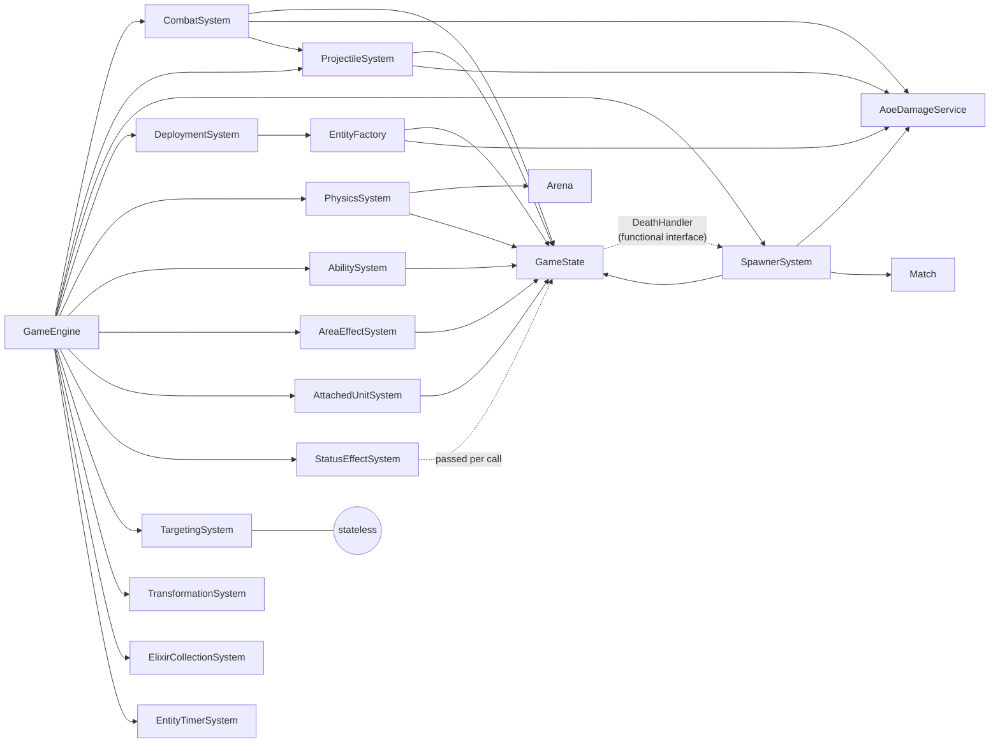

# crforge -- Architecture Overview

crforge is a deterministic tick-based Clash Royale simulator using Component-Entity-System (CES)
architecture. Entities hold data, systems hold logic, and the engine ticks at 30 FPS for
reproducible RL/AI training.

This page is an index into the detailed reference docs. Each sub-doc covers a focused area of the
codebase.

---

## System Dependencies

No circular dependencies between systems. Cross-system callbacks use functional interfaces wired at
construction time.


```mermaid
graph LR
    GE[GameEngine] --> CS[CombatSystem]
    GE --> PS[ProjectileSystem]
    GE --> SS[SpawnerSystem]
    GE --> DS[DeploymentSystem]
    GE --> PH[PhysicsSystem]
    GE --> AB[AbilitySystem]
    GE --> AE[AreaEffectSystem]
    GE --> AU[AttachedUnitSystem]
    GE --> SE[StatusEffectSystem]
    GE --> TS[TargetingSystem]
    GE --> TR[TransformationSystem]
    GE --> EC[ElixirCollectionSystem]
    GE --> ET[EntityTimerSystem]

    CS --> GS[GameState]
    CS --> AOE[AoeDamageService]
    CS --> PS

    PS --> GS
    PS --> AOE

    SS --> GS
    SS --> AOE
    SS --> MA[Match]

    DS --> EF[EntityFactory]
    EF --> GS
    EF --> AOE

    PH --> AR[Arena]
    PH --> GS

    AB --> GS
    AE --> GS
    AU --> GS
    SE -.-> |"passed per call"| GS

    GS -.-> |"DeathHandler\n(functional interface)"| SS

    TS --- ST((stateless))
```

---

## Documentation Map

| Document | Description |
|----------|-------------|
| [Simulation Engine & Entities](simulation.md) | Tick loop, system execution order, entity lifecycle flowchart, entity types (Troop, Building, Tower, Projectile, AreaEffect) |
| [Arena, Match & Economy](arena-and-match.md) | Arena layout, tile types, placement validation, match timing, win conditions, elixir regen, deck/hand |
| [Targeting, Combat & Abilities](combat.md) | Two-phase target locking, attack pipeline, melee/ranged, damage calc, 10 ability types (charge, dash, hook, reflect, etc.) |
| [Physics & Status Effects](physics-and-effects.md) | Movement pipeline, lane pathfinding, river jump, knockback, collisions, multiplier-based buff stacking |
| [Troop Pathfinding](pathfinding.md) | The waypoint and grid movement modes, the grid tick order, cell costs and routes, assumptions and what is still unvalidated |
| [Deployment, Spawning & Transformation](spawning.md) | Deployment pipeline, live/death spawning, bomb entities, HP-threshold transformation |
| [Card Data Schema](schema.md) | JSON schema for cards/units/projectiles/buffs, loading pipeline, reference resolution |
| [Level Scaling](level_scaling.md) | Rarity multiplier tables, tower stat scaling formulas |
| [Secret Stats](secret_stats.md) | Undocumented unit stats measured from in-game observation |
| [Card Tracker](card_tracker.md) | Implementation status for all 121 cards |
| [Measuring Missing Fields](reverse_engineering.md) | Guide for measuring unit stats from in-game observation |
| [Python Gymnasium Bridge](../python/README.md) | ZMQ transport, observation/action spaces, reward structure, opponent policies |

---

## Module Structure

```
crforge/
  core/           Headless simulation (no GUI dependencies)
  data/           Card/unit config loading (JSON -> Card objects)
  desktop/        LibGDX visualization (ShapeRenderer debug view)
  gym-bridge/     ZMQ server for Python Gymnasium integration
  python/         Gymnasium environment and bridge client
```

### Core Package Layout

```
org.crforge.core/
  ability/     AbilitySystem, AbilityComponent, AbilityType, 10 AbilityData records, 10 handlers
  arena/       Arena, Tile, TileType
  card/        Card, CardType, TroopStats, ProjectileStats, LevelScaling, Rarity, ...
  combat/      TargetingSystem, CombatSystem, AoeDamageService, ProjectileSystem, ProjectileFactory, ...
  component/   Health, Position, Combat, Movement, SpawnerComponent, ModifierSource, ...
  effect/      StatusEffectType, StatusEffectSystem, AppliedEffect, BuffDefinition, BuffRegistry
  engine/      GameEngine, GameState, DeploymentSystem, EntityTimerSystem, ElixirCollectionSystem, TransformationSystem
  entity/
    base/        Entity, AbstractEntity, EntityType, MovementType, TargetType
    unit/        Troop
    structure/   Building, Tower
    projectile/  Projectile
    effect/      AreaEffect, AreaEffectSystem
    SpawnerSystem, SpawnFactory, DeathHandler, AttachedUnitSystem
  match/       Match, Standard1v1Match, GameMode
  physics/     PhysicsSystem, BasePathfinder, Pathfinder
  player/      Player, Team, Deck, Hand, Elixir, LevelConfig
  util/        Vector2, FormationLayout
```

---

## Debug Visualizer

`./gradlew :desktop:run` opens the debug screen: a standard 1v1 match at level 11 that can be
paused, stepped through at 0.25x to 8x speed, and played by hand from either side's hand.

### Controls

| Key           | Action                                                                        |
|---------------|-------------------------------------------------------------------------------|
| `SPACE`       | Pause / resume                                                                |
| `R`           | Reset the match                                                               |
| `P`           | Toggle heading indicators                                                     |
| `O`           | Toggle attack range circles                                                   |
| `D`           | Toggle floating damage numbers                                                |
| `A`           | Toggle AOE damage indicators                                                  |
| `H`           | Toggle HP numbers                                                             |
| `M`           | Flip the pathfinding mode; applied on the next reset                          |
| `G`           | Toggle the routing cell cost overlay                                          |
| `N`           | Toggle the route, reference and state overlay                                 |
| `S`           | Run the next golden scenario (resets the match under the grid rules)          |
| `E`           | Export the recorded trajectories to `build/trajectories`                      |
| `+` / `-`     | Speed up / slow down (0.25x to 8x)                                            |
| `1`-`4`       | Select a card from the blue player's hand                                     |
| `5`-`8`       | Select a card from the red player's hand                                      |
| Left click    | Select a card from a hand panel, or deploy the selected card on the arena     |
| Right click   | Deselect the current card                                                     |

The number keys only *select* a card; deploying always goes through a left click on the arena.

### Grid pathfinding overlays

`M` chooses which movement and target-acquisition rules the next match runs its ground troops under.
The change only takes effect on a reset, because the rules are fixed when the match is created; the
status column shows the active mode and, while they differ, the pending one.

`G` paints one square per 500-unit routing cell, coloured by what the route search would charge to
enter it. The cost depends on the unit asking, so the overlay prices every cell for one fixed unit -
a plain ground unit of the blue side, in the moving state, on lane 1, with no water permission - and
the class of the cell under the mouse is printed with its cost in the status column. Roads, plain
ground, water, blocked cells and cells under a building footprint each get their own colour. Under
the waypoint rules there is no routing grid, so the overlay builds one from the arena's static cell
map with the standing towers stamped into it.

`N` draws, for every troop the routing grid drives, the polyline through the cells still left on its
route, a ring on the position it is holding as its reference, and a label with its state, how many
route cells are left and how far it may move this tick.

`S` cycles through three reference deployments of a Knight (left, right and centre), each time
resetting the match under the grid rules and deploying the unit at the reference position. The
reference trajectory is drawn as a ghost polyline with a ring on the position the reference gives
for the current tick, and the status column reports either `deviation: none` or the first tick at
which the live unit was somewhere else, with how far away it was. The bundled trajectories are the
output of a model of the game's rules, not captures of the shipped game; see
`desktop/src/main/resources/trajectories/README.md`.

`E` writes one file per recorded ground troop to `build/trajectories`, sampled once per tick from
the tick the troop appeared in:

```json
{"card": "Knight", "deploy": [3500, 10000], "side": 0,
 "samples": [{"tick": 0, "x": 3500, "y": 10000}]}
```

Positions are game units, side 0 is blue and side 1 is red, and a troop's ticks start at 0 on the
tick it first appeared in. Recording runs from every reset and is cleared by one.

---

## Known Gaps

- **Champions** (Archer Queen, Golden Knight, Skeleton King, Monk, Little Prince, Mighty Miner,
  Goblinstein, Boss Bandit) -- Basic stats loaded but require champion ability cycling system
  (tap-to-activate abilities with cooldowns). `[PARTIAL]`

### Game Modes Not Implemented

- 2v2 (`MATCH_2V2`)
- Double Elixir (`DOUBLE_ELIXIR`)
- Triple Elixir (`TRIPLE_ELIXIR`)
- Sudden Death (`SUDDEN_DEATH`)
