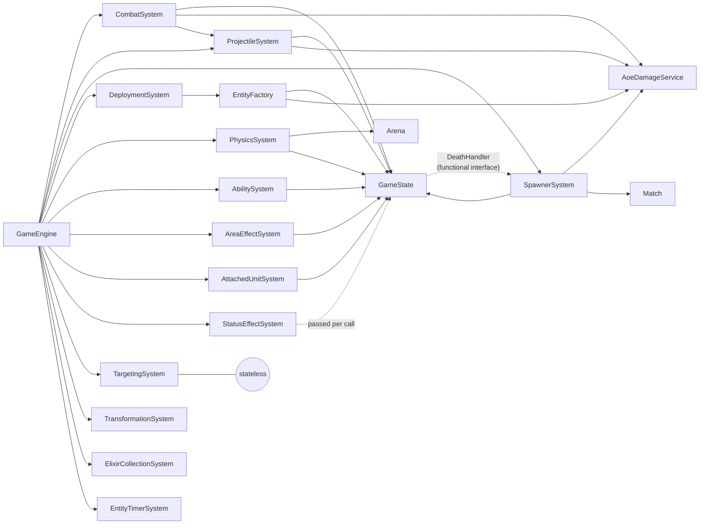

# crforge -- Architecture Overview

crforge is a deterministic tick-based Clash Royale simulator using Component-Entity-System (CES)
architecture. Entities hold data, systems hold logic, and the engine ticks at 30 FPS for
reproducible RL/AI training.

This page is an index into the detailed reference docs. Each sub-doc covers a focused area of the
codebase.

---

## System Dependencies

No circular dependencies between systems. Cross-system callbacks use functional interfaces wired at
construction time.


```mermaid
graph LR
    GE[GameEngine] --> CS[CombatSystem]
    GE --> PS[ProjectileSystem]
    GE --> SS[SpawnerSystem]
    GE --> DS[DeploymentSystem]
    GE --> PH[PhysicsSystem]
    GE --> AB[AbilitySystem]
    GE --> AE[AreaEffectSystem]
    GE --> AU[AttachedUnitSystem]
    GE --> SE[StatusEffectSystem]
    GE --> TS[TargetingSystem]
    GE --> TR[TransformationSystem]
    GE --> EC[ElixirCollectionSystem]
    GE --> ET[EntityTimerSystem]

    CS --> GS[GameState]
    CS --> AOE[AoeDamageService]
    CS --> PS

    PS --> GS
    PS --> AOE

    SS --> GS
    SS --> AOE
    SS --> MA[Match]

    DS --> EF[EntityFactory]
    EF --> GS
    EF --> AOE

    PH --> AR[Arena]
    PH --> GS

    AB --> GS
    AE --> GS
    AU --> GS
    SE -.-> |"passed per call"| GS

    GS -.-> |"DeathHandler\n(functional interface)"| SS

    TS --- ST((stateless))
```

---

## Documentation Map

| Document | Description |
|----------|-------------|
| [Simulation Engine & Entities](simulation.md) | Tick loop, system execution order, entity lifecycle flowchart, entity types (Troop, Building, Tower, Projectile, AreaEffect) |
| [Arena, Match & Economy](arena-and-match.md) | Arena layout, tile types, placement validation, match timing, win conditions, elixir regen, deck/hand |
| [Targeting, Combat & Abilities](combat.md) | Two-phase target locking, attack pipeline, melee/ranged, damage calc, 10 ability types (charge, dash, hook, reflect, etc.) |
| [Physics & Status Effects](physics-and-effects.md) | Movement pipeline, lane pathfinding, river jump, knockback, collisions, multiplier-based buff stacking |
| [The Battle Core](battle-core.md) | The second engine that only takes in established behaviour: the 50 ms step, the entity tick order, what is covered, the planned slices and the assumptions carried so far |
| [Troop Pathfinding](pathfinding.md) | The waypoint and grid movement modes, the grid tick order, cell costs and routes, assumptions and what is still unvalidated |
| [Deployment, Spawning & Transformation](spawning.md) | Deployment pipeline, live/death spawning, bomb entities, HP-threshold transformation |
| [Card Data Schema](schema.md) | JSON schema for cards/units/projectiles/buffs, loading pipeline, reference resolution |
| [Level Scaling](level_scaling.md) | Rarity multiplier tables, tower stat scaling formulas |
| [Secret Stats](secret_stats.md) | Undocumented unit stats measured from in-game observation |
| [Card Tracker](card_tracker.md) | Implementation status for all 121 cards |
| [Measuring Missing Fields](reverse_engineering.md) | Guide for measuring unit stats from in-game observation |
| [Python Gymnasium Bridge](../python/README.md) | ZMQ transport, observation/action spaces, reward structure, opponent policies |

---

## Module Structure

```
crforge/
  core/           Headless simulation (no GUI dependencies)
  data/           Card/unit config loading (JSON -> Card objects)
  desktop/        LibGDX visualization (ShapeRenderer debug view)
  gym-bridge/     ZMQ server for Python Gymnasium integration
  python/         Gymnasium environment and bridge client
```

### Core Package Layout

```
org.crforge.core/
  ability/     AbilitySystem, AbilityComponent, AbilityType, 10 AbilityData records, 10 handlers
  arena/       Arena, Tile, TileType
  card/        Card, CardType, TroopStats, ProjectileStats, LevelScaling, Rarity, ...
  combat/      TargetingSystem, CombatSystem, AoeDamageService, ProjectileSystem, ProjectileFactory, ...
  component/   Health, Position, Combat, Movement, SpawnerComponent, ModifierSource, ...
  effect/      StatusEffectType, StatusEffectSystem, AppliedEffect, BuffDefinition, BuffRegistry
  engine/      GameEngine, GameState, DeploymentSystem, EntityTimerSystem, ElixirCollectionSystem, TransformationSystem
  entity/
    base/        Entity, AbstractEntity, EntityType, MovementType, TargetType
    unit/        Troop
    structure/   Building, Tower
    projectile/  Projectile
    effect/      AreaEffect, AreaEffectSystem
    SpawnerSystem, SpawnFactory, DeathHandler, AttachedUnitSystem
  match/       Match, Standard1v1Match, GameMode
  physics/     PhysicsSystem, BasePathfinder, Pathfinder
  player/      Player, Team, Deck, Hand, Elixir, LevelConfig
  util/        Vector2, FormationLayout
```

---

## Debug Visualizer

`./gradlew :desktop:run` opens the debug screen on the battle core (`org.crforge.core.battle`): a Ladder 1v1 battle on the standard arena, towers and cards at level 11, that can be paused, run at 0.25x to 8x speed, and played by hand from either side's hand. The AI visualizer (`--args="--ai-port 9876"`) still runs the original engine.

### Game tables

The battle core reads the game's tables of one data version. The visualizer finds them in a **data root**, a checkout of the game data repository with one folder of tables per data version (`<root>/<version>/`) beside `references/`:

- the system property `crforge.dataRoot`, else the environment variable `CRFORGE_DATA_ROOT`;
- with neither, the `crforge-data` folder beside the project folder, when it exists. The project folder is the system property `crforge.projectDir`, which the `run` task sets to the root project's folder; an IDE run that does not set it uses the nearest folder up from its working folder that holds `crforge-data.lock`.

So a `crforge-data` checkout next to the `crforge` checkout needs no setting at all. The tables are then chosen by the first of these rules that applies:

1. An explicit data version: the argument `--data-version <v>` (`./gradlew :desktop:run --args="--data-version 16.402.18"`), else the property `crforge.dataVersion`. It opens `<root>/<v>`, and needs a data root.
2. A tables folder named outright, as before data roots: the property `crforge.gameTables`, else the variable `CRFORGE_GAME_TABLES`.
3. The `version=` of the project's `crforge-data.lock`, in the data root: `<root>/<version>`.

The `run` task passes the Gradle properties `crforge.dataRoot`, `crforge.dataVersion` and `crforge.gameTables` (for example from `~/.gradle/gradle.properties`, or `-P<name>=<value>`), or the variables `CRFORGE_DATA_ROOT` and `CRFORGE_GAME_TABLES`, to the program as system properties. A `crforge.gameTables` set for the test tasks therefore also wins over the lock's version here; the data root still gives `V` its versions.

At startup the launcher prints the data root and the setting that named it, the commit the root has checked out (read from its `.git` folder) against the lock's commit, which is informational only, the root's data versions, then the tables folder and the rule that chose it, the data version and the content sha:

```
data root: /path/to/crforge-data (from the crforge-data folder beside the project)
data root commit: e61b362a... (differs from the lock's 0f84a50d...; informational only)
data versions: 14.593.1, 16.402.18 (V switches)
game tables: /path/to/crforge-data/14.593.1 (from version=14.593.1 of crforge-data.lock in the data root)
data version: 14.593.1
content sha: 2be4aad4...
```

With no rule that applies it stops with a message naming `crforge.dataRoot`, `CRFORGE_DATA_ROOT`, `crforge.gameTables` and `CRFORGE_GAME_TABLES`; with a folder it cannot read it stops naming the folder (and the root's versions); and when the battle core refuses a battle on the chosen tables (it refuses tables it does not model as a battle on them is built) it stops with the reason.

`V` switches the screen to the data root's next version folder, in version order and wrapping round, and starts a new Ladder battle on its tables; each version's tables are loaded once and kept. The status column shows the current data version (`data: 14.593.1 (V: 2 versions)`). When a version's tables cannot be read, or the battle core refuses a battle on them (16.402.18 today), the battle on screen stays, the reason joins its messages, `R` resets on the version still on and `V` again tries the version after the refused one.

### The battle

The two decks are in `org.crforge.desktop.battle.BattleDecks`, the decks the visualizer showed before it ran on the battle core, by the tables' card row names:

- Blue (side 0, bottom): DarkPrince, Prince, Fisherman, InfernoDragon, ElectroWizard, Witch, Zap, SkeletonArmy
- Red (side 1, top): MegaKnight, ElectroGiant, Assassin (Bandit), SkeletonWarriors (Guards), Tombstone, DarkWitch (Night Witch), SkeletonArmy, RamRider

Hands, elixir, the next card, the clock and its elixir rate, the crowns and the result are the match's own. A click plays the selected card through the battle's play path (`Standard1v1Battle.submit`), so it runs 20 ticks later as a player's play does. A play is refused on the spot with a message when the match's gates would refuse it now (decided, king dead, not enough elixir once the side's plays still waiting are set aside), when the card is already played and waiting, or when the placement finds no tile; a play the battle refuses as it runs is reported the same way. The hovered tile shows where the battle would place the selected card now (`Standard1v1Battle.previewPlacement`): each unit's ghost and the attack range, a spell's circle, or a red tile. When the battle core refuses a behaviour it does not model it throws inside a step; the screen then stops stepping, shows the message and waits for `R`.

Every entity kind is drawn in its side's colour: troops (a ring for air units), buildings (squares), towers (king and princess shades), projectiles (a dot and the landing circle of one with an area) and area effects (a disc with its name and life left), each character with its health bar, shield bar, name and a line to its target.

### Controls

| Key           | Action                                                                        |
|---------------|-------------------------------------------------------------------------------|
| `SPACE`       | Pause / resume                                                                |
| `R`           | Reset to a new Ladder battle                                                  |
| `P`           | Toggle heading lines (each troop's direction of travel)                       |
| `O`           | Toggle attack, minimum and sight range circles                                |
| `D`           | Toggle floating damage numbers                                                |
| `A`           | Toggle area damage indicators                                                 |
| `H`           | Toggle HP numbers                                                             |
| `M`           | Not offered: the battle core has one set of movement rules (logs a note)      |
| `G`           | Toggle the routing cell cost overlay                                          |
| `N`           | Toggle the route, reference and state overlay                                 |
| `S`           | Run the next golden scenario (passive towers, the reference unit on tick 0)   |
| `E`           | Export the recorded trajectories of the played units to `build/trajectories`  |
| `V`           | Switch to the data root's next data version (a new Ladder battle on it)       |
| `F`           | Not offered here (logs a note): the view flips in the replay viewer only      |
| `T`           | Hide / show the text annotations (see below)                                  |
| `+` / `-`     | Speed up / slow down (0.25x to 8x)                                            |
| `1`-`4`       | Select a card from the blue player's hand                                     |
| `5`-`8`       | Select a card from the red player's hand                                      |
| Left click    | Select a card from a hand panel, or play the selected card on the arena       |
| Right click   | Deselect the current card                                                     |

The number keys only *select* a card; playing always goes through a left click on the arena.

`F` does not flip the Ladder screen: its hand panels, number keys and clicks play for a side by the arena and panels as drawn standing, so the screen keeps side 0 at the bottom in blue.

`T` hides the text annotations and shows them again; they are shown at first, on both screens. The annotations are the status column (the tick and entity count, the overlays that are on, the replay's or golden scenario's status, the data version and the controls legend) and the message column with its halted line. The battle itself (bodies, towers, health and shield bars, and the characters' and area effects' name labels), the hands, elixir, clock, crowns and result line, and the overlays with keys of their own (`P`, `O`, `D`, `A`, `H`, `G`, `N`) stay as they are.

### Replays

`./gradlew :desktop:run --args="--replay <file>"` (in the IDE, run `DesktopLauncher` with the program arguments `--replay <file>`) opens the replay viewer on a replay file instead of a Ladder battle. The tables are chosen as above, so `--args="--data-version 16.402.18 --replay <file>"` reads it against that version. A replay file dropped on the debug visualizer's or the viewer's window opens the same way, read against the version on screen.

The replay is read against the chosen game tables through the parity module's replay mapping (`org.crforge.parity.ReplayScenario`), the same mapping the parity runs use, and its battle is built the way they build it (`ReplaySmokeRun.build`): the towers, the seed, the players' data, the Ladder match between the two decks and every command queued at its tick. The command type numbers are the tables' data version's (`org.crforge.parity.CommandTypes`): 124 a card play and 178 an ability command in 14.593.1, 153 and 189 in 16.402.18, where 124 and 178 are refused. A version whose command types are not established has every command refused rather than read by another version's numbers. The fields a version's replays write beyond 14.593.1's are the version's too (`org.crforge.parity.ReplayFormat`): 16.402.18's replays give each side's king level in its player data (`hbd[i].kt`), pin the request lists (`srq`, `srs`), three header switches (`cardlvlmin`, `rrb`, `seb`) and the arena (54000144), and carry the players' profiles, the cards' cosmetics (`pr`, `sc`, `hsc` and the item's cosmetic bits), the tower card's count and flags, the deck header and the replay's events (`evt`, types 1, 3 and 5) with no battle input. A replay of a version whose fields are not decided is read by 14.593.1's, so a field only a later version writes is refused.

At startup the launcher prints the replay's file, its battle header (the game mode and location, both decks by card name, the end tick, the command count by type) and either what the mapping read or every reason the replay is refused:

```
replay: /path/to/replay.json
  game mode: Ladder, location PvP_goblin
  side 0 deck (red, top): ArcherQueen, Archer, Goblins, Giant, Minions, Musketeer, Fireball, Arrows
  side 1 deck (blue, bottom): ArcherQueen, Archer, Goblins, Giant, Minions, Musketeer, Fireball, Arrows
  end tick: 400
  commands: 2 (type 124 x1, a card play; type 178 x1, an ability command)
  recorded result: none in the replay
  mapping: every field read; 1 plays, 1 ability commands
```

A replay is refused, never played in part, when the mapping refuses any of it (a field it has no mapping for, a pinned value other than the one it was established on, a command type the data version does not map, a play it cannot read), when the battle core refuses the tables, or when it refuses to set up the replay's battle. Each reason is listed once with its count (`the command type 153: cmd[0].ct and 36 more (37 in all)`), and the window shows the same list instead of a battle. Tables the battle core refuses do not stop the launcher here, as they do for a Ladder battle: the refusal is one of the replay's reasons.

A replay that is played shows both sides' hands, elixir, crowns and the clock as the battle holds them. Each play and ability command that runs is noted in the message column (`red plays ArcherQueen on tick 220 (cmd0)` for side 0 in the flipped view), and each play's item is checked against the item the battle built for it, as a parity run checks it: a play that ran with another item halts the replay with the reason. The replay stops at its end tick (`endTick`), or when the battle ends by its own rule; one with no end tick plays until the battle ends. A 16.402.18 replay's end tick lies past the battle's own end (3681 for a battle that ends on tick 3678, 4871 for one that ends on tick 4845), so such a replay ends where the battle does. The status column then shows why it stopped, the battle's result and the replay's own recorded result; neither the replay files nor the scenario cases record a result, so that line reads "none in the replay".

| Key           | Action                                                   |
|---------------|----------------------------------------------------------|
| `SPACE`       | Pause / resume                                           |
| `R`           | Restart the replay from tick 0                           |
| `+` / `-`     | Speed up / slow down (0.25x to 8x)                       |
| `P`, `O`, `D`, `A`, `H`, `G`, `N` | The overlays, as on the debug screen |
| `F`           | Flip the view: side 1 at the bottom (the default) or side 0 |
| `T`           | Hide / show the text annotations, as on the debug screen |

Cards are not selected or played from the viewer: the plays are the replay's own.

A replay opens **flipped**: the arena is mirrored along its length only, as the game's own replay view draws it (a play on the right stays on the right), so the battle's side 1 (`deck1`) stands at the bottom in blue and side 0 (`deck0`) at the top in red. `F` flips it back to side 0 at the bottom and again, and the status column says which (`view: side 1 at bottom (F flips)`). The flip is a view only, made in one place (`org.crforge.desktop.render.ViewOrientation`): the battle's sides, positions and inputs are the replay's either way. Every position goes through it, so the arena's cells and halves, the bodies, bars, labels, target and heading lines, projectiles, area effects and every overlay (`P`, `O`, `D`, `A`, `H`, `G`, `N`) mirror together, and the mouse's tile and cell map back to the battle's own. The side at the bottom is always the one drawn blue and named blue: its hand and elixir take the bottom panel, its crowns are listed first, and the result line and the play notes name the sides by these colours.

### Overlays

`G` paints one square per 500-unit routing cell of the battle's own grid, coloured by what the route search would charge to enter it. The cost depends on the unit asking, so the overlay prices every cell for one fixed unit - a plain ground unit of the blue side, in the moving state, on lane 1, with no water permission - and the class of the cell under the mouse is printed with its cost in the status column. Roads, plain ground, water, blocked cells and cells under a building footprint each get their own colour.

`N` draws, for every troop, the polyline through the cells still left on its route, a ring on the position it is holding as its reference, and a label with its state, how many route cells are left and how far its movement visit asked to move in the last tick.

`A` draws a fading circle for every area hit: a unit's splash and a death's area, each hit of an area effect, and the arrival of a projectile with an area. `D` floats the hit points and shield each character lost since the last frame.

`S` cycles through three reference deployments of a Knight (left, right and centre). Each starts a battle of its own with the towers passive and places the Knight at the reference position on tick 0, as the battle core's golden trajectory test does, so the battle's first step is the reference's tick 0. The reference trajectory is drawn as a ghost polyline with a ring on the position the reference gives for the current tick, and the status column reports either `deviation: none` or the first tick at which the live unit was somewhere else, with how far away it was. The scenario has no hands; `R` returns to a Ladder battle. The bundled trajectories are copies of the core golden files, which are the output of a model of the game's rules, not captures of the shipped game; see `desktop/src/main/resources/trajectories/README.md`.

`E` writes one file per unit made by a card play (and the scenario's unit) to `build/trajectories`, named after the unit (`b1_0.json` is the first unit of blue's first play), in the layout of the reference trajectories the battle core's `TrajectoryRecorder` writes: the header, the events of every hit, launch and impact, and one record per tick from the unit's first tick in the battle. Recording starts with each battle and is cleared by a reset.

---

## Known Gaps

- **Champions** (Archer Queen, Golden Knight, Skeleton King, Monk, Little Prince, Mighty Miner,
  Goblinstein, Boss Bandit) -- Basic stats loaded but require champion ability cycling system
  (tap-to-activate abilities with cooldowns). `[PARTIAL]`

### Game Modes Not Implemented

- 2v2 (`MATCH_2V2`)
- Double Elixir (`DOUBLE_ELIXIR`)
- Triple Elixir (`TRIPLE_ELIXIR`)
- Sudden Death (`SUDDEN_DEATH`)
