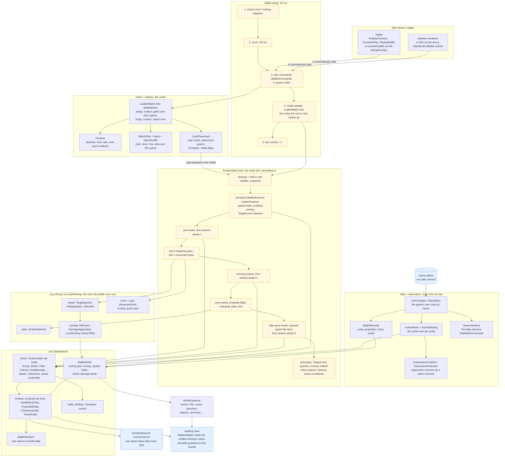

# The battle core

The battle core (`org.crforge.core.battle`) is crforge's engine. It only takes in behaviour that is established, and every class in it says which parts are settled and which are not: run `./gradlew :core:fidelityReport` to see how far that has come. It reads the game's own tables of one data version and is held tick by tick to battles recorded in the game (see [Game Tables and Reference Battles](game-tables.md)). The debug visualizer runs on it (see [Debug Visualizer](architecture.md#debug-visualizer)); a reinforcement learning environment will be built on it separately.

crforge began with an engine written from observation and a reference port, which the fidelity ledger listed almost entirely as a guess. The battle core was grown beside it a milestone at a time and replaced it; that engine and its card data are gone.

## Three footings

Three properties of the established behaviour cut across the whole engine, and the battle core is built on them:

- **Time is integer milliseconds.** Every duration is whole milliseconds stepped by exactly 50, so a duration of `ms` lasts `ceil(ms / 50)` steps.
- **A tick is passes over the whole entity list, not a chain of systems.** Every entity's targeting runs before any entity's movement, which runs before any entity's state visit, over a snapshot of the entity list taken at the head of the tick and ordered by id.
- **Commands run before the entity tick.** A card play runs twenty ticks after a player makes it, at the head of its step, and the entity tick of that same step admits and visits what it creates.

## Package layout

```
org.crforge.core.battle/
  Battle              the step: clock, entity tick, commands, tick counter
  BattleMode          when the match is over; what the mode does before the entity tick
  BattleCommand       a tick-stamped action from outside the entity tick
  EntityHolder        the entity tick: every hook and pass of every entity, in one fixed order
  HolderPasses        the once-per-tick work around the entity visits
  TargetLocks         which object holds which target, per channel, granted after phase 3
  BattleEntity        a container of four component slots with a pre-hook and a post-hook
  BattleComponent     one slot: a refresh and a visit
  EntityActions       the five action passes of one entity
  BattleRandom        the battle's random source: one shared 32-bit xorshift state
  expression/
    ExpressionCompiler the data's expression columns into opcode words, with the fold
    ExpressionEvaluator the stack machine that runs them over 32-bit integers
    Expression        one compiled expression: its words and its stack depth
    ExpressionEnvironment what an expression's symbols name and what each call answers
    BattleFunctions   the 47 names of the battle's functions, their ids and argument counts
  unit/
    BattleWorld       the routing grid, the building overlay and the spatial index, rebuilt per tick;
                      owns the holder, hands launched projectiles to it, and is where damage lands
    WorldEntity       an entity that stands on the arena, with its targeting component's state
    CharacterEntity   targeting in slot 0, movement in slot 1, the state visit as the post-hook
    TowerEntity       a crown tower: targeting in slot 0, the state visit and the combat gate as
                      the post-hook
    UnitData          the published columns of a unit, unconverted, its projectile row among them
    AbilityData       a unit's ability row: its cast, its trigger, the target it keeps, its action
    WorldObserver     what watches the arena from outside the tick: hits, areas, launches,
                      impacts, removals, a king tower's activation
    Standard1v1Battle the standard arena with its six towers
    ActivationEvent   one step of a king tower's activation, as observers are told it
    ActionOwnerEntity an object that only owns actions, standing in for the objects that run
                      spawn rows in the data
  match/
    LadderMatch       a Ladder match as the battle's mode: the setup, the update's advance, the
                      kings' visits, a play's gates and spend, the crowns
    Timeline          the battle's clock: sections, the elixir rate and the next-card cooldown
    BattleTimeline    a battle timeline row, as the game mode names it
    MatchSide         one player: the elixir in ten-thousandths, the deck and the hand, each
                      deck card's slot flags and the count per deck index
    EvolutionItem     the item a play of a deck card carries: its evolution field, the row cast
                      and its cost
    Hand              four slots, the queue and the refill cooldown
    DeckShuffle       the order a deck is dealt in, from one draw of the battle's source
    MatchCard         what the match reads of a card: its cost and its opening-hand columns
  action/
    ActionHolder      one entity's scheduled actions behind the five passes: the pending entries,
                      the running instances and the tags they set
    BattleAction      an action: its row's shared columns, what starting it does, and whether it
                      lasts
    ActionRow         the columns every action row shares; RowAction answers them from it
    ActionInstance    one run of an action that lasts, stepped by the run pass
    Group             schedules every part when it is scheduled, each at its own offset
    Select            schedules one part when it is scheduled, by its conditions
    Filter            schedules its true or false branch when it starts
    RunOnInstigator   schedules its action on the entity that caused it
    WaitToActivate    lasts until its condition holds, then schedules its activation
    WithDuration      lasts a fixed time, or one that follows the hit speed
    Interval          lasts, and fires its action every interval unless paused by a tag
    FlipFlop          lasts, and turns on and off once its condition disagrees long enough
    ActionOwner       the entity a holder belongs to, as the leaves that act on it see it
    SetVariable       writes a variable of its owner, which expressions naming it read
    SetShield         gives its owner a shield of a share of its maximum hit points
    RunActionAtHealth lasts, and runs an action as its owner's hit points fall past each threshold
    Taunt             forces its owner's target onto the parent of the area effect that caused
                      it, with a buff, for a step; the owner's run is armed at once
    LaserBall         lasts on an area effect, and at a fixed rate runs on everything its query
                      finds around it the action their count picks
    LaserBallHost     what a laser ball asks of the battle around its area effect
    ShapeSelector     lasts on an area effect or a character, and on ticks set from its start,
                      or from then on when it waits, runs an action on the object in its circle
                      with the most hit points and shield, and one on its owner by the pick's side
    ShapeSelectorHost what a shape selector asks of the battle around its owner
    SpawnGuard        makes a guard behind its area effect and sends it charging ahead after a
                      short deploy, pushing and hitting what it passes
    GuardHost         what a guard's run asks of the battle about its guard and around it
    BossBanditAbility locks its unit on itself and, a set number of battle ticks after it starts,
                      runs its warp on it
    WarpCharacter     moves its unit at once back toward its own side, off water and blocked cells
    DoPushbackFromInstigator pushes its unit a delay later along the width, away from the side of
                      the arena its cause stands on, and runs its success or failure actions
    AirToGround       lasts on its owner and holds it on the ground, pulling an air unit down and
                      letting it climb back
    TargetIndicatorAttack lasts on a character, marks the nearest enemy in its ring with a signal
                      and shoots a projectile at the signal's point a delay later
    TargetIndicatorHost what a target indicator attack asks of the battle around its character
    Heal              heals its owner by its value, with its over-heal percentage
    Kill              schedules its kill action on its owner, then kills it with the cause as killer
    DamageType        the switches a typed hit's pipeline runs, and the actions it runs after a hit
    DealDamage        queues a typed hit on its owner, with the cause as its source
    InertAction       a row that changes nothing the simulation reads: an inert class, an effect or
                      a forced animation; an effect that loops keeps a run
    PopBalloons       the Skeleton Barrel's pop: a run stepped doing nothing, never finishing;
                      a singleton's second start drops a container as an area effect
    PlayAnimationIfHasTarget the Goblin Cage's shake: a run stepped doing nothing, never finishing
    Berserk           the Berserker's starting action: a run that sets the attack sequence index
                      to 0 and flips it on every attack that lands
    CollectFriends    lasts, and claims the nearest friends through the target locks, requests
                      the ability and fires a projectile at each
    FriendCollecting  what a collector asks of the battle around its unit
    GoblinHutLifeState lasts, waits for an enemy within the hut's reach and spawns toward it at an
                      interval while it holds one
    GoblinHutLife     what a Goblin Hut's life state asks of the battle around its building
    GiantBufferBuff   lasts, and adds damage to every so many of its unit's hits, a projectile's
                      through the copy it carries
    LumberjackGhostWait lasts on the evolved Rage Barbarian's ghost, swaps a buff applied to it
                      for the one it considers, and once armed kills the ghost when that is gone
  data/
    GameTables        a folder of the game's own tables, one data version, and its action graph
    GameTable         one table's rows by name, in creation order
    GameRow           one row: its index, its class and its columns under the game's own names
    BattleRecords     the battle's units, projectiles and troop cards built from those rows
    ActionRows        the battle's actions built from the game's action rows, for one entity
    ActionBinding     what an action row needs from its entity: expressions, variables, tags
  spawn/
    SpawnRow          the columns of a character spawn row, at its source or to a location
    SpawnPerform      the row's perform: its source, its point, the block the spawner is handed,
                      and the calls made on the children after the spawn
    SpawnArguments    the block the spawner is handed
    SpawnObject       a game object as a spawn reads it
    SpawnPlacement    where the spawner places each child: on the point, or on a ring
    SpawnPassable     the in-front test: off the arena or over water refuses a point
    SpawnCharacters   the action: the perform's block handed to the battle's spawner
    SpawnAreaEffect   an area-effect spawn: the area effect at the owner's point, for the cause's
                      side and at its level, the cause its parent; a row that follows its parent
                      follows the owner
    SpawnProjectile   a projectile spawn: the projectile from the owner's point at the row's
                      height, aimed by the row's two expressions, at no target
    SpawnHost         an object a spawn can come from, which reaches the spawner
  filter/
    GameObjectFilter  one filter row: whether an object passes it, for a team and a name
    FilterSubject     an object as a filter asks about it
  deploy/
    CardPlacement     one card play worked out: the map check, the search, the column, then each
                      unit's offset, position, lane and start
    MapCheck          the raw requested point: on the map, and on a cell that may take the card
    DeployMask        the tiles a card may be placed on: the towers' boxes and the buildings
    PlacementSearch   the clamp, the snap and the nearest legal tile in square rings
    Formation         where the index-th unit of a card stands around the placed point
    InitialDelay      whether a unit starts deploying or waits its turn
    DeployCard        the columns of a troop card its placement reads
  projectile/
    ProjectileData    the published columns of a projectile row, unconverted
    ProjectileEntity  a projectile in flight: an entity of its own kind in the same holder
    ProjectileLauncher the hit application's projectile path: count, spread, start, aim, hand-over
    ProjectileFlight  one step of the flight, the arrival and the impact
    ProjectileAmounts the damage and the crown-tower damage at the projectile's level
```

The battle core reads its units and projectiles as the game's own rows: `org.crforge.core.battle.data.BattleRecords` builds them from the game tables, and the tests that play the reference runs take their units from it, so they need the tables configured and fail without them. A unit that fires and has no damage of its own deals its projectile's damage at its level, as the game's damage getter falls back. The crown towers are built from their rows too: the king tower's and the princess tower's shots scale by the tower rules their rows name, 109 at level 11. The battle's actions come from the game's action rows: `ActionRows` builds a row with the class its class type names, from its columns, and every row it names in turn, for one entity, compiling its expressions for that entity; the battle declares the tables' variables and game tags, a tag as the bit its row's index gives. The builder is strict: a column it neither reads nor knows to be presentation only is refused, and so is a class the battle does not have. The unit, projectile, area effect and buff rows are held to the same rule: a row is read through a view that records the columns read, and every column it sets that is not read, not presentation, not shown inert by the record and not pending a trace is listed as not modelled, which refuses the row where an entity is made of it, a tower included. The presentation columns - art, texts, effects, shadows, animation, health bars - are classified by what they name; a column whose role is not yet established would be carried unread as pending until a trace settles it, and none is now. Of the 946 rows of the data, 425 are built today. The rows that only show something - the four classes the runtime never reaches beyond scheduling, the effects, the forced animations and the animation modifiers - are built as inert actions; an effect whose flags loop it or tie its life to its run's keeps a run that never finishes by itself, and a row without a run never sets its tags. A battle is made on the tables: `Standard1v1Battle` takes them, and its world declares their variables and game tags and keeps the records and action rows its entities build from; a unit carries the names of its row's three hook actions - on starting, on death, on being killed - which nothing fires yet. A card play's card comes from its row too: the units it summons, how many, its formation and where it may be placed. A card's level index, which the game never reads, is not read here either, nor is a card's deploy time of its own, which nothing on the placement's path reads. A troop card may summon a list of characters in place of its groups, as the Three Musketeers' does, or after its first group, as the evolved Skeleton Army's general follows its fifteen soldiers: the card's first unit, which the map check and the search read, is its summoned character, else the list's first character, and each listed character is created after the groups' units at an offset of its own, both negated for the bottom side and, for the top side, the one across the width negated on the right half of the arena when the card mirrors it; a group card links the listed characters into its chain after its soldiers. A card that lists characters besides a second group but no first is refused, as none does. A spell card summons nothing and casts: it is played by the same command, its point clamped and snapped to the tile centre - or, for the Goblin Barrel, searched for its projectile's Goblin, with the symmetric adjustment - and, in the command pass of its tick, its area effect is created at the placed point, or its projectile starts from its side's king tower, at the centre and three times the king's collision radius up, with no target, and flies to the point; both are admitted by that step's opening cleanup and first act in its post-hooks, at the card's level re-based on their own rarity. Arrows casts three waves of ten projectiles, 200 ms apart, each wave a chain: the first arrow's ring point is the placed point and the others' stand on a ring of the spell's radius less six tenths of the arrow's, 40 degrees apart; each aims at its ring point plus six tenths of the arrow's radius turned by a battle random below 359, kept within nine tenths of the spell's radius of the placed point, and starts from the king tower shifted by a quarter of that offset across and the whole of it along. A delayed arrow counts its delay down 50 a visit without moving, so the later waves first move four and eight ticks after the cast. A chain's arrow deals its damage on its ring point, to the victims that stand in the chain's circle too - the placed point and the spell's radius - and not to one the chain has hit already. The Log and the Barbarian Barrel are thrown: the point snaps to the tile centre, and the projectile starts its MinDistance behind the point toward the caster's own side, at five times the king's collision radius, and falls to the point at the height of the rolling projectile it spawns. Its impact launches that one from where it landed, aimed its range beyond, along the line it came; a projectile that flies to a point this way runs a pass over what its body covers - the spatial index's box of its body radius and half height, one hit id a pass - as it is registered and after every step, and each entity found takes the travelling hit: none of its own side, none it has hit already, the damage at its level or the crown-tower share, and a push away from it, its row's push-all lifting the gates, on a character whose movement is still on. The rolling barrel's arrival spawns its Barbarian at its aim. A projectile's area impact pushes its victims its row's pushback away from the impact point, and a projectile that spawns characters makes them in the card formation around the impact point, at its level, deploying for its row's deploy time, each registered with its registration visit and then moved off the water onto its created point.

Every entity is of a kind - area effect, projectile, character - and its id is its kind's band of a
million plus a per-kind counter taken the moment it is handed to the holder, so a projectile
launched in the middle of a battle is still ahead of every character in the holder's id-sorted
list. Every troop and every building is a character.

The movement, targeting and state rules themselves live in `org.crforge.core.pathfinding`; see [Troop Pathfinding](pathfinding.md). The battle core runs them directly, inside its entity tick.

Level scaling, the hit-points object and the damage chain live beside those rules in `org.crforge.core.pathfinding.combat`: `RarityTable` (the published rows), `PackedLevel` (a level as an entity carries it), `ScalingGlobals` and `LevelScaling` (a stat at a level, under the card rule and the tower rule), `HitPoints` (what damage lowers, with the alive and removal tests), `DamageApplication` (one damage event reaching an object: the guards, the amount the two sides' buffs make of it, the dedupe list, the shield and the subtraction) and `AreaDamage` (damage landing on a circle: which entities it collects, in id order through the shared validator, and what each takes). Every arena entity is created at a level and scales its hit points and damage once, at creation.

The attacker's half of a hit stays with the targeting rules: `HitApplication` is the hit the targeting visit fires - the component writes, the long-distance cancel and the damage of one hit at the owner's level - and `DirectHit` is how a hit without a projectile reaches its target, with the plain damage and the crown-tower damage and the direction it came from. A unit with a projectile row launches instead, through the battle's `ProjectileLauncher`: the projectile is created in the attack tick, has its id at once, enters the holder's live list at that tick's closing cleanup and flies from the next tick on.

**The dependency rule.** `org.crforge.core.battle` and `org.crforge.core.pathfinding` may import each other, `org.crforge.core.fidelity` and `org.crforge.core.util`, and nothing else from this code base, and the core module's main code holds no other package. `BattlePackageDependencyTest` enforces both. Without the rule a single import would let guessed behaviour into a class that claims to be settled, and a second engine growing beside the battle core would again hold inferred behaviour next to the settled rules.

## One step

The diagram shows the battle core's inside: the game tables read once, the commands that drive a battle, one step and its entity tick, and what is read out of it. The numbered lists below give the full order.



`Battle.step()` is 50 ms of game time:

1. If the mode says the match is over, nothing happens at all: no clock, no entity tick, no tick counter.
2. The clock advances by 50 ms.
3. Due commands run, in the order they were queued: every command whose tick has come, a late one included.
4. The mode update runs. It either lets the entity tick run, handing it the current tick, or declines, in which case the holder is only cleaned up.
5. The tick counter advances.

So what a command creates is handed to the holder before the entity tick of its own step, and the tick's opening cleanup admits it: a unit placed on tick `n` is first visited on tick `n`, as the reference runs have it, with no offset anywhere. The towers of a standard battle are placed straight into the live list when the battle is set up, so they stand from the first tick.

`EntityHolder.tick()` is the entity tick:

1. Cleanup: drop removable entities, telling every remaining entity of each removal, then fold the entities handed over since the last cleanup into the live list, which stays sorted by id.
2. Take a snapshot of the live list. Every entity loop below runs over it.
3. The holder pre-pass: the spatial index and the building overlay are rebuilt from the snapshot.
4. Every entity's pre-hook.
5. Every entity's pending actions of phase 1.
6. One whole-list pass per component slot, lowest first: the component's refresh, then its visit when the component is switched on. Targeting is slot 0, movement is slot 1.
7. Every entity's running actions.
8. Every entity's pending actions of phase 2.
9. Every entity's post-hook: for a projectile its flight step, for a character its state visit, in that order because of the id bands.
10. The holder's after-post-hooks step, then every entity's pending actions of phase 3.
11. The holder post-pass: the overlay is rotated and the index cleared.
12. Cleanup again.
13. The end-of-tick action countdown, over the live list rather than the snapshot.

Three consequences that everything else leans on: entities are visited in ascending id, which is creation order within a kind with every projectile ahead of every character; an entity added during a tick is not visited until the next one; and an entity that becomes removable during a tick is visited for the rest of it and is gone before the next snapshot.

## Tests and game data

The unit tests read the game tables of the version `crforge-data.lock` names and hard-code no game data, so moving to a new data version needs no test edit unless the new version changes a behaviour the battle core must port. Every amount a test asserts stays exact, with no tolerance. A test takes one of three forms:

- A mechanic test writes the rows it counts on: rows of its own, or the lock's tables copied with the columns it needs written (`GameData.altered`, `alterLoaded`, `columns`, `fields`, `writeTowers`), and pins the exact outcome of those rows.
- A test of a shipped row reads the raw column (`Shipped.row`, `unitRow`, `number`, `scaled`, `cost`, `rarity`, `battleTicks`) and works the expected value out with its own arithmetic, never through the production code it tests.
- A census over the shipped rows asserts an invariant, never a count.

`GameData`, `Shipped` and `Scenarios` (battles and replays a test writes) are in `core/src/testFixtures`, shared by the core, conformance and desktop tests. Recordings of the game belong in the game data repository and are never committed here, and no test of the battle core reads a recording or a model's output. Test names and comments follow the same rule: they name the column a value comes from, not the value one version ships.

## What is covered today

A ground character deployed on the standard arena walks its lane, picks its target, routes around buildings, is pushed and steered by other characters and by the towers, and locks onto a tower, tick for tick as the recorded reference battles hold it. For its first ten walking ticks it only considers the towers of its own lane, so a unit deployed near the middle walks at its lane's princess tower before it turns to the king. Its state changes carry what the standard game attaches to them: taking a target prepares the route at once, stopping empties it, and resuming prepares a new one before the next movement visit.

Once locked on, it attacks. An attack starting from zero is credited the whole of a run-down load, so the first hit lands nine ticks after the lock and the rest follow at the hit speed. Each hit lands on the target and takes its hit points down by the character's damage at its level. A tower whose hit points reach zero is dead. A princess tower leaves the holder in the closing cleanup of the tick it dies, and every other entity is told at once. Until then it is still a target: a targeting component's bypass byte is 1, so its validator never asks whether the target is alive, and a unit visited later in the same pass keeps a target that died earlier in it, its attack time going on and a hit that falls due landing on it, until the cleanup's removal notice drops it and, with an attack running, starts its target-lost timer. A unit that loses its reference during its first, preloaded windup asks the lost-reference query: a row without a projectile or with a homing one stops, its attack time standing while the timer runs to the attack finish time, as after a loss in any later windup; a row whose area is centred on itself, one whose burst is running and one whose projectile does not home run on to a hit with no target. The king tower is never removable: it stays in the holder, and a unit that held it drops it through its own targeting on its next visit, with no removal notice and so no wait. At the tail of every state visit the combat gate runs: an entity that is dead or still deploying has its reference dropped there and its targeting component switched off, so a unit's reference is gone on the tick it dies and a king tower that dies fires no more. A character that was attacking it drops the reference and, with an attack running, stands for the attack finish time before it takes its next target and resumes its walk. The reference battles hold the attack, its cadence, the deaths and the removals: a princess tower falls in many of them, and in one a P.E.K.K.A destroys a princess tower and then the king.

A character with a projectile row fires instead of hitting. Each of its hits creates its projectiles in the attack tick, starts them the unit's launch radius along the line to the target and its launch height up, and aims them at where the target stood at the start of the visit. A projectile is an entity of the holder like a character, of its own kind, so it flies in the post-hook pass of every tick from the one after its launch, ahead of every character: a homing projectile re-pins its aim onto its target each step, moves its speed along the line and takes the height the arc gives there, and arrives on the step that reaches its aim. On arrival it is released, which makes it removable, and its impact deals its row's damage at its level - or the crown-tower share of it to a crown tower - to a target that still has hit points. A projectile whose target left the battle flies on to where the target stood and lands on nothing. A hopping projectile counts each launch and lists each target; after an impact under its count it hops on to the nearest character strictly inside its hop radius of where it landed - of the other side, not untargetable, with hit points, accepting an attacker and not hit by it yet, the first of equals in the order they joined, with no alive test - launched again from where it is, and waits 150 ms before it flies on, so a hop within one step of its speed lands four ticks after the impact. At its count, or with nobody in reach, it stays released; a hop after its launcher left is refused. A projectile whose impact spawns another launches as many as the spawned row's spawn count, at least one: each from where it landed, aimed beyond its aim along the line it came, turned by the spawned row's spawn radius as degrees times its step in the fan over the count, the steps from minus half the count up by one - the Firecracker's five explosions at -32, -16, 0, 16 and 32 degrees - each handed to the holder and, flying to a point, running its first pass at once before the next is made. A row with a constant height starts, aims and lands at that height in place of the launcher's: the Royal Giant's cannonball starts at 1500 and descends toward the tower it re-aims at, the Elite Archer's arrow flies level at 2000, and neither the hits nor the arrival tick move, as no hit test reads a height. A row that homes for a limited time re-aims from its launcher at its target for that time when launched far enough from it: the Elite Archer's arrow, launched more than 5000 from its target, bends toward it on its first two steps. A pingpong row sweeps out to its aim and back instead of flying at its speed: its time moves on by 50 ms a step - by what the launcher's buffs make of 50 ms, which no run holds - and it stands at its start plus the sine of 180 degrees times the share of the time gone of the way to its aim, its height unchanged. Its body hits what it covers where it stood before each step; on the step that crosses half the time it does not move but forgets what it has hit, so it hits each entity once out and once back. On the step after its time is up it lands back at its start on the ground, and its impact hits nothing at its aim. Its launch holds the launcher's targeting: the visit returns before its reference check until the projectile comes back and lets it go on, so the Axe Man's next throw comes a hit speed after the return; a return to a launcher whose targeting is off, and a pingpong row that a spell casts or an impact spawns, are refused. A unit whose attack launches several projectiles launches its custom first projectile first when it has one, and places every further one a battle random distance between a quarter of its spread and the spread out, turned by its share of the circle; under a custom first projectile without a radius, the circle scatter turns that point by a battle random share of the circle, and the line scatter throws it away and fans the projectiles about the line from the unit to its target, alternately to one side and the other, each step turned by the spread over the count in degrees - the Hunter's ten pellets 7 degrees apart. A row with a random delay waits a draw below it from the same source before it flies. Every projectile that flies to a point, unless it sweeps, runs its first pass as it is registered, widened by its row's start radius and whatever its delay. A row that stops at collisions is finished by the first hit its body lands on an entity with hit points left, which ends that pass, and reaching its aim without one it is released where it stands without an impact: at point blank all ten of the Hunter's pellets hit the first Knight as they are launched, and none reaches the second. A projectile row with a radius does not hit its target alone: its impact damages everything the area damage collects in the circle around its aim - an entity the validator accepts, on a layer the row reaches, inside the circle (a building by its square), and at most one tower-slot entity per area - and spares the launcher's own side only when the row says so. `BattleProjectileFlightTest` holds a shot's launch, every flight step and its impact on rows it writes, and the reference battles observe every projectile's position on every tick.

A character without a projectile whose row has an area radius does not hit its target alone either: every landed hit damages the circle around the character, for a row that centres its area on the unit, or around where its reference stood at the start of the visit, through the same area damage, with the character as the owner. The character's own targeting columns decide what the validator accepts, so its own side and the character itself are spared; its target takes its share only as one of the victims, and nothing is pushed, as no row of the data pushes with a hit. Such a row may also wait its own time instead of the global one before it takes a new target after losing one - the Valkyrie's is 100 ms. Three runs hold it: a Valkyrie hitting the princess tower alone; the Valkyrie with an enemy Knight at the tower, both damaged by every hit; and the Valkyrie fighting an enemy Knight beside her own princess tower, which her circle spares. The last two are the first runs with two units, one walking at the other: a unit's movement reads its reference where it stands at that moment, so a unit visited later in the movement pass steers at a unit visited earlier where that one has just moved.

The princess towers fight back. Every tower carries the same targeting component as a troop, in the same slot, and no movement component, so it stands for its whole life except to attack. With nothing in range it holds the opposing side's tower its default selection gives as its reference, out of range, and selects again every tick; a unit that walks into its range is locked on at once, and the tower fires its projectile row on the attack ticks through the same projectile path a Musketeer uses. The building branches of the targeting visit apply: a target that steps beyond the range and both radii is dropped at once, without the extension a unit keeps a target by, and a hit is never cancelled for distance. Each arrow puts the damage it will deal on its target as pending as it starts its flight, and hands it back as it arrives. While the damage pending on its target will kill it, whether the tower's own arrow or another shooter's shot carries it, the tower's own validator refuses the target, but the tower, having hit, keeps it, and its visit marks it kept. When the target dies, whoever kills it, the removal clears the reference and, if the tower's last visit kept it, skips the retarget load, so the tower selects again on the next tick. A target that dies otherwise starts the target-lost countdown, and the tower takes its default reference or another target on the sixth tick after the death. A tower sees its target alive on the tick it dies to another unit: the towers are visited before every card unit, and a projectile lands only after every targeting visit. So when another unit kills the tower's target while its arrow flies, a target the arrow would not have killed starts the countdown, and one it would have killed, a decaying Cannon say, leaves the tower selecting again on the next tick. A tower's post-hook is the state visit, which steps its elapsed time from its first tick, followed by the combat gate, which keeps the targeting component off while the tower is inactive or dead. A king tower sleeps until its side loses a princess tower or it loses hit points itself. Its placement queues a wait that sets the inactive tag, which the first tick's first pending pass starts after that tick's tags were folded in, so the king is visited on its first two ticks and then switched off. The run pass that first sees the condition ends the wait; the wait queues a 3300 ms activating run, which the same tick's second pending pass starts, and whose tag keeps the component off until the run pass after it finishes removes it. The king's first visit therefore falls seventy ticks after the tick that saw the condition. The tags an action sets live in the entity's one tag word, the word its flags are bits of: each entity recomputes it at its pre-hook from the tags its handlers set for one step and the tags of the actions it runs, so the king's sleeping and waking tags are the bits the combat gate tests. This is the first work the action passes do: a small action holder, shaped as the standard game's runtime is, with the actions the king's own starting row holds, built from the data: a group around the wait, the activating duration and the filter that shows the effect. The wait's condition is the data's own expression, `king_tower_damaged() || coop_king_tower_damaged() || tower_destroyed() || coop_tower_destroyed()`, compiled once and evaluated against the battle from the king: the first expression the battle runs. The reference battles hold the towers' locks, arrows and kills, since the towers fight in every one of them; `BattleTowerTargetingTest` holds the king's wake on rows it writes: a Knight destroys a princess tower, the king sees the condition in the next run pass, and its first visit locks on the Knight.

A troop card is played through a command. A player's play is stamped with the battle's tick counter and runs twenty ticks later, at the head of that step: its placement is worked out against every character, live or still queued, and its units are created at their formation places in creation order and handed to the holder, whose opening cleanup admits them, so they are visited in that same step. The first unit deploys at once; every further one waits its turn in the waiting state, visited by neither component, for the card's stagger times its index, and then deploys for its own deploy time. The placement reads the card's first unit's radius, angle shift and deploy time for every index, and hands the formation the second count as the row sets it; no card's units differ in them. A deploying unit is visited by the movement pass with no speed, so only a push moves it. Every entity takes part in contact, the towers included: a tower is a static neighbour of the push pass and an obstacle of the avoidance handler, and with a mass of 0 its share of a push is a single unit, so a unit deployed against its king is pushed off it one unit a tick. The reference battles hold card plays as the game makes them, refused plays and plays of either side among them, with every unit's position, state and hit points observed on every tick. With several units at once, the standard game shows this: a skeleton pushed off the bridge walks on the water beside it, a crowd presses some of its own inside the tower's collision circle, and a unit whose route the follower empties holds no route until its next visit. A static entity, a tower, makes the push pass ask whether a second one stands in line with the unit; a yes copies a push along one axis onto the other, and with the towers alone the answer is always no. An entity killed during a tick is still visited by the rest of it: nothing on the attack path asks about the attacker, so two units whose hits fall due on the same tick can kill each other - the first one visited kills the other, whose hit, due on the same tick, still lands. A character's death switches only its movement component off, so it takes no movement visit for the rest of the tick. A typed hit, which an action deals, is not dealt where it is dealt: the battle queues it and deals every queued hit once per tick, after every post-hook and before the last pending pass, in the order they were queued, each through its damage type's pipeline and with a damage id of its own. The pipeline's first stage scales the hit's amount, a first-level value, by its source's own rarity row and level, as a card's damage is scaled; a source that has left the battle still answers the level it had, now on the Common row. An action can spawn characters. The battle's spawner creates each child for its source's side, kept 250 inside the arena, walking at once or deploying when its row asks, and registers it inside the pass that ran the action: it takes its id and one visit of each active component at once, over the tick's index, so a unit already standing there pushes it, and it joins the live list at the tick's closing cleanup and is first visited on the next tick. A spawned child cannot be targeted until its sixth state visit, so a tower locks on it six ticks late. The pending passes run over every entity together, and an action with no delay scheduled onto any entity inside one of them starts at once. A unit whose row pushes it back asks for that pushback after each projectile it launches, away from the projectile's aim, and the pushback visit flies it over the next movement visits: the Sparky, recoiling from an enemy Knight, is pushed onto the river and moved off it to the nearest land before that visit's step. Nothing moves a unit off the river otherwise: a formation played into the pocket of a fallen princess tower creates two Barbarians on the water, and they walk off it.

- Two Knight walks have reference battles recorded for them: a Knight deployed inside the left lane near the middle, which holds the lane rule's first ten ticks (`golden-gaps-v1/walk_knight_left_inner`), and one deployed behind its right princess tower, steered around it (`golden-gaps-v1/walk_knight_right_rear`). `FirstHitAfterLockTest` runs the targeting pass on a unit it writes standing inside a princess tower's reach and holds the first hit nine ticks after the lock.
- `BattleProjectileFlightTest` holds a shooter's projectiles on rows it writes, a Musketeer standing in range of a princess tower: every launch with its id, row, owner, target, start and aim, every position after every flight step, worked out from the written launch radius, speed and gravity with the flight's integer arithmetic, every impact with its damage and the tower's remaining hit points, the projectile's place ahead of every character in the holder while it flies and its removal in the tick it arrives, and a shot whose target is destroyed mid-flight flying on to where the tower stood and landing on nothing.
- `BattleTowerTargetingTest` holds the towers' own targeting: a king tower visited on its first two ticks and then switched off; on rows it writes, the king switched off from the condition until its activating run has run out, its activation's every step, and its first visit, four ticks after the run's length, locking on the Knight that destroyed the princess tower; a tower's elapsed time stepped from its first tick; and a passive tower that never selects.
- `AreaDamageTest` holds the area damage's rules one at a time, a chain's circle and id list among them: the owner's side spared unless asked, a unit's own radius and a building's square in the circle test, the crown-tower damage, one tower-slot entity per area, the limit, the split rounded up and the air gate.
- `ExpressionCompilerTest` and `ExpressionEvaluatorTest` hold the expression language case by case: every operator's opcode, precedence and associativity, the literals and their 32-bit wrap, the tokenizer, symbols resolved in the environment before the builtins, every builtin, the fold and what it leaves to run, every refused string, the stack depth, 32-bit arithmetic with division by zero, truth, no short circuit, calls and the two early answers. `BattleFunctionsTest` holds the 47 names, `BattleRandomTest` the random source against 42 recorded sequences of draws, and `BattleExpressionEnvironmentTest` the battle's answers to the king's condition, `x` and `y` read from the context entity's position as it stands, `team_index` and `team_y_direction` for either side, `map_width` and `map_height`, a character or building row's name as its global id with `has_data` holding on that row alone and a negative id answering 0 by name, `is_moving` answering 1 for a walking character only - not while it deploys, under NO_MOVE, with its movement component off or for a tower - and the refusal of a function it does not answer yet.
- `BattleCardPlayTest` holds the stamp of a player's play and the twenty ticks it waits, and refuses a card whose unit has a starting action; `BattleTowerContactTest` holds a Knight deployed against its king tower being pushed off it one unit a tick.
- `PushbackRequestTest` holds the pushback request and its setter to 2000 recorded cases: the gates and what lifts them, the distance capped or less the separation, a longer pushback kept, the budget, the target and the zero vector.
- `BattleDeathTickTest` holds the two Knights killing each other on one tick: both hits land, both leave in that tick's cleanup, and both have their movement switched off.
- `AlignedStaticCheckTest` holds the push pass's aligned static neighbours check to 1500 recorded cases, and `PushPassTest` the neighbour a unit waiting to deploy is to it: not static, since it keeps its movement component switched off.
- `CardPlacementTest` holds parts of a card play's placement on rows it writes or the shipped card's columns: a listed character's offset turned by side and half, the top side's Three Musketeers on the left half, the first unit's radius, angle shift and deploy time serving every index, and the raw second count. Plays at the arena's edge, where the formation is clamped, are held by the recorded reference battles `golden-gaps-v1/place_barbarians_edge` and `golden-gaps-v1/place_skeleton_army_edge`. `FormationTest` holds the formation to 4992 recorded cases over every branch it takes, and `MapCheckTest` the map check's bounds and codes.
- `ActionRuntimeTest` holds the action runtime to its recorded cases: a delay of zero starting now and one in milliseconds queued as whole ticks, 49 ms included; a pending pass taking only its own phase and phase 0 going to any; a paused entry held and counting past zero, and a false start gate dropping the run; a run stepped once per pass and removed at the pass after it finishes, and a stopped one removed at once; a singleton's second start re-triggering its run; the next action after the run or alongside it, with the carried delay; the row's tags on its run; and the swap order of a pending pass.
- `ActionCompositesTest` holds the composites to their recorded cases: a group's parts scheduled at once at their offsets and none past a false start gate; a select's choice by its condition modulo the list or its first true per-part condition, else the part past the last condition, and none with no condition, its part queued with no delay and the select's cause, and nothing chosen or evaluated past a false start gate; a filter's branches and its default of true; a run on the instigator reversing the direction; a check of the instigator scheduling its match branch on its owner when the cause's row is named, its miss branch for a cause of another row or of none, a match for any cause when it names no row, and nothing without a cause; a duration's counter tested before it advances, at the usual step and the hit speed's, and its reset on a re-trigger; an interval's half-rate step, its reload, the owner as the cause of what it fires, and its pause tag; a wait's default of false and its end with or without an action; and a flip flop's full cycle and its reset on a flicker; and a select that passes its delay on, its part waiting the select's own.
- `ActionLeavesTest` holds the first leaves to their recorded cases: a variable written, replaced, a second key kept apart, 0 unread and nothing evaluated without a variable; a shield's share of the maximum with its clamps and truncation, and none without hit points or with a maximum of zero; and the health thresholds' start conditions, each fired once at or below its share, several in one step, and none re-armed by healing. `BattleVariablesTest` reads a variable an action wrote back through a compiled expression, per entity.
- `HealingTest` holds the heal to 2000 recorded cases and the worked heals of the data: the shield taking the whole heal, the dead object, the cap that keeps over-heal, the king tower's cap one short of full and the over-heal percentage. `KillTest` holds the kill to its worked cases: a death, a shield broken and a shield dented, the battle's holds ignored. `DrainTest` holds a tiebreaker's drain step landing under both holds, where an ordinary hit is refused, the step that takes the last hit point killing, and an untouchable target spared. `BattleKillActionTest` kills a walking Knight through the action - movement off, observers told, gone at the next cleanup - and lets a shield that is up take a kill.
- `TypedHitTest` holds the typed hit's entry: the hit points or the shield lowered and the amount it answers, the holds refusing it, and an id listed once and refused again without its tick moving. `DamageTypeTest` holds a damage type's switches, their defaults and the pipeline with no buffs, the level-scaling stage to 165 recorded cases (the published rows and rows of its own, amounts whose product wraps), and deal-damage amounts at level 11 on the published Common row (76 becomes 194). `BattleDealDamageTest` queues two typed hits on a Knight through the action, which land at the next drain in order, with the type's actions run on the source and the target in the same tick; it scales hits by a level 5 source and by a source on a row of its own, then by that source's level on the Common row once it has left, and refuses a scaling hit with no source at all.
- `SpawnPerformTest` holds the perform of a character spawn row to 1000 recorded cases: the source, both classes' points with the side's flips, the expressions and the building search, the block the spawner is handed and every call after the spawn. `SpawnPlacementTest` holds the spawner's placement to 600 recorded cases on the standard arena, a single child on the point or one unit right of it and the ring, and `SpawnPassableTest` the in-front test to 3000 recorded cases on the arena and on grids of their own.
- The Mirror after a Knight and after a Fireball, the Ram Rider's bola on two defenders under a Rage the Ram hands its rider, and an Electro Giant struck by two melee attackers and a Musketeer are held by the recorded reference battles `golden-gaps-v1/mirror_after_troop`, `golden-gaps-v1/mirror_after_spell`, `golden-gaps-v1/ram_rider_vs_knights` and `golden-gaps-v1/electro_giant_struck_by_knights`. `BattleActionSpawnTest` holds an action with no delay scheduled onto another entity inside a pending pass starting at once, a child's action to run on spawned running in the spawning pass before the child is live, and the refusals.
- `GameObjectFilterTest` holds the game object filter to its recorded cases: the team gate by the side's low bit, the type gate for each kind and the three ways a character passes it, the tag exclusion, each slot exclusion asked only when set and rejecting on its answer, their order, `FilterDead` set by default, the whole-name comparison, the character-only block and the two lists. `BattleRecordsTest` reads filters from their rows: the default that filters the dead, a row that turns it off, the lists and the tags as their bits. `BattleFiltersAndTagsTest` asks a filter about the towers, and reads the king's sleeping tag back through an expression from the tick after its wait starts.
- `ActionHolderTest` holds the action holder's rules one at a time: the swap-with-last order of a pending pass, a zero-delay action starting at once only inside a pending pass, a delay waited out in the end passes, a duration finishing on the step after it reaches its length and its tag counted until the next run pass removes it, and a wait ending on the step its condition holds; and an entity leaving the battle dropping the queued entries it caused whose rows abort, swapping the last in, and keeping those whose rows do not.
- `BattleSelectDrawTest` holds a select's draw: at the scheduling while the select's own entry waits out its delay, a condition the data writes as a list compiling from its first element, and an action owner's expressions answering `rand` and refusing any other name as the row is built.
- `BattleMegaKnightTest` holds the Mega Knight's play where its runs do not take it: its appearance starting five king radii short of the placed point along the length, whichever side plays; a play's push finding nobody beside an enemy, the appearance then pushing the Knight but not the Giant, which ignores pushback; a Mega Knight that waits its turn entering the deploying state inside the tick, whose push reaches the Knight and the Giant around it but not a friend, a flying enemy, a building or one out of reach; and an evolved Mega Knight placed directly, which pushes nobody and casts nothing.
- `SpellCardTest` reads a spell card - its projectile or area effect, the Goblin Barrel's search for its Goblin, Arrows' waves, and The Log thrown with the rolling projectile it spawns - and refuses Snowball as it is cast; Rage, which summons a character, stays a troop play, and so does Heal, which deploys as a spell. The wizards, which name no unit, are spells.
- `BattleAreaEffectLaunchTest` holds an area effect's launch where the Lightning and Royal Delivery runs do not take it: each hit striking the enemy with the most hit points and shield not struck before, the first of equals kept and a Recruit's shield lifting it above a Musketeer; a friend and a unit outside the circle passed by, and a hit with nobody left launching nothing; a hidden Tesla no candidate; a hit with nobody in the circle lost, a unit placed after it struck by the next; an update whose launch found nobody ending without its life-end action; the area effect as the projectile's launcher and the cause it names, forgotten as it leaves; and an area effect whose projectile sets a column its impact does not model refused as it is created.
- `BattleElectroGiantTest` holds the Electro Giant's reflect where its runs do not take it: a shot from strictly inside its reach struck back and one from exactly that far not; a Zap, an area effect, never struck back, and nothing struck back while its stun holds; every pellet of one Hunter attack re-applying the buff while only the first deals the damage; the hit that kills it still struck back, but not a second hit on that tick, which finds it with no hit points; a Cannon, no crown tower, taking the reflect's damage; a Valkyrie's area hit struck back; nothing struck back at its own side or for a shot whose row ignores the reflect; a Giant Skeleton killed by the reflected damage dying at once and dropping its bomb; a Spear Goblin's shot struck back at the Goblin Giant it rides on, which hands the buff to both its riders; and a kill on it refused.
- `BattleThreeMusketeersTest` holds the Three Musketeers' attack choice where its runs do not take it: a Knight within the bayonet's reach taking only typed hits of the bayonet's damage, a Minion as close only shots; a buff on damage, patched onto the row, applied on the bayonet's tick before its typed hit lands; target_is_ground answering 0 with the targeting off and refusing a target a tag forces onto a layer; and the refusals: an entry's action in a sequence of one or beside a projectile, and an enchanting buff on a unit whose attack sequence replaces its attack. `CardPlacementTest` holds a listed character's offset on both sides and halves, and the top side's list on the left half.
- `BattlePhoenixTest` holds the Phoenix where its runs do not take it: a ring of three death projectiles from a row given a spawn radius, an angle shift and a count, the bottom side's turned across the width and the top side's along the length; a Zap reaching an egg still immune; the egg's row tags absent on the tick its fireball's impact makes it and in its tag word from the next; an egg leaving once it hatches with no death, and one whose row keeps it staying with no second firing; and the refusals: a death projectile drawn from a least radius, counted by a spawner's limit, held by its launcher's targeting component or launched by a clone. `BattleRecordsTest` reads the Phoenix's and its egg's columns and refuses a row tag besides the egg's three.
- `BattleSkeletonBarrelTest` holds the Skeleton Barrel where its runs do not take it: the top side's container in the right lane, its ring turned over along the length only and its children taken as 0, 6400 and on up to 230400 nearer; a Kamikaze time longer than the hit points in visits draining one a visit, its hit killing nothing; and the refusal of a live spawner that asks for a fixed priority. `BattleRecordsTest` reads the barrel's and its container's columns; `ActionRowsTest` holds the pop's run stepped doing nothing and refuses a pop that drops containers or is a singleton; `GridMovementAnswersTest` holds the special waypoint at the attack range from the reference, along the length for a unit standing on it; `DrainTest` holds the drain refused where damage is forbidden.
- `BattleGoblinHutTest` holds the Goblin Hut's life state where its runs do not take it, each against the standard game's spawns: a target in reach at the start, spawned at once and then every interval; of three in reach the nearest, and of two equally near the one the index lists first; a flyer found; a target east of the hut, turned the other way; a fan of three from a row given a spawn count of 3; a target that leaves the keep reach and comes back, taken again without a spawn; a target killed between ticks marking the run lost, and another taken without a spawn; the edge of the reach, strict for the finder and inclusive for the keep test; a stun that holds the timer; a spawn due on the tick the hut dies, after its death spawn; a rage that quickens the timer, worked from the record; and the refusal of a child with a starting action of its own. `ActionRowsTest` and `BattleCardPlayTest` count the life state's rows built and refuse the Goblin Cage's starting action.
- `BattleFishermanTest` holds the Fisherman's special where its runs do not take it: the ring from the reference's radius plus the special's minimum range out to its radius plus the special range, both bounds armed and one unit beyond either not; the row's load taking 50 a visit and firing on the visit that empties it, and the slow's share of 50 a visit under IceWizardSlowDown; a hook on a Cannon dragging him at the hook's self-drag speed until within both radii and letting him walk on; a Knight written slower than 60 pulled at 60 of the drag-back speed and a Golem at the speed its row is loaded at, its mass and pushback not read; the pulled troop's reference out of range dropped and both its components off until it is let go, the Fisherman's targeting on and his movement off while he waits; a Fisherman who leaves or is stunned during the pull ending his hook with no second impact, the troop let go where the pull left it; a troop that leaves during the pull letting the hook go at once; a troop let go on the river moved off it; and the refusals: a troop still followed asked to stand on the river or to be cloned, a hook flying at a dashing troop, arriving at a troop in the air or at one another holds a lock on, a special that lists its targets and a special range without a special projectile.
- `BattleGraveyardTest` holds the Graveyard's area effect where its runs do not take it: the middle of the arena, where the first row's offset is kept at 9000 and turned over at 9500, as the offsets across the width are turned over only strictly right of the middle; a life of the first spawn's delay running it on the tick of its last update and one 50 ms shorter dropping it, still queued as the area effect leaves; a point on the river refused, the skeleton made one unit right of it and still on the water; and an area effect's expressions reading its point, its side's direction, the arena's width and the battle's random source, any other name refused as the row is built.
- `BattleCloneTest` holds the Clone where its run does not take it: its hit cloning the own troops in its circle, air ones too, but no building, enemy or unit a Clone passes by; a clone at the Clone's level rather than its unit's, with 1 hit point of 1, in the clone state with its targeting off and carrying a copy of the Clone buff; a shield kept as 1 of 1 while its unit's is up and none of 1 once broken; the two moving apart 125 a visit for ten visits and resumed; a second Clone cloning the units again and passing their clones by, the perform refusing a clone reached directly; a clone's death spawns made clones; the refusal of a unit still deploying; and area effects with a buff over a Knight's and a Minion's clones: a Rage buffing both, a Heal Spirit's area refusing both, a Zap killing both before its buff, a Tornado's pull asking the test before its buff, and an Earthquake buffing the ground clone until it dies and refusing the air one by its air test after the buff test.
- `BattleHealSpiritTest` holds the Heal Spirit's area effect where its run does not take it: made by the impact at the impact point, for the projectile's side, at its level re-based on the area effect's rarity, after the impact's damage, and first updated on the next tick; and its one hit healing the own troops in its circle - a hurt Knight, a Minion up to its maximum, a Knight at full hit points, a Knight still deploying - while an own Cannon, an own princess tower and the enemy are left out.
- `BattleAreaEffectTest` reads an area effect's row and its buff's, and refuses one whose buff sets a column not modelled. `BuffComponentTest` holds how the listed buffs scale a speed - the largest boost times what the strongest slow leaves, Rage and Poison making 60 66, a stun making every step 0 - the damage over time at a level, on a unit and a crown tower, a refresh keeping the longer time, two reducing buffs counting only the larger, an arrow of 109 taking 43 under the evolved Knight's Fortify and 38 with the Monk's 65 beside it, and a buff's life condition: asked after the step of an instance with time left, not of one its step spends or one that never runs out, an answer of 0 removing it on that visit, and attack_count read whether the targeting component is on or not. `BattleEarthquakeTest` holds where the Earthquake runs leave a buff whose hits follow their source: the count set from the area effect's age however late the instance was applied, the hit as the age reaches 950 of a second, an instance that never runs out or whose source has gone counting on as a plain one, the count for a hit frequency of 0, a source that is not an area effect refused, and a hidden Tesla taking no damage over time, as no ordinary hit lands on it. `BattleTornadoTest` holds who a Tornado's pull reaches - the enemy units in its circle, not a friendly unit or one outside it, and not a tower, a building or a unit whose movement is off, which take the buff - and the parent an instance keeps: only for a buff that stacks, an instance with the same parent stopping a new one, a removable parent removing the instance with time left, a parent that leaves removing its instances where a source is only forgotten, and the not-attacking section sparing an instance with a parent. `BuffPushTest` holds the pull on the push accumulators: the share of the configured speed, the water clamp for a unit that neither flies nor hovers, a unit on the centre, the skipped jumps and dashes, the lateral share, the mass factor and a pull without a speed factor.
- `BattleAttackSequenceTest` holds the attack sequence where the Archer runs do not reach it: the evolved Archer's two entries from its numbered columns, the single element a row without a sequence keeps, an index-setting action storing only below the order's length, `target_in_range` against the target's edge, the argument and the unit's own radius, and a timer-driven sequence refused.
- `BattleDeathHookTest` holds a death's hooks on the Tombstone: a unit killed by another schedules its death action and then its killed action, with the killer as their cause, and both run in the next pending pass; a unit that kills itself schedules its death action alone; a kill inside a pending pass runs the hooks at once, inside the kill. It refuses a death hook with no attacker and one with no pending pass of the tick ahead of it, and a Tombstone whose spawner makes a child with a shield; a death's damage landing on an enemy within its radius before the hooks; and the Battle Ram's death spawn, its two Barbarians on a ring turned by its angle shift and the angle it faces, one in front of it and one behind. `UnitSpawnerTest` holds a Witch's first wave on the twentieth visit after its deploy ends, and a stun holding its timer for every visit it lasts. `TimelineTest`, `DeckShuffleTest`, `MatchSideTest` and `LadderMatchTest` hold the Ladder timeline's boundaries - 2x on 2400 and 3x on 4800, overtime at 3:00 with equal crowns and the time up without, the freeze - the reference's two deck orders and a held-back card never in the opening hand, the elixir full on the visit of tick 224, 357 and 537 a step, a play's spend and cycle, the refill's cooldown, the gates 9 and 0xd, a fallen king's end - the winner, the frozen timeline, a play refused with 4, an ordinary hit refused, the 79 steps to the stop - and the tiebreaker: both kings falling together, drained after the idle window and ended a draw on the 67th step; its clearing killing a Knight and ticking the entities on that step only, an ordinary hit refused from its first step; the refusal of an object the clearing would remove at once; and the drain's five steps at their bounds. `MatchSideTest` also holds an add from a collector or a death clamped at the cap, the rest counted as wasted. `BattleElixirTest` holds an Elixir Golem killed by Poison paying the side the buff was applied for, a kill with no side paying nothing, a row's ManaOnDeath paid to its own king as it dies and nothing without one, and an elixir collector refused outside a match where its elixir block first runs. `BattleChampionRefundTest` holds a champion slot's refund window on a hand-written ability row: its RefundWindow, not its trigger delay; the trigger delay for a row without one; the window running out while the champion casts; and the refusal of a refund only a held window lets through. `BattleDashTest` holds a Bandit untouchable while it dashes and for its immunity after, a Mega Knight that can be hurt while it dashes, the Mega Knight's landing hold, and the refusal of a Golden Knight's ability left pending. `BattleChargeTest` holds a charge tracked from 0 for a row with a charge range and not at all without, and the refusal of a row whose completed charge runs an action. `RiderTest` holds a Goblin Giant's riders: made first with the lower ids, placed behind it at 4000 high, untouchable, answering no attacker, out of collisions, and gone from the pre-pass after the cleanup that removes the Giant, their Spear Goblins in; a buff on the Giant handed to each rider as an instance of its own, equal to the Giant's and kept when the Giant's is removed, a refresh handed over by the same rule, a row that names another for riders handing them that one, a Clone buff kept from them and the Goblin Curse refused by their own rows; and the refusals of a direct placement and of a buff applied to a rider other than through its parent.
- `BattleChangeDataTest` holds the swap of a character onto another row: hit points kept above a smaller maximum, the damage and maximum of the new row at the same level, a kept target stored again through the setter on the new row's columns, a target the row resets given up with the attack timing left as it was, a walking row with a lifetime taken by a walking unit without one, its hit points and level kept and its drain started, the refused swaps, and `hp` and `max_hp`.
- `BattleShapeSelectorTest` holds the shape selector where the runs do not reach, on the Giant hero form's slap selector written in Vines' form (three entries of Vines' group at 0, 50 and 150 ms, Vines' filter, none of the slap's wait, tags or actions on its owner) and run by Vines' area effect 900 ms after it is placed: a circle that holds nobody, whose due steps end before the finish's test so the run finishes a tick late; two Knights of equal hit points, the lower id picked first though the query finds the other first; a Guard whose shield lifts it over a Minion, and the Minion first when the row scores by hit points alone; a row that may pick an object again, whose later picks start the Knight's air-to-ground run over; a tunnelling Miner, which Vines' filter drops, never picked; and a selector on a crown tower refused.
- `BattleAirToGroundTest` holds Vines' air-to-ground run where the references do not reach: a Baby Dragon pulled down in two steps, at height 0 from the next pre-hook and a ground unit from the one after, which climbs back as its hold ends and has its path reset refused; a held Knight carrying FORCE_IS_GROUND from the pre-hook after its first step to the one after its last, and none when the row does not ask for it; and a hovering Battle Healer refused.
- `BattleLaserBallTest` holds Dark Magic's laser ball: a fire that finds nobody, which picks the first list and schedules nothing; a Cannon found by its square, its corner within the radius though its centre lies beyond the radius plus its collision radius; two Dark Magics striking one Knight on the same tick, whose buffs, added as individual ones, deal both hits, and with that column cleared, one; and a laser ball on a unit refused.
- `BattleTargetIndicatorTest` holds the Goblin Machine's rocket in the scenes of three recorded cases, every tick twenty later than there: a Zap that ends the attack and its signal on the next tick and holds the load, the machine marking the Musketeer again ten ticks on and shooting twenty after that; a Musketeer moved off after it was marked, whom the rocket misses; the machine killed with its rocket in flight, whose run stops as it leaves and ends its signal while the rocket still lands; and a signal whose machine leaves on the tick it is made, refused as it is admitted.
- `BattleLittlePrinceTest` holds a stun where the Little Prince runs do not take it: a Zap on a ramped Little Prince clears its attack time, its row restarting the hit timer when it gives its reference up, and its fastest speed-up, alive only while attack_count is 6 or more, ends at the buff visit that follows.
- `BattleGoblinsteinTest` holds Goblinstein where its runs do not reach: a monster that leaves before the ability run's first step leaves the doctor first in its chain, so the run connects to nothing and the doctor's death makes no death area; a listener given a cost, whose count adds each play's cost until a play finds it reached; the tether hitting an enemy on its segment for its tether damage at each of its passes and sparing one farther off; refused: a variant card's play a listener of its side hears, the ability's run on an owner other than an area effect that follows, and a Mirror of Goblinstein, whose doctor is its champion.
- `SegmentTestsTest` holds the segment geometry of the tether's query, a building by its square and anything else by its circle, and the nearest point; `SpatialIndexTest` holds the segment walk, which tests each object once.
- `BattleChampionTest` holds a champion's ability where the Archer Queen runs do not reach: a second play of her card makes its slot follow the new copy, its cooldown cleared, and a command naming the first copy, still on the field as a plain unit, is refused with 0x3ee while one naming the new copy is paid; refused: an ability command outside a match, a clone of a unit carrying a buff that is not cloned, and a deck with two champion cards.
- `BattleReferenceLossTest` holds the lost-reference query on every shipped character row the battle builds: the rows whose area is centred on themselves or whose projectile does not home run on, every other row stops, a running burst runs on, and every row stops without ALLOW_AOE_ATTACKS_WITHOUT_TARGET, which is set.
- `BattleBossBanditTest` holds the killer's hook where the Boss Bandit runs do not take it: a kill schedules the killer's killed-done check after the dying unit's death damage and before its death hooks, and the check runs in the killer's next pending pass; a projectile's kill for a launcher with a killed-done action is refused.
- `BattleWarpTest` holds the Boss Bandit's warp where its runs do not take it: a landing on either side, on water, past the arena's edge and inside a tower's footprint, each where the game lands it; a warp with a projectile aimed at the unit is refused. `ActionRowsTest` reads the ability's and the warp's columns with their defaults, and refuses tags, a next action, a speed byte clear, no warp row, a release in the warp's own step, another mode, a speed and a warp that waits as a next action.
- `GoldenKnightChargeTest` holds the Golden Knight's charge, tapped in a match: with no enemy within the dash range the knight walks under the charge buff until one comes within its selector's shape; the charge dashes at the closest enemy character and the knight's own chain goes on to the others; a chain stops at its row's dash count with targets left in reach; and a chain whose next target is a crown tower stops there with a Skeleton in reach. `BattleRecordsTest` reads its chain's columns and its ability's dash range and activation group.
- `BattleMonkTest` holds the Monk's ability where its runs do not take it: the two tags from the tick after it enters its follow-up state to the tick it leaves it, standing; a Poison's damage over time cut to what its buff's reduction leaves of what it deals another Monk beside it; an area's push leaving it where it stands while the Monk beside it is pushed; the pending damage's lethal test at what the reduction leaves; a deflected Musketeer shot's damage on the Monk handed back, its side turned to the Monk's and its whole damage registered on the Musketeer, which it hits; and a Princess's arrow, which carries a deflection radius of its own, refused.
- `BattleSkeletonKingTest` holds the Skeleton King's ability where its runs do not take it: twelve deaths across the arena, both sides in turn, counting ten souls; a Golem, a Cannon and a clone dying without a soul, and a King placed directly, which no controller follows, collecting none; the graveyard staying where its King died and making all six skeletons there; and a clone out of collision while it deploys.
- `BattleMightyMinerTest` holds the Mighty Miner's lane switch where its runs do not take it: a Zap landing on it as it routes across passes it by while it hits a Knight beside it; a switch from within 250 of the arena's edge aims 250 inside the other edge; and a deploy time for the bomb, and a row that stays visible as it routes across, are refused.
- `BattleMirrorTest` holds the Mirror where the recorded Mirror battles do not reach: a Mirror after a Mirror repeats the same Knight one level up for 4 each, and a Mirror before any card is refused with code 23, nothing taken and nothing cycled; a Mirror outside a match, one with another play of its side due in the 21 ticks up to its own, and one of a champion are refused.
- `BattleBuffAfterHitsTest` holds the hit counter where the BuffAfterHits runs do not take it: counts of 2 and 4 applying the first buff on the second hit and the second on the fourth before the counter starts over, counts out of order stopping the walk for good, a projectile's impact counted for its shooter and a reflected attack for the reflecting unit; the refusals of a typed hit and damage over time from a BuffAfterHits row and of lists of different lengths; a buff's start action on a new instance and not on a refresh, its remove action on an expiry and a cleanse and not at a death; and the refusals of a clone of a hook carrier, a clone Ghost, a summon with a starting action that does more than show something and a summon area that follows its parent. `GhostEvoTest` holds the Ghost's run on a stub: the latch, the two areas 2000 to either side across the line to the point, the damage area only on a countdown landing on 0, the summon runs and a reference forgotten as it leaves. `DamageApplicationTest` holds where the hit is counted, `ActionHolderTest` a buff's hook starting at once only inside its holder's own pending pass, and `BattleExpressionEnvironmentTest` `is_clone`.
- `BattleShieldLostTest` holds a broken shield's action where the shield runs do not take it: a break outside a pending pass queuing the action and its part with the hitting unit as their cause, a hit short of the shield queuing nothing and a row without the action breaking with nothing; a kill with the shield up breaking only the shield, the killer the cause, and the king's circle naming none; a break inside another unit's pending pass starting the action at once and making the explosion. It holds the Recruit's charge buff from the Recruit whatever caused the action, the reset as it is listed from none to 0, and a later reset leaving 0; and the refusals of a swap and a clone's copy while the buff is listed, its removal, and the buff on a unit that fires. `GridStateSetterTest` holds the setter's charge reset leaving 0 under a buff's charge range.
- `BattleUppercutWindTest` holds the uppercut, the knock and the wind where the references do not take them: an uppercut on a tower ending as it starts, the Mega Knight held one step; the hold ending as the Mega Knight takes another target in range; an uppercut with no current target refused; the targeting queue's flush taking nothing at priority 0 and refusing a priority above; the knock's arc for another duration; a knock on a unit with an ability refused; the top side's wind made and following 1500 below its dragon; a second start giving the wind its life back, and a start after the run has ended making a new wind; a choice by team with no cause refused; and actions run at an area effect's ages, again after its life is given back only with repeats, nothing from lists that do not match, and refused on a character. `ActionRuntimeTest` holds a singleton whose run has finished starting a new one, `SpatialIndexTest` the rectangle's box query, and `GridMovementAnswersTest` the hovering answer under a force tag.
- `BattleBuildingEvoTest` holds the evolved buildings where the references do not take them: the Tesla's placement ring reaching each enemy once on the first update whose radius passes it, a Knight 2000 away on 8, a Minion 3500 away on 15, a Cannon 4500 away on 20 and one on the diagonal on 17 by its square, a Knight 4501 away on 21 and one 6000 away on 28, never one 6600 away or a friend; a princess tower it reaches taking its buff's crown-tower damage and dropping the Tesla while stunned; a top-side Furnace's spirit launched from 6000 high, 1500 to its left and 1000 behind it; a top-side Cannon's bombs at the same points across the arena, ahead of it toward the bottom; and a bomb off the arena refused.
- `BattleSnowballEvoTest` holds the evolved Snowball's rolling snowball where the references do not take it: cast for side 1, it is aimed and rolls the roll's written distance down the length from the impact; cast at (3500, 29000), its destination past the arena's end is walked back to (3500, 30900). A captured Goblin answers hidden from the tick after its hiding run first sets the tag to the tick after the snowball leaves. `ActionRowsTest` reads the roll's, the capture's, the hide's and the wait's columns, a hide stopping with its hider when its row leaves it empty, and the refusals: the evolved Goblin Cage's capture, a drag delay, a capture without its buff and a roll without its buff; every row of the actions table is built or refused by name.
- `BattleIceSpiritEvoTest` holds the area following the unit the evolved Ice Spirit hit, once that unit leaves: it lets go, stays on the unit's last point and still hits the unit beside it there, on its sixtieth update. `ProjectileActionsTest` holds a projectile's own actions: its expressions reading its sweep's distance from its start, any other name refused as the row is built, and the swap of the axe's row for its other forms, a row whose battle columns differ refused.
- `BattleAttackActionTest` holds the evolved Valkyrie's tag in its tag word from the tick after its first hit for the ten ticks its buff is listed, and the refusal of a pull with an angle window. `HitApplicationTest` holds the attack action after a direct hit and at a launch, and none for a hit cancelled for distance.
- `BattleEvolutionTest` holds evolution and hero slots: a hero slot's Giant played as Giant_hero for 5, its champion the one the first slot follows; a Mirror after a hero play repeating the hero row for 6 and refused as a Mirror of a champion; a card in both slots played as its hero form, which resets its count, so it never evolves; an evolution slot's Zap and Cannon played plain twice, evolved on their third plays as Zap_EV1 and Cannon_EV1, and plain again on their fourth; the evolved Goblin Barrel's third play casting its decoy barrel on the king at once, made right after the barrel, from the barrel's start to its aim turned over across the width, whose impact makes three GoblinDummy; and the refusals: a hero slot on a spell, the Mirror in either slot, two copies of an evolution slot's card, and a play of that card while another play of it is due.
- `BattleMergeMaidenTest` holds the Merge Maiden: the option is picked from the elixir after the step 21 before the run, so 5.99 then plays the maiden on foot though 6.34 is there at the run, and 6.01 a tick later the mounted one; a play picked on foot that finds less than 3 at its run is refused, the elixir short of its cost, nothing taken; a Zap given 9 ticks before the Merge Maiden and still pending at the pick has its cost set aside, so the maiden comes on foot where the elixir alone would pick it mounted; a Merge Maiden outside a match, run before tick 21, given in the tick of another play of its side or the tick after, with a Mirror of its side pending, within 62 ticks of a play of its side refused at its run, or with an ability command of its side given in the 62 ticks up to it, and a Mirror after a Merge Maiden are refused. `SpellVariantTest` holds the pick: the hundredths, the cap, the boundary at 6.0, the last option below every trigger, and the projection's 1 at 3x.
- `TargetIndicatorAttackTest` holds the run against a machine stub: the ring's edges, a Knight at 3750 or 6249 marked and one at 3749 or 6250 not; the nearest less its const-priority offset, the earlier of equals, and the rocket's start 1200 behind the facing; the stop tag from a shot to the next step; and an abort that puts a started cooldown back to 0 and holds it there.
- `BattleTauntTest` holds the Goblin Demolisher's cancelling area effect: an own P.E.K.K.A whose circle holds the Demolisher's point taunted onto the Demolisher too, with the buff that locks its reference, which its next step ends; an own Giant, which attacks only buildings, left without reference or buff, its run finishing at once; the Demolisher attacking as its taunt steps, which keeps the reference it was forced onto; the Demolisher leaving while the P.E.K.K.A is taunted onto it, which ends the P.E.K.K.A's run; the area effect standing on the walking Demolisher's point at its update; a longer-lived one reaching the Demolisher once and leaving at the cleanup where the Demolisher leaves; and the refusals of a following area effect placed by no action and of a taunted building.
- `BattleRunIfExistsTest` holds the check whether objects exist on the battle's own units, rule by rule: the owner's battle's live objects through the row's filter, the owner among them and an action owner in the list; a named row found, one of the other side never shown; one excluded object vetoing the check; named rows counted to the number needed, each object once, and a number of 0 matching on the first object; without names the filtered objects counted; no filter doing nothing; and each branch run on the owner as its own cause.
- `BattleLevelChangeTest` holds a level change on units in the battle: the cause changed and not the owner, the hit points keeping their share on a rise and kept on a fall, the damage and maxima of the new level, the absolute level, the same level left as it is, a dead cause or none left alone, and a tower refused.

A test can play a battle with the towers passive: `Standard1v1Battle` takes a flag that keeps every tower's targeting component off for the whole battle.
- `LevelScalingTest` holds the two scaling rules to the published tables and percentages: for every level a card can have the card rule is the iterated floor of a tenth per step, and at the published values the tower rule is 1.07 (king hit points) or 1.08 per level up to the tournament cap and 1.10 from there.
- `EntityHolderTest` and `BattleTest` pin the two orders above line by line, the ids per kind and the fold that keeps a late projectile ahead of every character among them.

## Roadmap

The work lives on the `battle_core` branch and reaches `main` only when the engine is ready; every change is a pull request into `battle_core`.

Each milestone lands test first, against a reference it can be held to, and is driven through `Battle.step()` rather than by calling its rules directly. A milestone whose behaviour is not established yet does not start from a guess; it waits.

| Milestone | Content | Held to |
| --- | --- | --- |
| M1 (done) | The step, the entity tick, characters walking and locking on | five Knight trajectories and a 48-trajectory sweep over sixteen units and both sides, since replaced by the recorded reference battles |
| M2 (done) | Hits: the attack timer and its load, level scaling, hit application, the direct hit, the damage entry with its guards and the shield, hit points, death and removal, a destroyed tower leaving the holder and the target lists, the run exported in the reference layout | a Knight destroying a princess tower and then the king tower: the tick and remaining hit points of every hit, and every position of the 1258-tick run |
| M3 (done) | Ids per kind and the projectile as an entity of the holder, from launch to impact, with its removal notice; the targeting component on the towers, so the princess towers shoot; the area impact of a projectile with a radius; king tower activation through a small action holder; the area damage of a unit that splashes with a direct hit; the damage a homing shot puts on its target as pending, by which an attacker keeps a target its shot will kill and re-selects on the tick after | done: a Musketeer shooting a passive princess tower down, every launch, projectile position and impact; a princess tower shooting down a walking Knight, a Musketeer and a Wizard, the lock and every launch, impact and record with the unit's own hit points, the Wizard's fireballs through the area damage; the king tower waking when a princess tower falls, its activation's every step; a Valkyrie's areas around herself, with two victims, and sparing her own tower; every tower's re-lock after its arrow's kill across the battle references, and a shield keeping a tower's target in pending_shield_guards |
| M4 (done) | one command pass before the entity tick; the placement of a troop card worked out: the map check, the deploy mask, the search, the column, the formation and each unit's start; the card play as a command that creates the units, the stagger they wait through, and the towers taking part in contact; the anomalies the earlier engine's grid movement showed with several units at once settled under the battle, three as the standard game's behaviour and one as that engine's own deployment defect; the tick a unit dies on, visited to its end with its movement switched off; a unit's own recoil after each launch and its relocation off the river; the king tower never removed | a Barbarians card on the left lane, in the corner and into the pocket a fallen tower opens, a Skeleton Army in the corner, at the bridge and near the corner, a Knight of the top side, two Knights that kill each other, a Sparky pushed onto the river and a refused play, every unit and projectile on every tick |
| M5 (in progress) | Done: the expression compiler and evaluator with the battle's function names and random source, the king's condition evaluated as the data writes it; the action runtime behind `EntityActions` - delays in milliseconds queued as ticks, the three phases, the pause, start and stop gates, the singleton re-trigger, the next action after the run or alongside, the row's tags on its run; the composites - group, select, filter, run on the instigator, wait, duration, interval and flip flop - with the cause an entry carries; the first leaves, those that act on their own owner and are settled end to end - setting a variable, which the battle's expressions read by name, setting a shield, running actions at health thresholds, healing, killing and dealing typed damage, which the battle queues and deals after the post-hooks; changing the level of the entity that caused the action, its damage following from the next hit and its hit points keeping their share on a rise; checking whether objects exist, through a game object filter read from its row; swapping a character's row, with `hp` and `max_hp` in the rows around it; the game object filter, game tags read by name in expressions, and the entity's one tag word recomputed at its pre-hook; the level scaling of a typed hit; the perform of a character spawn row, where the spawner places its children, and the spawn in the battle - the children's creation, their registration inside the action's pass, their first-tick immunity and their first visit on the next tick - with the pending passes' one flag for every entity; a queued action dropped when the entity that caused it leaves the battle; a directly placed character's starting action built from its row, a spawn row's position expressions read on its owner as the spawn runs, an area effect's own actions' expressions read on the area effect, its point and its side, and an action row's base, which the derived tables have already resolved, carried unread, and the children linked into their source's group; the expression functions of the team, the map size and a data row's id; the death slot inside the killing hit, the death damage with its pushback and the death spawn on its ring or on the dying entity's point, its children flying back to the ring when the row pushes them, and a bomb's death slot as its deploy ends; the attack sequence loaded from its rows, its entry at the index launching in place of the row's projectile, the starting-attack row and the index-setting action; `rand` drawing from the battle's one random source where its expression is evaluated, and the select choosing, and drawing, as it is scheduled, with its else part and its part queued with no delay; a death's hooks, the death action and the killed action scheduled on the dying entity with what killed it as the cause, running in the next pending pass of the tick, a building that stands while it deploys, and a spawned champion handed over to its side; a killer's killed-done action scheduled on itself with what it killed as the cause, and a check of an action's cause. Next: the rest of the leaf actions by how often the card data uses them; game tags and object filters; loaders for the data they need | done: every recorded case of the compiler and the evaluator, 42 recorded sequences of draws, the level-1 king run with its condition compiled, the recorded cases of the action runtime, the composites, the first leaves, the game object filter, the typed hit's level scaling, the spawn perform, the spawner's placement and the in-front test, and twenty spawn runs tick for tick; next: per-action fixtures, then whole cards whose behaviour is only expressed as actions |
| M6 (started) | Buffs and status effects (done: the combat gate at the state visit's tail; the buff component, applied by an area effect's hits and a projectile's circle and refreshed by row or by source, its speed, hit speed and spawn speed scales, a stun through the gate, and damage over time, its hits on its own count or on the clock of the area effect that applied it, the pull of an attracting buff with its area effect as the parent, and a buff's life condition), area-effect entities (the entity, its creation by a death and by a direct placement, its update and hits: done), spells (started: a spell card's play and cast, as one projectile from the king tower, a troop card's projectile cast before its units (the Mega Knight's appearance), Arrows' waves of chained projectiles, a thrown projectile that spawns a rolling one, or one area effect at the point, whose starting action may make the card's unit (the Electro and Ice Wizards) and which may launch a projectile on its hits (Lightning, Royal Delivery); the impact's pushback, its spawned characters, projectile and area effect (the Heal Spirit's), and a flying body's hits along its way; the Clone's hit action and its clones, and the buff test of a clone; an area effect an action spawns, which may follow its maker, and its hit action of buff spawns, the Goblin Curse's, or a taunt, the Goblin Demolisher's; Dark Magic's starting action written inline, and its laser ball; Vines' selector and its hold on the ground; the Goblin Machine's target indicator attack) | per-card fixtures; waits until the behaviour is established |
| M7 (started) | The rest of the character; done: death spawns that fly back, bombs, buildings once deployed - their attacks, their minimum range, their lifetime's decay and their live spawner - air units, shields, a walking unit's own spawner, attached riders and the buffs their parent hands them, the charge, the river jump, the dash, the Golden Knight's chained dash, the Ram Rider and its rider's bola, the Giant Buffer's collection of friends, its ability's cast and its enchanted hits, the Miner's tunnel and the Goblin Drill's morph, the Electro Wizard's hits on two targets and the buff a hit applies on damage, the continuous-damage ramp of the Inferno Tower, the Inferno Dragon and the Mighty Miner, the Mighty Miner's lane switch and its bomb, the Monk's Deflect, the Skeleton King's souls and its graveyard, and hovering units: the Ghost's invisibility while it does not attack and the Battle Healer's heals, and the Suspicious Bush's; the Tesla's hiding; the Electro Giant's reflect; the Fisherman's special and its hook; the Three Musketeers' list and their bayonet; the Phoenix's death projectile and its egg; the Skeleton Barrel's direct flight, its drain and its container's ring; the Goblin Hut's life state; the Goblin Cage's shake; the Berserker's index toggle; the Little Prince's ramp; the Boss Bandit's kill checks; Goblinstein's group chain, its ability run, its tether, its death area and the monster's card-play listener; the champion's ability: the player's command, the kings' champion slots, the Archer Queen's self-buff, the Little Prince's guard and the Boss Bandit's warp; then a sweep of the card library | per-card fixtures |
| M8 (done) | The mode: the match clock, elixir and hands - the timeline advanced to the battle tick before the entity tick, each king's refill and regeneration at the head of its post-hook, the opening hand shuffled with one draw of the battle's source, a play's gates, its spend and its cycle - the end: the crowns, the match decided at a king's fall, the end handler, the end timer, the fallen king's circle, nothing fighting after the end, and the stop - and the tiebreaker: its clearing, its idle window, the drain and its end by a fallen tower or equal towers - and the elixir units pay the kings: a collector's payout and a death's for the killing side - and building cards played from the hand - and the Mirror: its item built from the king's copy of the last card, gated on its cost, the card placed or cast one level up, the Mirror cycled and the last card kept - and the Merge Maiden: its option picked from the elixir as the play is given, gated on the option's cost, the option placed as a troop card and the Merge Maiden cycled - and evolutions and hero forms: each deck card's slot flags, the count per deck index an evolution slot's plays move, the evolved and the hero item, their row placed at its cost, the hero form in the champion deck pass, and the Mirror of an evolved play; refused: a projectile or an area effect the clearing reaches, a generation limit, a Mirror outside a match, with another play of its side pending, of a champion or of a Merge Maiden, and a Merge Maiden outside a match, before tick 21 or with another play of its side pending | match_elixir_150s, match_knights_king, match_overtime_tiebreak, match_overtime_draw, match_elixir_sources, match_building_cards, mirror_knight, mirror_fireball, merge_maiden_mounted, merge_maiden_normal, evolution_knight and evolution_hero_mirror |
| M9 (in progress) | Done: the visualizer switched over to `Battle`, the earlier engine and its card data retired. Left: merge to `main` | the visualizer on `Battle`; the build with the battle core as the only engine |

M5's interpreter, composites and evaluator do not depend on M2 to M4 and can proceed beside them. Hovering units joined in M7 with the Ghost and the Battle Healer.

**Ready for `main`** means: the visualizer runs on `Battle`, no class in the battle package is a guess, and the fidelity report says what is still partial and why.

## Known assumptions carried today

These are supplied answers, recorded on the classes that carry them and listed here so they are not mistaken for settled behaviour.

- A deploying character's targeting component is not visited, and its movement component is visited but asks for no route and gets no speed, so only a push moves it. The registration visit is modelled for a spawned child; the one a card play's unit gets, over an index that is still empty, is not.
- The spawn runs schedule their rows on an action owner, an object that stands in for the area effects and event buildings that run them in the data and has no update, lifetime or removal of its own. The spawner refuses a morph, a spawn for the other side, the ring's lane mirror and pushback, a ring around a character, a unit that paths to its spawn point, and a unit without hit points; a creation that ignores effects is the same creation, less the spawn effect, which is presentation. The spawn action refuses a building's placement search and every call after the spawn but the group link and the champion hand-over, which changes nothing about the champion. A spawned child that is still immune refuses every attacker, which is what a character asks; whether an area of a projectile or an area effect is refused too is not established.
- A king tower's activation runs from its own starting row, built from the data: its wait's condition is the data's expression, of whose functions the battle answers only the five it uses, the two co-op ones and the one that asks for a battle against the game's own opponent answering 0 in a battle of two players, and the combat gate runs as the standard game's does, with the hit speed the king's buffs scale. The rest of the king's own state visit is not modelled. A building with no reference resets its attack only when it has hit points at the first level, as every tower has; no reference run reaches that branch, because a tower always has a default tower to fall back on.
- An air unit is created at its row's flying height and keeps it; its layer is answered from that height, so it prepares a route of one node, the nearest cell within its attack range of its target, crosses water, and meets in the push and avoidance passes only units on its side of height 0; its targets are paired by the validator's air and ground rules, and its shots start at its height plus the row's launch height. A row that flies direct paths heads, while it holds a reference, for the point at its attack range from the reference on the line to where it stands, instead of its route's cell, at its usual speed. A row that hovers is refused, and so is a swap to a row of the other layer.
- A unit whose row has a charge range tracks a charge from 0: each step it walks in the moving state adds the step times 1000 over the range, so a full charge of 10000 takes ten times the range, whether or not the grid lets it cover the step. From the step that completes it the unit is charging; from the next its targeting component's strike-now byte is set, and its budget is its speed times the row's charge multiplier from the next visit. Any other step - standing, attacking, stunned - drops the charge to 0 and clears the byte, except a jump's and an attack pushback's. The byte makes the attack-timer advance round up to a whole hit, so the first attack visit hits; a direct hit on a full charge deals the row's DamageSpecial at the level, its area carrying it, and resets the charge unless the row keeps it. A buff that gives a charge range, RecruitsCharge_EV1's OverrideChargeRange 250, starts the charge of a row without one: listing it resets the charge, from none to 0, every later reset leaves 0 while it is listed, and each step adds the step times 1000 over the range of the first listed instance that sets one. Refused: a completed charge's action, a charging row that fires, the charge buff on a unit that fires, its removal and a clone's copy of it, and a swap to or from a row with a charge or a jump, or while the buff is listed.
- A Kamikaze row's hit ends, after its direct hit or its launch and whether or not it landed, in the unit killing itself: its whole hit points as one kill, with itself as the attacker on its own side, so its death action runs alone and its death slot - the Battle Ram's two Barbarians - runs in the same pass; it leaves at the closing cleanup of the hit's tick, and a projectile it launched flies on without it. Only a hit the unit's tags forbid does not end so. A child its death spawn makes with a deploy time faces the way it faced, which no run holds. A row with a Kamikaze time, the Skeleton Barrel, only marks its hit ended: it deletes no buff and kills nothing, and its hits go on landing. From the state visit of that tick, right after the not-attacking section, each visit drains its maximum hit points over its time in visits, at least one, with itself as the attacker, refused only where damage is forbidden and passing the battle's holds; the step that takes the last hit point runs its death as its own killer. Refused: a Kamikaze row carrying a death-spawn buff, which the end would delete unspawned, and one with a shield of its own, or without hit points, either way.
- A Goblin Hut's life state, its starting action, keeps a run of four words - a timer, the target's id, a lost byte and a spawn count - started in the pending pass that starts it, twenty ticks after the play, and stepped by every run pass from that tick on. Its finder queries the index around the hut within its collision radius and range, testing a building by its square, through the row's filter, and takes the strictly nearest the hut's validator accepts, the earlier of equals; a target found while waiting is spawned at once. Holding one, each step adds what the hut's spawn speed makes of 50 to the timer, then the keep test - the same reach plus the target's radius, at most, and the validator - lets it go as lost; at 2100 a spawn, the interval carried. Lost, a target found is taken without a spawn, and nobody by the interval sends the run back to waiting. A stun lets the target go and holds the timer. A target that leaves the battle marks the run lost through the notice every running instance hears, before the holder drops what the leaving object caused. Each spawn makes one SpearGoblin_Dummy 1200 toward the target, turned 20 degrees one way for a target on the hut's right and the other on its left and flipped every other spawn, kept inside the arena and off water, at the hut's level, deploying for its row's 500 ms, untargetable at first and queued with no registration visit. A spawn due on the tick the hut's decay kills it still comes. The tag it sets and its effect rows only show something. Refused: a child that is a building, paths to its point or has a starting action of its own.
- A Goblin Cage's starting action, its shake while it has a target, has no perform but keeps a run, started in the pending pass that starts it and stepped by every run pass while the cage stands, doing nothing and never finishing by itself: which frames it plays, and at what priority, only its view reads. A row of its class that sets tags, a stop gate, a singleton or a chained action is refused. The cage is otherwise an ordinary building: it takes the nearest enemy ground unit or building in its sight, hits it for nothing every hit speed in range, is taken by enemy units as any building, decays, and leaves its Goblin Brawler on its point.
- An action's spawn row of the area-effect type, the Goblin Curse's GoblinCurseCore, creates its area effect at the point of the holder's owner, for the side and at the level of the action's cause, re-based on the area effect's own rarity, and keeps the cause as the area effect's parent. It is handed to the holder in the pass that ran the action, so it is admitted at that tick's closing cleanup and first updates on the next tick. An area effect's hit action that is a group of buff spawns, GoblinCurseBase's, is scheduled with each hit on every unit its circle reaches, the area effect the cause, and runs in the tick's last pending pass: each buff goes on the unit for its spawn time, at the area effect's level and for its side, so the curse and its damage over time are refreshed every tick while a unit stays in the circle. A unit that dies under the curse leaves its death spawn, GoblinCurseGoblin, for the other side, the caster's. Refused: a spawn to a location, one that sets any other spawn column (the owner as the source, a level index, the offsets), a spawn with no cause or a clone as its cause, an area effect that follows its target, and a hit action that does not clone on an area effect no action made.
- The Goblin Demolisher's trigger runs its group at half its hit points with the Demolisher as the cause: SpawnCancelTauntAEO at once, and the swap into its kamikaze form 100 ms later. CancelTauntAEO follows its parent: at each update it stands on the point of the owner whose action made it, and it ends at the cleanup where that owner leaves. Its Filter is read only on the Shape path, so it filters nothing, and its hit action reaches each unit once. Its one update schedules ResetTauntEffect, a taunt, on every own ground unit whose circle holds its point, the Demolisher among them. The taunt forces each onto the area effect's parent, the Demolisher itself: when the unit can attack it and is not dashing, the Demolisher becomes its reference, LOCK_TARGET locks its selector from its next pre-hook and its re-selection waits 50 ms, and GoblinDemolisher_ResetTargetBuff, whose LockTarget the selector also reads, goes on it with the Demolisher as its source. A unit that cannot attack it, one that attacks only buildings, gets nothing and its run finishes at once. The run's next step clears the wait and, unless the unit is attacking, its reference, and every finish removes the buff. The kamikaze form is a walking row with a lifetime: the swap keeps the hit points and the level, and the hit points drain over the new row's lifetime from the next hit-points visit. Refused: a taunt with any column but its valid duration and buff, or longer than one step; a taunted building, rider, carrier or pathfinding unit, or a flying object to force onto; a following area effect placed by no action, or one that chains another or pulls; one hit per target without a hit action; and a swap away from a lifetime.
- Dark Magic's area effect writes its starting and life-end actions inline, and its laser ball's three buff spawns write their buffs inline: an inline action is the actions table's row named after the row and the column, and an inline buff the buff row of its Name. The area effect's starting group runs the laser ball 500 ms after it is admitted, a run on its holder whose timer starts at the hit frequency less the first hit's delay, 0. Each step lists afresh the objects its query finds around the area effect's point - within 2500, a building by its square - through ForcedCharacterTargets for the area effect's team, in the query's order. Once the timer has reached 1000, it goes back to 0 and the run schedules on each listed object, the area effect as the cause, the buff spawn the count picks: the strongest for one, the middle one for two to four, the weakest for five or more; every step then adds 50. So it fires on the 30th, 50th and 70th tick after the area effect is made, which leaves after the 79th. Each buff spawn runs in its target's phase-2 pending pass of the same tick, a princess tower's too: its 100 ms buff, at the area effect's level, deals one hit two ticks later, on its second visit, which removes it - 340, 160 or 76 at level 11, and on a crown tower the per-hit column, 48, 25 or 17. The buffs are added as individual ones, so two Dark Magics firing on one unit on the same tick deal both hits. Its effects, and the area effect's own update, which never hits, change nothing the battle reads. A laser ball that keeps its detection, resets it after a hit, cools down after one, runs an action list on its owner, has no filter or runs on anything but an area effect is refused.
- Vines' area effect runs its selector 900 ms after it is admitted, a run on its holder that records the battle tick and is due on that tick, the next and the third after. On each due tick it queries its circle once - Vines_AOE_Shape, 2500 around its point, a building by its square - through enemy_troops_for_vines for its team, and picks the object with the most hit points and shield not picked before, an equal score going to the lower id; with nobody left the entry picks nobody, and an empty circle ends the step at once. The pick's Vines_Action_Group is built for it and scheduled with the area effect as the cause, and runs in its phase-2 pass: the air-to-ground run and the snare the pick's size selects, the five rows alike in the battle. The run finishes on its last due tick. The air-to-ground run holds a ground unit, a tower too, for 2000 ms, raising FORCE_IS_GROUND every step; it pulls an air unit down in two steps, holds it at height 0 for 1900 ms raising the tag, and lets it climb back in one. The height changes it pushes are folded into the unit's height offset at its next pre-hook, and from then on the pre-hook reads the unit's layer from its tag word: under FORCE_IS_GROUND it is a ground unit to every reader, so a unit that attacks only ground units takes it. A second pick of the same unit starts its run's phase over. The snare stops movement, attacks and spawns for 2000 ms and deals 153 twice at level 11, 38 on a crown tower, which drops its target and shoots nothing until the snare goes. Refused: a selector that waits, pauses, runs actions on its owner, scores by maximum or distance or has a shape other than a circle; an air-to-ground row with landing actions or a path reset at landing; a held clone, hovering unit, rider or carrier; and the path reset of an air unit whose run ends, which no reference holds.
- The Goblin Machine's starting action, goblin_machine_rocket, keeps a run on the machine, started in its phase-1 pass of the play tick and stepped by every run pass, with its own load, cooldown and attacks; it asks the targeting component only whether it is on, which it is not while the machine deploys or waits to. Each step adds the step its hit speed makes of 50 to the load while the component is on; NO_ATTACK or the component off ends every attack, ending its signal, and holds a started cooldown at 0. Past LoadTime 1500, with no attack and the cooldown out, the finder queries 5750 around the machine's point, a building by its square, through DefaultCharacterTargets, keeps the objects whose centre lies 2500 to 5000 beyond both radii, ends included, and takes the least squared distance less the const-priority offset, the earlier of equals; it asks no validator, so air units and buildings are taken too. The signal, an area effect that does nothing, stands at the target's point for the machine's side and level with the machine as parent, and goblin_machine_rocket_load runs on the machine; AttackDelay 1000 later the rocket leaves from the machine's point plus its facing scaled to -1200, at height 5000, for the signal's point, which its flight never re-aims, the cooldown restarts and UNIT_CUSTOM_TAG_1 is on the run until its next step, read only by that effect's stop. The step after the rocket has gone ends the attack and its signal. The targeting visit turns a unit running such an attack toward its reference as each attack starts, as its special loads and as its dash winds up, the facing the shot reads; every other unit's turn is left out, as the reference does. The machine leaving the battle stops the run after every notice of it: its attacks end and a rocket in flight still lands. Refused: a signal admitted after its maker left, which the game destroys unread, a turn toward no reference, and a clone running the attack; the step under a hit-speed buff is translated but held by no reference.
- The Berserker's starting action is written inline in its row, as an ActionBerserk with no column, and is the actions table's row named after the unit and the column, `Berserker_OnStartingAction`. Its run, started in the pending pass that starts it, sets the attack sequence index to 0; every attack that lands then tells each running instance of the unit, first to last, that it ended, and the Berserker's run sets the index to 0 when it is above 0, else one up, so it runs 0, 1, 0, 1. Both stores keep the index below the length of the order and ignore whether the targeting component is on. Its step does nothing and it never finishes by itself. The Berserker's three entries are equal, Damage 40 and HitSpeedMultiplier 100, so the damage of each hit and the timer of the next attack are a plain attack's; its row's own Damage is absent. Its AnimationsKeepLastFrame only shows something. Refused: a row of the class that sets any column besides its class, a run started beside an enchanting buff, and any other starting action written inline.
- The Little Prince's starting-attack row, LittlePrinceChooseAttack, reads attack_count: the unit's attack time over its row's HitSpeed, toward zero, whether its targeting component is on or not, so it is the hit count of the current attack however fast the hits come. At 0 the row sets the index to 0, at 3 it puts LittlePrinceLvl1 (HitSpeedMultiplier 200) on the unit, at 6 LittlePrinceLvlMax (300) and sets the index to 1, and at 7 sets it to 2. Each buff goes on for 999999 ms with the unit itself as its source, and a second spawn of a row still listed refreshes it. Each lives while its AliveIfTrue holds: the buff visit asks it of the carrier after the step of an instance with time left, and an answer of 0 ends the instance on that visit. So Lvl1 ends at the sixth hit and LvlMax when the attack time is reset, and at HitSpeed 1200 the hits come 24, 12, then 8 ticks apart. The three entries are equal, so the index changes no hit. A kill keeps the ramp when the next target is in range; a target out of range clears the attack time, and so does a stun, the row restarting its hit timer when it gives its reference up (ResetHitTimerWhenNoTarget). Its AnimationsKeepLastFrame only shows something, and a card play never requests its ability.
- Goblinstein is a group card: its construction links each unit it makes after the one made before it, the monster first and the doctor after it, and a unit leaves the chain as it is released. The doctor's starting action, written inline as a spawn of AOE_goblinstein_ability, is the actions table's row `goblinstein_doctor_OnStartingAction`; the area effect follows the doctor and never hits, and its starting action, goblinstein_ability_action, keeps a run on its holder. The run's first step connects to the first unit of the doctor's chain, or the one after it when the doctor is the first; every later step waits for the doctor to cast its ability, then for the cast to end, and then runs the tether for TetherDuration, eighty updates. Its first update schedules the activation rows on the area effect and on the connected unit, the area effect their cause; a damage pass runs on it and every TetherHitInterval after, along the segment from the area effect to the connected unit. The pass's query walks the index's buckets over the segment's box widened by TetherWidth, visiting each object once, and takes those the TetherDamageTargets filter passes that lie within the width of the segment, a building by its square and anything else by its circle. Each touchable one with hit points takes TetherDamage, or TetherCrownTowerDamage on a crown tower, at the area effect's level and rarity, as an area effect's hit with the hidden test lifted, and TetherHitAction once until the list of objects it reached is emptied every TetherHitActionInterval. The tags the tether sets on both ends are read by no battle code and are not set. When the connected unit leaves, the run makes dead_goblinstein at its point, once, for the area effect's side and at its level, the area effect its parent, and holds it, so a later tether runs to it; it never hits, and its looping effect only shows something. As the area effect leaves, before any notice of it, a death area it holds ends and leaves in the next round of the same cleanup; the doctor's leaving ends the area effect the same way, and the monster is untouched. The monster's starting group lists a card-play listener, made after the play that made it, so it never hears that play, and a health-bar run with a duration, which shows something. The listener hears every later play of its side: the card the play put down, a Mirror's repeated card, is tested against the playable cards of its CardGroup, Goblinstein's being Goblinstein alone; with its count at ElixirCost, 0 for the monster, the play schedules OnActivateAction on the monster, goblinstein_set_custom_tag, a tag no battle code reads, and takes the cost off the count, and below it adds the card's cost. The champion of the card is the doctor, so a Mirror of it is refused. Refused: a variant card's play a listener of its side hears; an inline starting action other than a bare Berserker's or a bare spawn of an area effect.
- A champion's ability is used by its player's command, which names one unit and runs, as a card play does, in the command pass 20 ticks after it is given, in order with the plays. Each king has two champion slots, runs of the row SUMMONER_CHAMPION_ABILITY_ACTION names, made as a match is set up; the deck pass then walks the deck from its last card and gives the first champion it finds to the first slot, with its full cooldown. A play of a card that summons that champion makes the slot follow it, by the king's count of card plays before it, which the play's units carry: its charges refilled, unlimited for a row with none, its cooldown cleared and its state deploying. The command's gates, in order: the king alive (0x3ec); the unit found, in the live list or as the side's first character of its row and play, and followed by a slot (0x3ee); the cooldown out (0x3ed); a charge left (0x3f6); a champion's ability (8); nothing pending (0x3f1); no clone (0xa); not disabled (0x3f5); and the whole elixir covering the cost (0x41a). A frozen or deploying champion passes. A refused command changes nothing; one that passes takes the cost from the king, then every run of the king, last to first, hears it, and the slot following the unit's row requests the ability of each live copy, opens the refund window for the ability's RefundWindow (its trigger delay for a row without a positive one, as the loader sets it), starts the full cooldown and spends a charge if it counts them. Each king run pass steps each slot: its live copies rebuilt from the live list, last to first - the side's characters of the followed play, not clones, whose row names the champion's ability row, so a hero's other form with the same ability stays a copy - its state worked out, its cooldown down 50 unless a copy holds its ability pending or carries the pausing tag, and its refund window down 50 while a copy casts (in the casting state or carrying CASTING_ABILITY), held while none does; with none left inside the window the cost is given back once. A refund that only a held window lets through is refused: no reference holds one. The Archer Queen's ability fires TriggerDelay / 50 - 1 visits after her cast starts and applies ArcherQueenRapid to herself for 3500 ms, at her level, she its parent and source: her attack restarts from its load time after the cast and steps 140 a visit, she walks at 75 percent, and while it lasts every character asker drops her at its next check, though an arrow in flight lands and area damage reaches her. Its NotCloned is read only by the clone creator; a clone of a unit carrying such a buff is refused. A deck with two champion cards, which only another mode deals, is refused.
- The Little Prince's ability keeps his target through the cast, so his attack time and his speed-ups wait out the 18 visits. Its handler runs his wait, LittlePrinceWaitGuard, which carries NO_MOVE for 1500 ms, and with it, as its next action does not wait, the area effect DummySpawnLittlePrinceGuard at his point, for 1000 ms, never hitting; 850 ms later its starting action, a guard spawn, makes ChampionGuard. The guard appears 2000 behind the area effect's point, toward its own side, moved off water and kept inside the arena, at the area effect's level re-based on its rarity; its run is listed on it, carrying NO_CHECKCOLLISIONS, NO_CHECKAVOIDANCE and NO_BUFFS and, while more than one step of the deploy is left, NO_SHADOW; it is registered with its registration visit while still walking, faced toward the area effect's point and put into its 300 ms deploy, whose entry ends with the combat gate, dropping what the registration visit selected. On the step that finds 50 ms left the run asks the object query around the guard, cuts the deploy short and dashes to the area effect's point 4000 ahead, toward the enemy side, clamped into the arena, with no reference and stopping by its collision radius alone. On that step and every one after, until the step after its dash, it pushes every enemy ground character within 2500 away from the guard to the edge of that circle, the request's gates skipped and a longer push in flight kept, and hits each once for the push damage at the guard's level. The guard is then an ordinary unit. Refused: a guard spawn with tags, a singleton, a next action, a gate or a phase of its own, or no filter, one on anything but an area effect, and a guard that starts an action. While the run is listed its NO_BUFFS turns every buff away from the guard, as the tag does for any entity, though none reaches it in the runs; ChampionGuard's IngamePathfindVisible and DeployTimeChangesDeployAnim are read by no path the battle takes.
- The Boss Bandit's ability has two charges a deploy: each use spends one and starts the full 3000 ms cooldown, and nothing gives one back but a new play of its card, so a command during the cast is refused with 0x3ed for the cooldown and one after the second cooldown with 0x3f6. Its handler, three visits after the request, runs its activation group in the phase-3 pass: BossBandit_ability_buff, Invisible for 1000 ms, and its ability run. The run reads the battle tick and warps 14 ticks later. It asks the battle's target locks at once for the unit on itself, on channel 0, granted after phase 3, and claims the lock on its next step; on the warp tick it schedules its warp row on the unit, which the unit's phase-2 pass of the same tick runs, on the last tick of the cast; one step later it finishes and releases the lock, which the next pre-pass drops. The lock locks nothing of the unit's own; a Fisherman's hook reaching the Boss Bandit while it holds it is refused, as a hook on any unit another holds is. The warp moves the unit 6000 toward its own side in one write, clamped into the arena, a water or blocked landing cell replaced by the nearest allowed cell of its column within four rows, the nearer half-row neighbour first, at that cell's centre; then its pending damage is reset, its route emptied and its reference dropped, and the cast ends on the same visit. Refused: an ability run with tags, a next action, a gate, a speed byte clear, no warp row or a release in the warp's own step, or on anything but a character; a warp in another mode, with a speed or the flying warp's columns, on anything but a character, or with a projectile aimed at the unit, whose drop no reference holds. The wait while the unit dashes is read but never reached in the runs: the warp tick falls inside the cast.
- The Boss Bandit's row runs its killed-done action, BossBandit_won_against_bandit_check, on each kill it makes, and its killed action, BossBandit_defeated_by_bandit_check, as it is killed: each checks its cause against the Bandit and ends in a voice line, which only shows something, so nothing reaches the battle. Its dash is the Bandit's, with DashDamage 192 (491 at level 11), and its DashFilter only shows something. Its starting group checks the friendly troops for its greeting and ends in a voice line too, and a card play never requests its ability.
- The Golden Knight is placed as a plain melee unit: its dash columns are read only on a path its ability opens. Its ability, GoldenKnightChain, has one charge and an activation action: the tap runs the activation group, whose selector, GoldenKnight_Charge_Target, waits under the charge buff for the closest enemy ground character within 5500 and then runs the dashing attack chain, which dashes the knight at that character, stopping short by its collision radius. Each dash start counts the chain, lists the reference among the chain's hits and keeps the first dash's vector, and each landing hits the reference for DashDamage with no push. As the unit leaves the dashing state two visits after a landing, with fewer than DashCount 10 dashes made, the chain's next dash starts at the nearest valid neighbour of the landing point within DashSecondaryRange 5500, the current reference and every target already hit refused, unless the current reference is a crown tower; the unit stays dashing, and stops at the target's point. With no next dash the dash end clears the chain's count and first vector, empties the hit list and drops the reference; the same reset runs as its targeting component is switched off. The unit is untouchable throughout, and the push pass neither pushes it nor lets it push. Translated but held by no reference: the later of two equally near objects, and the forward test a back-dash radius below the query radius would apply, which the Golden Knight's never is.
- A unit whose row jumps the river routes over water at the water cost, 7 against the land's 8. When the node after the one it reaches is water, its route becomes the one node of the first land cell beyond it, the direction pointed there, and it asks for the jumping state, which its setter applies at once: it flies there at its jump speed, whatever its own, with its arc kept in the movement component's samples and its height left at 0, and asks for the moving state once fewer than two steps remain, whose entry prepares a route from where it landed. While it jumps it takes no part in contact, attacks nothing, and only an attacker that attacks air may target it.
- A battle played as a Ladder match reads the Ladder game mode's battle timeline and the published MAX_MANA. Set up before the first step, side 0 first, each king starts with the timeline's starting elixir, in ten-thousandths, and its deck of eight is dealt in the order a Mersenne-twister variant draws, seeded with one draw of the battle's source below 0x0fffffff plus the player's word: four cards first, a card kept out of the opening hand held back until they are drawn; the first four are the hand. Each step the update sets whether the crowns are equal and advances the timeline to the battle tick, before the entity tick; in its post-hook each king first refills its hand - once the cooldown has run out, the first empty slot takes the queue's front and the cooldown restarts - then regenerates `MAX_MANA * 500000 / ElixirFullBarMS` a step, 178, 357 or 537, up to the cap. A card play is refused by the match with code 8 for a dead king, 9 for a card not in the four slots, 0xd for a cost above the whole elixir, before its placement; a play placed or cast takes its cost and sends its card to the back of the queue before anything is made. The crowns a side has taken are 3 when the other king is dead, else the princess towers the other side has lost, from the cleanup that removes one. The match is decided when a king has fallen, overtime sees a crown or the time is up, asked at the head of each step and after the entity tick; the first time, it ends: the timeline freezes, the winner is the side with more crowns, and the end timer starts at 1. Every play is then refused with code 4, the entities are ticked while the timer gains 50 an update, the update that takes it to the location's end screen delay of 4000 only cleans the holder up, and from the next step the battle runs nothing. From the update after a king falls, a circle grows from it to the arena's length over 2000 ms and kills every living entity of its side it reaches, told to observers as the circle's kill. From the end every attack timer is held at zero and every ordinary hit is refused, so nothing fights on; only the circle kills. The end screen delay is the one every location shares, since the battle's location is not read. A match decided with equal crowns - the time up, or both kings fallen together - goes to the tiebreaker, which replaces the step. Each of its steps adds 50 to its time, and from its first every ordinary hit is refused. While its time before the step is at most 1450 it clears the field - every character but a crown tower is resumed and killed - and runs the update, with its entity tick, only on a step whose clearing killed something; then it runs only the commands, every play refused, until the step that begins at 3250 ms; from then each step drains every princess tower and both kings, side 0 first, by 1, 10, 20, 40 or 50 as the lowest tower's hit points are below 21, 200, 500, 1000 or not. When a tower reaches 0 or both sides' lowest are equal, the holder is cleaned up, and the next step ends the match by crowns: equal lowest towers end it a draw although Ladder allows none. The commands run last in each of its steps. Refused: a projectile, an area effect or a character without hit points the clearing reaches, which the holder removes at once. A Mirror plays its side's last card again. The king keeps the last card played that was not a Mirror, and its post-hook copies it after the refill and the regeneration; a Mirror's play carries an item the player's client builds from that copy: the card, at the Mirror's level plus MIRROR_LEVEL_OFFSET (1, not capped), for the Mirror's ManaCost plus the card's, at most MAX_MANA. The gates read the Mirror's own hand slot and the item's cost, so a Mirror after a Knight needs 4; the card is then placed or cast as itself at the item's level, and the play takes the item's cost, starts the card's production stop and sends the Mirror to the back of the queue. The last card stays the one repeated, so a Mirror after a Mirror repeats it again. A Mirror with nothing to repeat finds no position (0x17), nothing taken; a Ladder deck never holds one before a play, as the shuffle keeps it out of the opening hand. The battle builds the item as the play runs: a Mirror given while another play of its side is pending, which the client may repeat in place of the last card, is refused, and so is a Mirror outside a match and one that repeats a champion. A variant card, the Merge Maiden, is played as one of its options, in their order: the mounted maiden from an AvailableManaTrigger of 6000, the maiden on foot from 3000, each stored ten times over in ten-thousandths. The player's client picks the option as it gives the play, from the king's elixir less the costs it has promised, held to MAX_MANA and truncated to hundredths: the first whose trigger it reaches, else the last, so the mounted maiden from 6 elixir and the maiden on foot below. UseProjectedTimeSummon adds the option's PrecastPendingTime over the milliseconds an elixir takes, 0 at 1x and 2x and 1 at 3x, which moves no pick. The play carries the option and the option row's ManaCost, 6 or 3; the gates read the Merge Maiden's own hand slot and that cost, the option's row is placed and cast as any troop card, and the play takes the cost, starts the option's production stop and sends the Merge Maiden to the back of the queue. Nothing changes a maiden once it is made. The battle picks the option after the step 21 before the play's run, the last its client can have seen. Each play the client gives promises its item's cost, held apart until the next step and then counted until the play's run pays it, or until 60 ticks after its giving for a play refused at its run; so the pick sets aside the item's cost of each play of its side given two ticks or more before the variant play and not yet run. A variant play given in the tick of another play of its side or the tick after, where the client's moment decides whether that cost is counted yet, is refused, and so is one with a Mirror's play of its side pending, one within 62 ticks of a play of its side refused at its run, one with an ability command of its side given in the 62 ticks up to it, whose promise is not modelled, one outside a match, one run before tick 21, and a Mirror after a Merge Maiden, which repeats the option played. A deck marks its evolution and hero slots, which are where the deck puts them: each deck card comes with two flags, the evolution slot and the hero slot, and the battle only reads them. The king keeps one count per deck index, 0 at the battle's start. A play of a deck card carries an item built from that count: evolved when the card's evolved row - the first row of its EvolvedSpells in the evolved form, a row of the evolved cards unless it names another form - has a DarkElixirCost of at least 1 and the count has reached it; else in its hero form for a hero slot's card; else neither. The play is gated on and spends the ManaCost of the row it is cast as, the card's first in that form, starts that row's production stop, and places and casts it as any troop card at the card's level; the hand cycles the deck card, and the card-play listeners hear the deck card played and the row put down. A play of an evolution slot's card then resets its count after an evolved or hero play and otherwise adds one while it is below DarkElixirCost, so a Knight whose Knight_EV1 costs 2 is evolved on its third play and plain on its fourth. DarkElixirCost is never spent, and every evolved and hero row costs its card's ManaCost. A card in both slots is played as its hero form while its count is short, and that play resets it, so it never evolves. The champion deck pass asks a hero slot's card in its hero form, so its king's slot follows the hero, and a hero play is followed as any champion's. A Mirror after an evolved play repeats the deck card itself, after a hero play the hero row, which is a champion and refused. The marks an evolved or hero play leaves on its objects and its king are not carried: no battle code reads them. A spell or building card in the evolution slot is counted and cast as a troop card is: the item, the count and the row cast do not ask which kind of card it is, and the evolved row is refused as it is cast when it sets something its kind's cast does not model. A spell's action on its cast (OnExecuteAction, only the evolved Goblin Barrel's) runs as the cast's last step on the side's king tower at once, with the first object the cast made as its cause; its mirrored extra spell throws its projectile for the cause's side and level from where the cause stands, at its height, to the cause's aim (its target's position when it homes onto one) turned over across the arena's width, with no delay, handed to the holder after the cast's own. A mirrored extra spell whose cause is not a projectile is refused. A spell card in the hero slot is played as a troop card there is: its hero row is cast, and the champion slot follows the champion that row links; the Barbarian Barrel's hero projectiles hold the slot's button state ready while they fly and roll (a projectile's override is performed through the king that cast it, and its run writes by its own side; its expressions read its own variables), and the barbarian its roll leaves carries the play, so the slot follows it, and starts its actions as the holder admits it. The barbarian's ability rerolls it: it backs off toward its own side over the spawn delay, then rolls forward in a barrel it launches and follows a step behind, healed by half its missing hit points and raising NO_DAMAGE, UNTARGETABLE and NO_ATTACK among its rolling tags each step, and deploys again where the barrel ends, its path and target reset; the damage entry refuses an entity whose tag word holds NO_DAMAGE. A deflected roll is refused. Refused: a hero slot on a building card or on a spell card with no hero form, a deflected projectile whose impact would make its deflected spawn, slot flags on the Mirror or a variant card, and two copies of an evolution slot's card in a deck, which no reference holds; and a play of an evolution slot's card while another play of it is due, as the client builds the item from the count before that play runs and the battle builds it as the play runs. An evolved buff's action on a reduced hit is carried when it only plays an effect that keeps no run, the evolved Knight's protection: such a row makes no run, so it is not scheduled. Units pay into the kings' elixir: an Elixir Collector's state visit, right after its goal-row test, counts half the spawn step a visit from its deploy's end and, at its generation time, pays its own king the row's amount - but only while that amount and the king's whole elixir come to at most MAX_MANA; otherwise its timer is held at the generation time and it tries again each visit. A player's unit's death pays ManaOnDeathForOpponent, which the loader stores times ten, in ten-thousandths to the king of the side of the killing hit - the attacker's, or for damage over time the side its buff was applied for; a kill with no side pays nothing, and a lifetime's decay does not reach the death handler. The death slot pays a dying object's ManaOnDeath, in whole elixir, to its own side's king, whatever killed it, a lifetime's end included: the Elixir Collector's 1 as it dies. Every add clamps at the cap and count the rest as wasted. Outside a match no king holds elixir: a death pays nothing and a collector is refused where its block first runs. Refused: a row with a limit on its generation (ManaGenerateLimit), whose remaining count's writer is not read. A building card is played from the hand as a troop card is, its unit a building, so a collector may be played or placed directly. The players' word is supplied as 0 and the battle's source starts from its default state; what a server battle starts them from is not established.
- A unit takes its row's TargetOnlyTroops into the validator, which passes over a building, and its IgnoreTargetsWithBuff and DeprioritizeTargetsWithBuff into the validator and the selector's priority. The one buff a row names there - the Ram Rider's BolaSnare - is one the rider ranks lower rather than passes over: its priority asks each candidate's buff list for an instance of that row, and prefers a troop without one. Every hit such a row lands drops its reference, so the rider ranks the candidates again on its next targeting visit and turns from the Knight it just snared to one that is not. A buff some character passes over outright would be read by the validator, and is refused wherever it is applied; no row does. The rider's bola, a homing shot that slows its one target after its damage, names a column for the flight back to a shooter that walks on, which the battle logic never reads: it is presentation.
- A unit whose row has a dash cooldown dashes at a reference inside its dash ring - beyond its own collision radius plus its least dash range, within its greatest dash range of the reference's edge - while its speed through its buffs is at least 1. Its wind-up runs for its cooldown, 50 ms a visit scaled by its buffs, and holds it still; a reference that leaves its greatest dash range plus 1000 meanwhile is dropped. At the end it dashes toward the reference, stopping short of it by both radii - or of the point where their edges would touch, for a row that dashes to the edge - on that cell's single node, facing the reference; the dashing state's entry resets its charge, loads its constant dash time and clears its landing hold. It flies at its jump speed in steps of 250, with no contact - the push pass neither pushes it nor lets it push, as no row sets DashingDamage - and no attack; a dash with a constant time follows its height profile and ends as the time runs out, one without ends when less than a step remains or, without a jump height, when its reference is in range, tested after each step at the position that step left it. It lands on the point it stopped at, moved off water: its dash damage at its level over its dash radius with its push, or on its reference alone when the validator accepts it and it is within its range widened by 500, the attack then reset and the wind-up reloaded. With no landing time it walks on at once; with one it holds, gaining 50 a visit, and walks on at the landing time with its attack reset. A row with a dash immunity is untouchable while it dashes and for that time after - the damage entry refuses every hit on it then, a direct hit, a dash landing, a projectile's impact and a buff's damage alike - and its hits are never cancelled for distance. A dasher that loses its reference resumes. Refused: a dash's contact damage, fixed distance, area effect and closing action, a swap to or from a dashing row, and a single landing hit that leaves the unit on a cell it may not stand on.
- A unit's default target, and an idle tower's, is chosen among the other side's princess towers, registered at its first selection, with that side's king as the seed; the king is never a candidate. A princess tower that leaves the battle is dropped from them at the cleanup of the tick it dies; the king never leaves. A building placed during the battle never enters the candidates. The tower the rule picks replaces the king only when the square of its approximate distance is below the square of the king's true distance, so a tower nearer only by the approximation leaves the unit on the king: a Mighty Miner that switched lanes keeps the lane it was made in, and across the arena, its own lane's princess tower gone, it walks at the king.
- A unit whose row walks in bursts - the Giant and the Golem families - stops for its WaitMS after every StopMovementAfterMS of walking.
- Every tower, king or princess, is a crown tower: the selector notices it from 2000 units farther, the index orders it last and a hit on it deals the crown-tower damage. Only the king fills its side's tower slot, which the validator's tower filters read.
- Every entity carries hit points and damage at its level, packed against its own row's rarity - the rows are published at the first level and the card's rarity only positions the level - and the towers scale as Common. A hit of a unit without a projectile lands on its target and lowers it; a unit with a projectile row launches it, and the projectile's impact lowers its one target by the row's damage at the projectile's level. A projectile row with a radius damages the circle around its aim instead; its target limit is not carried and taken as none, and a row that flies to a point or only heals does nothing on arrival. A unit with an area radius and no projectile damages the circle instead of its target, with no push, as no row of the data pushes with a hit; a circle centred on the target rather than the unit has no reference run, as the one row that does it carries mechanics of later milestones. The buffs that change an amount are not modelled. An entity whose hit points reach zero is dead and leaves the holder in the closing cleanup of the tick it dies, as the reference run has it; what a death does beyond that - the rewards, the death spawns, what a destroyed tower does to the match - is not modelled.
- A row's columns the battle does not model refuse it where an entity is made of it, and the rest are carried. Some are read only to be refused where they would act: a spawned row that limits its spawn group is refused wherever it is spawned, except by an action from a character of another row, which leaves the limit unused. A unit's sight clips are its row's, as the loader leaves them: a SightClip of 0 becomes 1000 and a building's is 0, and SightClipSide is the row's; the selector and the extra-target lookup skip a candidate beyond them. Its LoadFirstHit is its row's too. The columns only the view reads - the walking speed tweak, a sprite's rotation, the attack animation's states, the filters, an attached character such as the Ghost's overlay, of which nothing is made - and those nothing reads - a turret's movement, an area effect's buff number - are inert; so are AttackDashTime, which times only a turn toward the target that is modelled for no unit, the resurrect gate, read only by a resurrecting ability's soul count, and the in-game pathfinding speed, read only in the state a refused lane switch enters. A spawner's SpawnLimit is read by its firing and its destruction at the limit; a death spawn or a death projectile that would count by it is refused.
- A hit that reaches several targets hits its reference first, then, for each further target, the lookup's pick: the nearest valid enemy other than the reference within the attack range, found by a query of its own that leaves the king towers in place, or the reference again when the row has AllTargetsHit and nothing is found. Each is a whole hit with its own hit id, so the targets of one attack take consecutive ids, and each lookup sees what the hits before it did. The extra targets leave the attack timer, the reference and the target locks alone. A third target, whose lookup skips the second's pick, has no reference run and is refused, and so are unique targets, which no row sets. After a direct hit that was not cancelled, a row's BuffOnDamage goes onto the target for its BuffOnDamageTime at the attacker's level, the attacker as its source, unless the target is untouchable; there is no alive test, so a target the hit killed takes it too, and a later hit refreshes the one instance. A buff on damage over an area is refused, as no row with one has an area, and so is one from a hit on nothing. The buff on damage every so many hits is not modelled, as no row with a buff on damage sets an interval.
- A projectile flies straight to its aim with the height the arc gives; the deflection pass finds nothing, and the projectile's own collision radius is zero. The ring scatter is not modelled; no row the reference runs use has it.
- A homing projectile with a target puts the damage it will deal, its crown-tower damage on a crown tower, on the target as pending as the holder admits it and at each chained hop, and raises the target's pending duration to its flight time, the distance over its speed per 50 ms, rounded up to 50 and at most 1000; the target's state visit counts the duration down by 50. The projectile hands the damage back as it arrives, before its impact, or as it is released or finished early; a target that leaves is handed nothing back, one entering a pathfinding state drops it, and a morph passes it to the new object. A projectile attacker asking to take or keep a target refuses one the pending damage will kill within 600 ms, no shield up and the target not untouchable, unless the target will dash out of its way, lives for a time without being a building, or is being healed while its full hit points exceed the damage; an attacker that has hit keeps such a reference all the same, and its removal then skips the retarget load. A deflection's hand-backs and a projectile row's starting action are not modelled.
- Neither side of a hit carries a buff that changes the damage, nothing is untouchable or immune, and the battle never holds damage. These are the answers the reference run was produced with; what would change them is not established.
- A dead king tower fails the validator's alive test although every targeting component bypasses it: a fallen king ends the battle, and what a validator answers for it while the end timer runs is not established, so the battle keeps the refusal the references were made with.
- A removable entity - one that has asked to be removed or has no hit points left, or a projectile that has arrived - leaves the holder in the closing cleanup of the tick it becomes removable, and every remaining entity is told inside that cleanup, those handed over that tick before the live list: a character drops a reference to it, starting the target-lost countdown when an attack was running unless it held the reference through a killing shot of its own in flight, its default targets lose it, and a projectile aimed at it keeps its aim where it stood and forgets it. Each entity's action holder is told after its components: it drops every queued action the removed entity caused whose row aborts when its cause does, which a row does unless it sets `AbortIfInstigatorDies` false, walking its queue by swapping the last entry into a dropped one's place; an action already running is kept, and the removed entity's own queue leaves with it. Whether the removed entity is told of its own removal, and what the removal does to a held projectile or a followed entity, is not modelled.
- An expression names only the battle's functions, the variables and game tags registered with the battle, the character and building rows, and the builtins, in that order: a row's name stands for its global id, and one whose id is negative answers 0, as the game's own dispatch leaves it; the variables and tags are registered by hand until the data is loaded. An entity's tag word is recomputed from its one-step word, its actions' tags, its listed buffs' tags and its row's. Of the 47 functions the battle answers the four the king's condition uses, `x` and `y`, `team_index`, `team_y_direction`, `map_width`, `map_height`, `has_data`, `rand` and `is_clone`, a character's clone byte, and refuses the rest; an action owner's expressions answer `rand` alone. The random source draws as recorded, and an expression's draw falls where the expression is evaluated, so draws follow the battle's own call order: a select draws as it is scheduled. The battle's seed is not established: it is 1 unless a run gives its own.
- A building that hides while it does not attack, the Tesla, keeps a hide counter its state visit steps from the end of its deploy, after the elixir block: by 50 a visit, 0 under a stun that stops time. Outside the attacking and deploying states the counter climbs to HideTimeMs and stays there; attacking, it climbs on through HideTimeMs plus UpTimeMs and wraps to 0; attacking while still going down, it turns back into a negative count towards 0, rising at once from more than half-way. It is hidden exactly while the counter stands at HideTimeMs: no attacker takes it, an arrow already in flight lands on it for nothing, and every area and buff passes it by but an area effect that reaches hidden units, which takes it, damages it and buffs it. A buff's damage over time does not land on it hidden either: the bookkeeping a buff's hit goes through asks the hidden test as the entry does. Hidden is not untouchable. At its deploy end the state visit runs the combat gate and its targeting visit right after the resume, so it takes its reference, and a target in reach, a tick before its targeting component's own first visit. Its targeting is a building's, so it keeps a target with no range extension and lets it go as it leaves its reach. Its hide and rise effects only show something; a rise's or a hide start's action, area object and push, and hiding before the first hit, are refused with the row that sets them.
- An area effect whose buff attracts, the Tornado, pulls with each hit, before its buff is applied: every entity of the battle's live list inside its circle that is not a building, that the shared validator accepts as an enemy of the area effect in an area's query, and whose movement is on. The pull is added to the unit's push accumulators and waits for its next movement visit, which averages it with the collision pushes, adds it to the route step with the 150 cap lifted, keeps a ground unit off the water, and clears the accumulators. It is AttractPercentage of the unit's configured speed, scaled by PushSpeedFactor, along the way to the centre: 216 a step for a Knight or a Barbarian, 162 for a Giant, and the Tornado's PushMassFactor of 0 leaves the mass out. Nothing resets the unit's route, reference or state, so it walks its old route on from where it was dragged. The area effect is the parent of the buff it applies, which stacks: it is refreshed to 500 without its damage counter moving, and as the area effect leaves at its closing cleanup its instances go with it. The slot that ControlsBuff gates is reached by no path the battle models. The evolved Valkyrie's mini tornado follows the Valkyrie and pulls from where it stands at each update, three times a Barbarian's speed, 180 a step. The pull is handed the area effect's move since the start of the tick but reads it only for its angle window, which neither row asks for; an area effect whose pull has an angle window is refused. A unit that died earlier in the tick has its movement switched off and is passed over.
- An area effect with a Projectile, Lightning or Royal Delivery, launches it in its update after the hits and before its life-end action: one projectile at most, on an update whose hit count rose - Lightning's tenth, nineteenth and twenty-eighth updates, Royal Delivery's fortieth and last. A row with HitBiggestTargets, Lightning, drops it onto the object its chooser picks: over the battle's live list, in its order, a character or tower it has not struck before that the shared validator accepts as its target - of the other side, not untargetable, passing the area effect's own test, with hit points and accepting it as an asker, so a hidden Tesla is passed by - whose air or ground it reaches and that stands in its circle, with the most current hit points and shield; the first of equals stays, nothing tests whether it is alive, and the chosen one is listed and never chosen again, whether or not the strike lands. With nobody to choose, nothing is launched, the hit is lost and the update ends without its life-end action. The projectile starts on the chosen object at the row's ProjectileStartHeight and aims at the same point, keeping the object as its target; without HitBiggestTargets it starts and aims at the area effect's own point, with no target. It fights for the area effect's side at the area effect's level re-based on its row's rarity, and the area effect is its launcher, owner and root and the cause it names, until the area effect leaves. It is handed to the holder, which gives it its id at once and admits it at that tick's closing cleanup, so it flies on the next tick, after every area effect's update, and lands then: Lightning's strike on its target wherever it stands, the crown-tower damage on a tower and its stun after the damage, nothing on a target that has left; Royal Delivery's crate over its circle, then its Recruit, after the area effect has gone. A launch from the area effect's source (a start height of -1), a first hit kept for a first target, and a spread of projectiles from the second hit of a row without HitBiggestTargets - two battle draws - are refused; no shipped card has them. SpawnInitialDelay and SpawnTime are read only by the character spawner, which a row without a SpawnCharacter never enters, so on Royal Delivery's row they change nothing; a card's TouchdownLimitedDeploy is read only with the game mode's touchdown query, which is off in a battle of two players, and is carried unused.
- A projectile with a SpawnAreaEffectObject, the Heal Spirit's, makes that area effect in its impact: after the impact's damage, its target buff and its spawned characters, and before its spawned projectiles, at the impact point, for the projectile's side, at the projectile's level re-based on the area effect's rarity. The holder gives it its id at once and admits it at the closing cleanup of the impact tick, where the projectile leaves too, so it first updates on the next tick. The projectile is its parent and the projectile's target its own; the deflection is the only reader of the one known, and only of an area effect that deflects projectiles, which none made this way is, and none of the other, so neither is carried. The Heal Spirit's area has one hit, which buffs the own troops in 2500 with HealSpiritBuff for a second: air units and deploying ones too, while IgnoreBuildings leaves out every building and crown tower and OnlyOwnTroops the enemies; the buff heals 100 a time at level 11 on its sixth, eleventh, sixteenth and twenty-first visit, up to the maximum. A row whose area effect follows the projectile is made on its first flight visit instead, and one that follows its target follows it; both are refused, with any area effect row the battle refuses.
- A unit whose row sets both SpawnPushback and SpawnPushbackRadius, the Mega Knight, pushes the enemies around it each time it enters the deploying state through its setter, after the row's area object: the object query of the spatial index, as wide as SpawnPushback, and for each entity found that is alive and of another side - its side as it is - and not passed by as a flying one (a row that does not attack both air and ground passes them) or a hidden one, and that has its movement on, which no building has, a pushback of SpawnPushbackRadius away from the unit with the gates lifted: IgnorePushback, a buff and the no-pushback flag do not refuse it, a pushback in flight still does, and its mass is not read. A card play enters the state in the command pass, between the holder's post-pass that empties the index and the pre-pass that fills it, so the play's push finds nobody; a unit that waits its turn enters it inside the tick, with the index filled, and pushes.
- The placement of a card play covers troop cards, building cards and spells cast as one projectile or one area effect in a battle of two players. A building card is read from the buildings card table and played as a troop card is: its unit is a buildings-table row, whose even footprint the search snaps to the tile corner and searches over, and it deploys at once; a building card that waits to deploy is refused. A card whose first row has a SpawnPathfindSpeed hands its units to the tunnel in place of a start: each is moved onto its own king tower at its flying height, aimed at the placed point, and set to the spawn-pathfinding state, then queued with its registration visit, which searches its route and takes its first step. It walks at its SpawnPathfindSpeed, which is also its reached radius, surfaces on the point deploying, and is hidden meanwhile: no attacker takes it, the damage entry refuses it, and every hit, area and buff passes it by. An area effect that reaches hidden units, the one exception, is refused when it reaches such a unit. A unit that morphs as it surfaces, the Goblin Drill's dig, is searched for as the row it morphs into, may cross water, and as it surfaces is replaced by that row: made on its point at its level, in its lane, with its share of the hit points and its facing, queued with its registration visit in the state it is made in - a building stands, so it takes a target and a LifeTime step there - and then set deploying, whose entry makes the row's area object and updates it at once. The dig leaves at that tick's closing cleanup. The new object is started at that cleanup's fold like any object the holder admits, so a row with a starting action has it scheduled then: the evolved Goblin Drill's relocation, which takes the place of its area object, makes its first-appear damage area in the next tick's pending pass; at each hit-point threshold (66 and 33 percent) the building goes underground for its hide time, its hide group spawning two Goblins a half tile either side of it, which face where the drill faces (a spawn with a deploy time of its own hands the child a character source's facing), is moved five ring steps (one tile each) around the enemy tower it stands by with two steps of the hide time left, and deploys again there; its spawner holds its timer while it is underground. A building on no ring point of an enemy tower, a backward walk along the ring, the arena-quarter rule and character spawns or reappear actions of the relocation are refused. A morph into a character, of another rarity, of a unit riding another or carrying buffs, or out of the deploying and waiting states is refused, and so is the death of a building whose area object is still in the battle. A card that names no unit - no summoned character, second group or list - but casts a projectile or an area effect is a spell whichever card table it is in: the Electro Wizard and the Ice Wizard cast their area effect, whose starting action makes the wizard in the area effect's first pending pass of the same tick, before its hit. Deploying as a spell changes nothing else: Heal and the Goblin Drill are troop plays, and a card with a unit and a cast that deploys as a spell, which would clear the search's snap, is refused. A troop card that also casts a projectile, the Mega Knight's MegaKnightAppear, launches it before its units are made, as a spell's is launched but from the placed point less five times the king tower's collision radius along the length, whichever side plays, at three times that radius, onto the placed point: it lands six ticks after the play, before the unit's deploy ends, on the ground enemies around the point, buildings and crown towers too, and pushes them as an area hit does, so a Giant, which ignores pushback, stays. A card with a unit and an area effect is refused; no card has one. A Mega Knight placed directly starts deploying without its setter's entry, so it pushes nobody, and its card's cast is a play's, which a placement makes none of. A unit that tunnels to its point from its king tower (SpawnPathfindSpeed: the Miner, the Goblin Drill's dig) is refused where it is played, and so is a unit's hit that reaches several targets (MultipleTargets) or, without a projectile, buffs what it hits (BuffOnDamage), such as the Electro Wizard's; a unit that fires hands its hit to its projectile and never applies its own, so the Witch Mother's curse is her projectile's target buff. A spell's several projectiles other than Arrows' ring, a spell thrown as a projectile without one to spawn, a touchdown mode, a capture tower and the dummy rows are not modelled, and neither are the elixir and the other gates that come before the map check. A spell's level is the level it is played at less one, the card item's level field, as the hand is not modelled. A projectile the cast launches is not reported as a launch. A spell whose projectile, or the projectile that one spawns, buffs through its hits on the way, spawns an area effect or projectiles along an axis, pushes along its flight, stops at the first entity it touches, sweeps back and forth or has a push floor is refused as it is cast or spawned; a projectile whose row fixes its spawn priority, the Goblin Barrel's, gives the k-th character its impact makes (20k)^2 off its squared distance as a candidate in every selection.
- A typed hit with no source at all, whose type scales by level, is refused: the level it would read is not established. A source replaced by another object (a morph) is not modelled; the hit would scale by the replacement's row and level. A projectile has an action holder only as the cause of what it kills' death hooks, so it is never a typed hit's source. No buff protects, multiplies or adds on hit, and the drain runs before the observers are told the post-hooks are done.
- A level change moves an entity's packed level, its damage from the next hit, its maximum and team pools, and on a rise its hit points by their share of the old maximum, never lowering them; a fall keeps them as they stand. The growth percentage the share is taken at is the usual 100, as no unit that grows is modelled; a tower's level change and one on an entity carrying a shield are refused. A row swap reads the new row from then on: the maximum hit points at the unchanged level, the hit points kept, the damage, the collision radius, mass and speed, and the targeting columns; the reference is cleared as it stands and a kept target stored again through the setter. A walking unit may take a building row that stands still and drains over a lifetime, as the Moving Cannon breaks into BrokenCannon below half its hit points: its movement component is freed, it counts as a building from then on, its hit points drain over the new row's lifetime from its next hit-points visit, and it keeps its state, position, lane, level and target; the drain's death is the decay death. That the freed movement and the building flags change what others do is held by no run. Any other swap that builds or frees the movement component, or reaches a lifetime, a building or a flying row, a champion, a shield or another deploy time, is refused, and so is a projectile's swap. `max_hp` reads the maximum at the usual growth percentage of 100, as no unit that grows is modelled.
- A unit's ability is requested by a friend collector, or by its player's command through a champion's controller. With the gate open - the targeting component on, the unit in none of the states from dashing to the follow-up's, neither postponed nor disabled, and the ability running an activation action, buffing the unit, creating an area effect, switching lanes, leaving a character behind or, dashing only, with the unit's reference within its dash range - the request enters the casting state through the setter, which seeds the cast time and the trigger delay in whole ticks and ends with the combat gate; shut, the ability is left pending, and the state visit casts it on the first visit the gate opens. The effect fires on the visit the trigger delay reaches zero and schedules the activation action; the unit stands on the visit the cast time does, and leaving before the effect leaves the ability pending again. With KeepCurrentTarget the combat gate switches the targeting component off during the cast and keeps the reference. A lane switch, the Mighty Miner's, fires nine ticks into its cast: the unit is aimed at the mirror of its position across the arena's width, its own length kept, moved 250 inside the arena and off water, and sent there in the in-game pathfinding state, which ends the cast; every projectile aimed at it whose row allows it loses it and lands on nothing. The ability then leaves its character on the unit's spot, the Mighty Miner's bomb, for the unit's side at its level, deploying for its own deploy time and untargetable on its first tick, queued for the closing cleanup; the bomb dies at the end of its deploy into its death damage and push. In the in-game pathfinding state the unit is hidden, refused by every validator and dropped by whoever holds it at their next targeting visit, spared the damage over time of the buffs it carries (which deal again once it lands), out of the push pass, and routes on the spawn-pathfinding cell cost at its IngamePathfindSpeed, keeping its own reference; on arrival it deploys again for its deploy time, the setter's combat gate on the way out dropping its reference, and then selects anew, a ramp starting over from its first window. The Monk's ability fires eighteen ticks into its cast, inside the state visit, so the cast's end that the same visit tests finds it out of the casting state: it buffs the Monk with ShieldBoostMonk, creates the area effect Deflect at the Monk, which follows it as its parent, and holds it in the follow-up state for AbilityStateDuration over 50 visits, counted from that visit: 79 ticks in which the combat gate keeps its targeting component off, its reference kept, and it carries the ability's GameTagsWhileAbilityActive, AVOIDANCE_AS_OBSTACLE and NO_MOVE_ALLOW_ATTRACT, from the next tick to the tick it leaves; it stands, and its next targeting visit takes the attack up again from its load time. A buff's DamageReduction cuts what reaches its carrier: the largest at or above 0 plus the smallest at or below 0 over the listed buffs, held within PROTECTION_CAP_PERCENTAGE, takes that percent off the amount, truncated, at the hit-points entry before its floor at 1, in the pending damage's lethal test, in a typed hit's protection, floored at 0, and on a buff's damage over time; IgnorePushBack refuses every push that does not lift the gates. An area effect that deflects projectiles stays in the live list's order, and each flying projectile, after each move at its new position and height and at its arrival at its aim, is measured against it as a point within its radius in three dimensions, the area effect on the ground; an enemy projectile it touches hits the area effect's parent with its damage at its level, a fresh hit id, through the hit-points entry and the shared validator, and is sent back at its root owner: the damage registered on its target handed back, its target and root forgotten, the deflections counted, the deflector's side, and relaunched from where it stands with the parent as launcher and owner, registering on the root owner the deflected share it deals on impact: DEFLECTED_PRJ_TOWERS_DMG_MUL percent of its crown-tower damage on a crown tower, DEFLECTED_PRJ_UNITS_DMG_MUL of its damage on anything else. A projectile with no deflection, NoDeflect, passes untouched; one with a deflection behaviour or radius of its own, an action on its deflector, a body, a hop, a flight to a point, a timed homing, a random delay, a sweep, a hook, a stop at collisions, a spawned projectile, a chain or a volley's group, one without a root owner or fired by a king tower, one carrying copies that change its damage, and a deflection past MAX_DEFLECTION_TIMES are refused. The Skeleton King's ability fires nine ticks into its cast and creates the area effect SkeletonKingGraveyard at the King, which follows it; an ability that collects souls - ResurrectBaseCount set - then gives that area effect a lifetime of its own: SpawnInterval for each character after the first and its SpawnInitialDelay, for ResurrectBaseCount characters and one more for each soul, at most SpawnLimit, and clears the souls. A soul is counted as the death slot's notice, after its projectiles, tells every character of the live list of a death, the dying one included: by a unit whose ability collects souls, not a clone, the copy a champion controller of its side follows, for the death of a character of its own side under ResurrectOwnTroops or of the other side under ResurrectEnemies that is not a clone, a building or a row that ignores resurrection, while ResurrectBaseCount and its souls stay below SpawnLimit, wherever the death falls; the King's own death counts on itself as it dies. A unit no controller follows - placed directly, or an older copy - collects none. An area effect with a spawner makes its characters from its update, after its counters and radius: one each SpawnInterval after the SpawnInitialDelay, on the row's own lifetime even when an ability gave it another, so the Skeleton King's graveyard makes one on every fifth update, from the fifth. The directions are shared out over the characters its lifetime holds after the delay, in an order shuffled on its first update by fifty pairs of draws of the battle's random source for each; each character is placed at SpawnMinRadius and a draw below what the radius leaves after its collision radius and that distance, moved off water and 250 inside the arena, and drawn again anywhere in the circle, up to five times, while a building overlaps it or the standing test refuses its cell. It is made on the area effect's side at its level, deploying for SpawnTime, registered at once, and, for a row that spawns clones, a clone of 1 hit point, whose death counts no soul. A clone takes no part in collision while it deploys. The graveyard stays on its last point as the King leaves, StayAfterParentDies, and makes the rest there. A spawner made by anything but an ability, one that also hits, chains or runs an action, one that turns its directions by a fixed step, and a child that is a building, paths to its point, starts an action or is not a clone, are refused. Any other effect of an ability - a buff over a radius, a morph, a deploy time for the character it leaves, or a buff kept while it is pending - is refused as the ability is requested, and so is a cast with no countdowns and a lane switch for a row that stays visible as it routes across.
- A friend collector, the Giant Buffer's, asks the battle's target locks for its nearest friends that its filter passes, as the object query answers them from the index, with the squared distance flipped against the largest int as the priority. The locks are made by its first step; the post-pass after the phase-3 pending pass grants each target to its highest priority, the first of equals keeping it, and the pre-pass drops a lock whose target or holder is no longer listed alive, then acts on the queued releases. A collector that unbuffs a friend beyond a distance is refused. Its projectile's impact schedules the on-hit action on the friend, the projectile as the cause; the enchanting buff it starts walks back from the projectile to the collector for its level and rarity, and listens to its unit's hits: the damage of the hit that completes its count, and the end of each landed single-target attack, which counts it and at the count runs its action. A projectile the unit registers on that hit carries a copy of the buff to its impact. The enemy-target visual the buff hands a landed hit to only shows it and is not modelled; a unit with attached children, which would get copies, and the Berserker's sequence step are refused. A singleton row found running re-triggers by its name, whichever entity's tree built it.
- A character placed directly starts its row's starting action as it is placed, with itself as the cause, so it runs in its phase-1 pending pass of the placement tick. A card play's unit is started the same way, deploying or still waiting its turn, so its starting action runs in its phase-1 pending pass of the play tick, or its row's delay later: the Moving Cannon's watch on its hit points and the Furnace's interval both start on the play tick. A spawn whose child has a starting action is refused: that start is not held yet. A unit whose hook is written inline, as a row with no name, is refused rather than read as having none; an ability's activation action and a projectile's on-hit action written inline are the actions table's row named after their row and column, as the reference names them. What a spawned child's group is read for, and what becomes of the group when its source leaves first, is not modelled.
- Of the action rows, a class the battle does not have is refused when the row is built, and so is a column it does not model: an optional action delay passed on by a select, and the spawn columns of the other spawn types. A buff spawn row puts its buff on its owner for its spawn time, at the level and for the side of its cause, which is the buff's source, or of its owner for a row that takes its owner as the source (ParentGOAsSource); one that writes its buff inline, names a buff the battle does not model or one its parent controls, or sets any other spawn column, is refused. An interval affected by the spawn speed steps at its owner's spawn rate, which its buffs set, and any other at the usual 100; what it fires has its owner as the cause. A variable is keyed by its row's index, which only has to agree between the actions that write it and the expressions that read it. A check whether objects exist asks a projectile or an action owner in the live list only its kind and side, which every shipped filter's gates reject; a filter that lets one through and asks more is refused.
- A dying entity schedules its death action and, unless it killed itself, its killed action on itself, what killed it as their cause: the unit for a direct hit or its area, the projectile itself for an impact, a typed hit's source while it is still in the battle, the killer of a kill. The cause is the attacker's own holder, where the game hands the hook a copy of the attacker made at the kill; a hook reads no more of it than its presence and its row, which the copy shares. A death hook with no attacker, whose cause would carry a side alone, and one with no pending pass of the tick ahead of it, which would leave with the entity, are refused. Every hit that lands calls the killer's hook on its attacker, a projectile's on its shooter while the shooter is in the battle and a character. Its first block, on a kill or not, drops the reference of a row that both passes over and ranks lower the targets carrying a buff - the Ram Rider's rider - through the setter's null path while its targeting component is on, before the kill's blocks, the death handler and the projectile's target buff; its attack time runs on. On a kill the hook comes between the dying entity's death slot and its hooks: an arena entity whose hit killed, and whose row has a killed-done action, schedules it on itself with the row's own delay and the entity it killed as the cause, so it runs in the killer's next pending pass, phase 2 after a melee hit or a dash landing. A projectile's kill for a launcher with a killed-done action, which the game hands on to the launcher, is refused, as is such a kill with no pending pass ahead. A check of an action's cause schedules its action to run on its owner, the owner its cause, when the cause's character or building row is one it names, or for any cause when it names none, and otherwise its action for no match; a projectile or an area effect matches no name, a dead cause matches as a living one, and without a cause it does nothing at all. A check through an object filter is refused, as no row sets one. A death runs the row's death slot inside the killing hit, before its hooks: the death damage, the area damage around the dying entity at its level, scaled as a card's damage, with the row's crown-tower percent, air and ground reach and death pushback, its buildings-only column not narrowing it; then the death spawn, as many as its count on the ring of its radius - a row that gives its children a fixed priority, the Skeleton Barrel's container, asks the lane of the entity's point before each child and turns the ring over across the width in lane 1 and along the length for the top team, and its i-th child is taken as (80i)^2 nearer by a selection - or with no radius a single child on the entity's point and several together in front of it, the entity's collision radius and the child's away toward the enemy, at the entity's level re-based, walking at once when it has a speed and standing when it has none, or deploying for its own deploy time when it has no hit points, registered in the pass of the kill and untargetable at first. Then its death projectiles, as many as the death spawn's count, which the row keeps at one or more under a death projectile as under a death spawn: each launched from the dying entity's point and height with it as launcher and owner, at its level re-based, with no target, and aimed at the row's spawn radius from that point, at an angle that starts at the row's angle shift and steps by an equal share of the circle, the bottom side's turned across the width and the top side's along the length; each has its id at once and joins the live list at the tick's closing cleanup. The Phoenix's fireball, with no spawn radius, is aimed at its own start, so its first flight visit, the next tick, lands it at once: its area damage and push, then its impact makes the egg. A row that pushes its children makes each on the dying entity's point and flies it back to its ring point, one step of 250 per movement visit for as many whole steps as fit in the distance, the first in its registration visit. A child without hit points - a bomb - stands where it is made, and as its deploy ends its state visit runs its death slot without the death hooks and asks for its removal, and it leaves at the next tick's closing cleanup. A death whose row sets a second or third death spawn, a starting buff taken back, a spawned area object ended, or a death spawn's limit, is refused, and so are a least radius below the radius, which draws each ring radius from the battle's random source, a child without hit points that has a range, and a child that is a building with hit points, paths to its point or starts an action of its own. A death projectile drawn from a least radius, counted by a spawner's limit, held by its launcher's targeting component as a sweeping or hooking one is, or launched by a clone, which would hand what its impact makes its clone answer, is refused. The elixir a death gives is left out, as no elixir is modelled. The battle tells its observers of a hit before the death it causes runs, except a typed hit, whose death runs before its type's actions. A building stands without a movement component while it deploys. Its deploy ends in the standing state through the resume, and its targeting component visits it from the next tick: it targets and attacks as a princess tower does, the owner's building tests being the same for both, with its row's minimum range plus its collision radius as the closest a target may stand. A character with a lifetime loses its hit points by the decay in its hit-points visit, the third component pass, from the tick after its deploy ends: each visit adds the maximum times 100,000 over the lifetime, over 20, to a carry of hundredths, and the whole hundreds leave its hit points; the visit that takes the last one runs its death slot without the death handler, and it leaves at that tick's closing cleanup. Its death action alone, not its killed action, is then scheduled on it with itself as the cause, and runs in the tick's next pending pass. A building's spawner runs in its state visit from the end of its deploy: each visit takes 50 ms off its timer, which starts at its row's start time, and at 0 or below it fires one child for a row with an interval or the whole wave at its spawn radius for one without, the next firing the interval away within a wave or the pause away after it, never less than 1 ms, a timer below 0 carrying. A spawner with a limit fires only while it has firings left, each firing taking one; one whose row destroys it at its limit asks to leave on its visit after the last, and the tick's closing cleanup removes it with no death slot and no death handler, as the Phoenix's egg leaves once it hatches. A row that gives its spawner's children their deploy sets each deploying for its own deploy time. Each child stands in front of the building, the building's collision radius and its own away toward the enemy, at the building's level re-based, walking at once, with no first-tick immunity, registered in the post-hook pass. A unit's own spawner runs the same block from the end of its deploy whether it walks, attacks or is pushed, a stun holding its timer, and a wave due on the tick the unit dies still comes; without a spawn radius its children stand in front of it toward the enemy, not where it walks, which no run holds. A row that sets an angle shift turns its spawner's ring, and its death spawn's, by that shift plus the angle the unit faces. A row that attaches its spawner's children makes them as it enters the deploying state - in a card play before the unit is queued, so they take the lower ids and every pass visits them first - on the ring of its spawn radius, deploying for its deploy time and facing as it faces; after its registration visit each is attached. From then on a rider's movement visit places it at the parent's spawn radius behind the parent's heading, turned by its own angle shift and its share of its arc, at its own flying height, and faces as the parent does; it targets and attacks with its own columns. An attached rider is untouchable, answers no attacker and takes no part in collision. When the parent leaves the holder, each rider hears of it last in the removal notice, forgets it, runs its death slot without the death handler and is removed in the same cleanup, whose removals repeat until a round removes nothing. A buff applied to a parent, made or refreshed, is then handed to each of its riders in the order they were made - every row but a Clone one, the row its AttachedInheritAs names in its place - with the parent's time, level, source, side and parent: each rider's apply is its own, with its own refusals, its own refresh or instance, which its own visit steps, so with the same time the instances run out on the same tick, and removing the parent's touches none of them. The rider then acts on its instances as any unit: a freeze switches its targeting off at its own combat gate and a rage speeds its attack step, while its position stays the attached placement's. Refused: a row that attaches riders placed directly, spawned or waiting its turn, a buff applied to a rider other than through its parent, a rider whose parent may not attack, and a parent that lets its riders go under an inherited ignore list. A death spawn's inherited ignore list changes nothing, as no id list it would join is ever written. A spawner's drawn ring, a spawner that gives its children a fixed priority, and a spawner child without hit points, a building, pathing to its point or starting an action are refused. A unit whose row pushes or runs an action as its shield breaks, hiding, a buff at a share of its hit points, elixir, a spawner's launches, its second and third characters or its push is refused as it is created. A buff scales the spawner's step as it does the speed; the flag that holds a spawner's timer, and the hit-points visit's dedupe expiry and shield tag, are not modelled. A spawned champion is handed over to its side's champion controllers, which do nothing with it, as no ability is modelled. A row untargetable when spawned starts every unit of it with a spawned child's immunity, whatever makes it: the Phoenix's egg refuses every character that asks for it until its sixth state visit, while a spell's area or impact still reaches it. A character's own row's tags join its tag word at each pre-hook, from the first after it is made: the egg's keep it standing unless something pulls it, make it an obstacle to the others' avoidance with no push pass of its own, and pass it by under a filter that excludes the Giant Buffer's and the Chef's enchantment; a row that sets any other tag is refused as it is created.
- A unit whose row sets a reflected-attack buff, the Electro Giant, strikes back inside a hit that reached its hit points alive: after the hit points (or the shield) took it and before its death runs, so a hit that kills it is still struck back and the attacker it kills dies first. Nothing is struck back while its own hit-speed scale of 100 is below 1, under a stun, or for a hit without an attacker. The attacker must be a character, building or tower - a melee hit, a character's area hit, a dash's landing - or a projectile whose root is one and whose row does not ignore the reflect; an area effect, a buff from one and what an area effect launched are never struck back. A source riding on a parent is replaced by the parent. The one struck must not be untouchable, must be of the other team, and must stand strictly inside the reflect radius plus both collision radii, the squares compared unsigned. It takes ZapFreeze for 500 ms at the Giant's level on every reflected hit, so its combat gate drops its reference that tick and its attack timer stands still until the stun ends; and once per attack - keyed by the source's attack count, raised by every hit not cancelled for distance, and its id, listed on the Giant and never cleared - the reflected damage, 192 at level 11, or 128 against a crown tower, dealt through the damage entry with the Giant as the attacker and the battle's holds and the hidden test lifted. A typed hit or a kill on a reflecting unit, a character's damaging buff on it, a reflect onto another reflecting unit or inside another reflect, are refused; a reflect onto a unit that carries riders hands the buff to them.
- A troop whose row sets a special range and a special projectile, the Fisherman, loads its special in its targeting visit's attack part: with no load pending and no tag forbidding it, a reference whose centre stands between its own radius plus SpecialMinRange and its radius plus SpecialRange from the unit's centre, both bounds inclusive and the unit's own radius left out, not in its hit list and not a building under SpecialIgnoreBuildings, arms the load at SpecialLoadTime. Each visit, the arming one included, takes its hit-speed scale of 50 off the load and ends there, so the unit neither attacks nor dashes and its speed is 0: it stands. While the load runs its attack range is SpecialRange, and a reference beyond it is dropped with the load. Once the load is spent the next visit is an attack tick, whose hit fires the special projectile at no damage. A special projectile without a ring, a ring without a special projectile, a building's special and a special that lists its targets are refused with their row. The hook, a projectile with a drag-back speed, holds its owner's targeting visit from its launch until it leaves the battle, and the attack timer stands still meanwhile. Arriving at its target it hooks: it turns around where it stands, on the ground, its start that point and its aim its owner's position pulled in by DragMargin and both radii. A building or a crown tower sends the owner to state 13, following the hook, which stands still and drags him toward itself at DragSelfSpeed until he is within both radii, then is let go and asks him to move; anything else goes to state 12, following the hook, and the owner to 14, and the hook flies back at DragBackSpeed times the target's Speed column, at least 30, over 100, the target's state visit putting it on the hook each tick, until its next step would reach the aim, where it is let go and impacts again. Neither impact deals damage; each puts the row's target buff on the target. Entering 12 or 13 drops a reference out of attack range and switches both components off, entering 14 switches both off, and every change into or out of the three ends with the combat gate, which switches the targeting component back on in 13 and 14. The hook's leaving makes its owner forget the hold and the unit that followed it forget it and resume, which does nothing in 12, whose next state visit asks to stand. Leaving 12 or 13 switches both components on, resets the route, the point aimed at, the charge and the pushback's bytes, drops a reference out of range and moves a unit off a cell it may not stand on; leaving 14 to attack switches the movement component on. A hook whose owner has left or has its targeting switched off ends where it is, with no impact; one whose target left arrives at once where the target stood. A hook flying at a dashing troop, arriving at one in the air, or at one another holds a lock on, a pulled troop asked into a clone's setup, and one let go on a cell it may not stand on while still following, are refused; a row with a MorphCharacter, which the hook's leaving would morph back into, is refused with its row.
- A troop whose row sets a special projectile without a special range, the evolved Firecracker, never fires it: only the range loads a special hit, the other columns that would make one due are set by no row, and a unit that fires is refused the charge whose complete charged shot would take the special projectile instead. Every shot is the row's own projectile.
- A Clone's area effect hits once, on its first update, and its hit schedules its hit action, CloneAction, on each unit the index query of its circle finds, in the query's order and before any damage: alive, not a building, not hidden, of its own side, not untouchable, untagged against targeting and clones, no unit a Clone passes by (IgnoreClone) and no clone, the standard game cloning no clone. The area effect is the cause, and the action runs in the tick's last pending pass, unit by unit in id order. Its perform tests the unit again - no unit a Clone passes by, no clone, alive, riding nothing - then puts the Clone buff on it for 500 ms at once, at the Clone's level, and makes the clone: on the unit's point, kept inside the arena, of the unit's row and side, at the Clone's level re-based on the row's rarity, with 1 hit point of 1, a shield of 1 of 1 while the unit's is up and none of 1 once it is broken, facing as the unit faces, in the clone state 8, whose combat gate switches its targeting off and keeps its reference. It is registered at once, its registration visit moving nothing, and joins the live list at the tick's closing cleanup; it copies every buff its unit carries with the time left, the Clone buff among them. Then the clone moves back toward its own side and the unit, set to 8 too unless it dashes, forward: a single-cell route to the point 250 steps of 500 away, kept inside the arena, at a budget of 125 a visit whatever the row's speed or buffs, for ten visits of the run pass, after which each still in 8 is resumed; leaving 8 empties the route and forgets the point. A clone dies at its first damage; its death slot runs as any, its death damage at its level, and its death spawns, as every spawn of a clone, are clones of 1 hit point. The burst clock of a unit that walks in bursts steps by half the buff-scaled 100 a visit, so under the Clone buff's speed of -100 it stands still. Refused: a clone made by anything but an area effect, of a row with a cloned version or riders, of a unit still deploying or running an action, of a building, a unit whose hit destroys it or a champion, a clone that deploys. A clone is otherwise tested as its unit by every area effect: the area effect's own filter asks of a clone, after the tags, IgnoreClone and untouchability, its buff row's HealPerSecond at level 0, the column itself, and refuses the clone when it is 1 or more - the ten healing rows, HealSpirit, Heal and the like - and passes it as any unit otherwise. The same filter answers the area damage's validator, the buff's walk and its apply, which asks the test again as the walk reaches each target, the pull, the hit action loop and the chooser. The update deals its damage before its buff block, and the buff's walk asks alive before the filter, so a clone a Zap or a Freeze kills is not stunned by it.
- An area effect is an object of its own kind in the area-effect band of ids, created by a death's DeathAreaEffect, a unit's direct hit, a unit entering the deploying state or placed directly, at the level of what made it re-based on its own rarity, admitted at the next cleanup, where its row's starting action is scheduled on it. Its update is its post-hook: 50 ms off its countdown, the hits its hit speed and offset put in the step - one on the first update for a hit speed of 0 - each the area damage around it with itself as the owner, its own side spared when it hits enemies only, its own test of a target, the crown-tower percent and its pushback, and then its buff; it leaves once its countdown is below 1. On its first update it creates the area effect its row chains, at its point and level. Its buff reaches each character of the tick in its circle, in the order they joined, that is alive, not untouchable, not waiting to deploy, of the side the row names and passing its own test of a target; of the king-class towers only the first takes a buff that deals damage. The buff lasts the row's buff time, capped by the life left and one hit speed more when the row says so. A projectile with a radius and a target buff, the Snowball's, buffs its circle the same way after its impact's damage, so a victim the damage killed takes nothing: each character inside the circle around the impact point, in the order they joined, of the side the row names, alive, not untouchable and not waiting to deploy, with no test of its own, so air and ground alike, while the row's target limit lasts (1000 for an empty column); the projectile is the source, and the buff is applied at its level for the row's buff time plus its increase for each step of that level. Only the sparing of the launcher's own side is held by no run. A projectile without a radius buffs its one target, after its damage or before it when the row says so, with no alive test and nothing for a target riding or dashing under a dash immunity unless the row applies it even then; the lingering immunity after a dash does not count. A buff applied before the damage is on the target when the damage kills it, so its death sees it: as the death slot runs, after the dying object's own area effect and before its death damage, each listed instance with a death spawn makes its characters, unless the dying object is a building - in front of it toward its enemy, or on its point for a row that spawns on the same location, at the instance's level, for the opponent when the row spawns for the enemy, deploying for the child's own deploy time and facing the way the dying object faced, without a first-tick immunity. The Witch Mother's curse is held this way; the Electro Dragon's freeze after its damage on each target it hops to; the target buff before the damage on a circle is held by no run. A buff with a death spawn that would make another listed one give way, a death spawn on a ring and a child that is a building, paths or starts an action are refused. On the entity the buff component, in slot 3, refreshes an instance of the same row instead of listing a second - by source for a stacking row, by side for one specific to a player - keeping the longer time and the higher level, and otherwise lists a new instance at the level re-based on the buff's rarity. Its visit, in the fourth component pass, takes 50 ms off each instance from the last, deals the damage over time due - every hit frequency over 50 visits, the damage per second at the instance's level rounded down to what one hit can deal, a crown tower's per-hit column or that raised by its percent, a building's percent - then the heal over time due - the heal per second at the instance's level for the hit's period, a crown tower's whole heal per second raised by its percent, capped at the maximum or the row's over-heal share of it - and removes an instance whose time is gone. The speed budget, the follower's step, the attack timer, the dash and special loads, the combat gate, the deploy step and the spawner's step read the largest boost of the listed rows times what the largest slow leaves; a stun of -100 makes the hit speed 0, so the combat gate drops the reference and switches the targeting off while it lasts. A buff that sets a projectile, a chain, spawns, a morph, actions, tags, a team switch, a shield, a hit point or damage multiplier, an action on a damage reduction, a pull or push, a parent that controls it or an inherited row, and an area effect whose buff boosts one target or lasts longer by level, a hit action but a Clone's, a shape, a filter, spawns, launches, a life condition, following a target, tags, a lifetime that grows by level, a push floor or gate lift or one hit per target, are refused; an area effect that reaches hidden units is refused when it reaches one, and none is yet created by an action. What kills with an area effect's hit is the area effect.
- A unit whose row has a shield is created with it full, at the row's ShieldHitpoints at its level by the card hit-points rule on the row's own rarity (256 for a SkeletonWarrior at level 11, 240 for a Recruit). Every hit meets it in the subtraction - a direct hit, a projectile, an area, an area effect, damage over time, a typed hit, a kill - and it takes the whole hit up to its value; the rest is lost, and the hit points take nothing. A hit that brings it to 0 breaks it in the hit's own pass: every character with an attack sequence mode that is attacking the unit has its attack reset, as an inferno's ramp is. The hit-points visit tags a shield that is up (HAS_SHIELD, read only by data expressions). A level change recomputes the shield's maximum, and a shield that is up keeps its share on a rise; a swap takes the maximum from the new row and keeps the shield; a broken shield stays at 0. No pending damage is modelled, so a shielded target is never judged doomed. After the attack resets, a hit that breaks it schedules the row's ShieldLostAction on the unit's own holder, with what the hit came from as its cause - the unit of a direct hit or its area, the projectile of an impact, the area effect, the buff's source, a typed hit's source, the killer of a kill, nothing for the king's circle, a clearing or a tiebreaker - and the row's own delay: with none it is queued for the battle's next pending pass of the tick, phase 2 after a direct hit and phase 3 after an impact, and started at once when the break comes inside a pending pass. The evolved Wizard's makes Wizard_EV1_ShieldLostExplosion on the Wizard for its side and level, which hits every enemy within 3000 once the next tick and pushes it 3000; the evolved Recruit's gives the Recruit RecruitsCharge_EV1. The Wizard's start group gives it a buff that only lives while HAS_SHIELD is in its tag word, gone the tick after the break, and a looping effect that only shows something. The shield's pushback, set by no row, is refused.
- Every unit carries its attack sequence as the loader builds it, a row without one keeping a single element. For an order of two or more the entry at the index gives the next hit's projectile and damage; an action moves the index, only below the order's length. A continuous-damage attacker, whose row's numbered VariableDamage columns make a Hittime sequence (the Inferno Tower, the Inferno Dragon, the Mighty Miner), moves it by itself: every attack step stores the window its attack timer has reached, each entry's VariableDamageTime taken off the timer in turn, the last window open-ended, so the ramp is the timer. A new reference, in range or not, or none - the visit dropping one, a stun's gate - resets the attack timer but not the index or the load countdown, and the next attack step walks the reset timer back to the first window; the timer moves again only once the load countdown, reloaded by every hit, is at or below the hit speed, so an Inferno starts over its LoadTime less its HitSpeed after its last hit. While the timer runs, a reference the validator still accepts but that stands beyond the plain range is dropped at once, a building keeping no extension and a unit 25, and the target-lost countdown starts. The reference's death leaves the timer and the index as they are for the target-lost countdown to clear; the hit that breaks the reference's shield resets the timer in its own pass. While it walks such a unit's range is 500 less, both what it stops at and what it tells the rest of the battle, so it routes to where it stops. An entry may name an action in place of a projectile, the Three Musketeers' bayonet: the hit that reads it neither launches nor deals a direct hit, but schedules the action on the unit with its target as the cause, cancelled for distance or not, and the buff on damage follows a hit that was not; the hit does not tell the unit's listening actions that its attack ended. The bayonet's action runs in the unit's pending pass and turns round onto the target, which queues 123 for the drain: 314 at level 11 by the musketeer's own row, with no crown-tower share. The starting-attack row picks the entry: target_is_ground is the reference's row's flying height 0, so buildings and crown towers are ground and a flying row is not, and none while the unit's targeting is off; a reference whose layer a tag forces is refused. The other modes - StaticLoop, HittimeLoop, Manual - are refused, as is an entry that sets more than a projectile, a damage, an action and a continuous-damage attacker's window, an entry's action beside a projectile, in a sequence of one, in a continuous-damage attacker or on a charging row, an entry with neither a projectile nor an action on a unit that fires, an enchanting buff on a unit whose sequence replaces its attack, and a morph of a unit a continuous-damage attacker references, whose replacement is not established. The Mighty Miner's lane switch, its ability, is refused when it is requested; a card play never requests it. The starting-attack row is queued on the unit at the first attack step, at each hit and on a new reference already in range, and runs in its phase-2 pass.

- A unit's row may name an action it runs as it attacks. Every hit not cancelled for distance schedules it on the unit after the hit's own action, direct hit or launch, with the hit's target as the cause: once a hit, at the launch for a unit that fires and never at the impact. A hit with no target schedules nothing. It runs in the unit's pending pass of the same tick, its next action right after it. A spawn row, the evolved Mega Knight's uppercut and the evolved Baby Dragon's wind are read; a unit whose row names any other is refused, as is a row's action run on the unit as its own cause. The evolved Valkyrie's spawns its mini tornado and the evolved Royal Giant's its push area, each taking the unit itself as the source, so the side, level and parent are the unit's rather than the target's. The Valkyrie's next action gives it a buff for 500 ms whose tag keeps its enemies from pushing it: a buff's tags join its carrier's tag word at each pre-hook while it is listed, and a buff that sets any other tag is refused. The Royal Giant's area hits enemy ground units within 3000 and pushes each 1000 from its centre; its one tag only hides the pushback's presentation, and an area effect with any other tag is refused.
- The evolved Mega Knight's uppercut is a run on the unit. As it starts the unit carries NO_ATTACK and NO_MOVE for one step and the run keeps its targeting component's target; a target without a movement component, a tower, ends it at once. Its first update, the next tick, pushes the target 4000 through the pushback entry, past every gate of the request, away from a point 50 behind it on the line from the nearest tower of its own side - its side's princess towers, then the king facing the Mega Knight - so toward that tower, and schedules the uppercut's group on it with the Mega Knight as the cause; the Mega Knight then carries NO_ATTACK, NO_MOVE and LOCK_TARGET for a step and is held, neither moving nor attacking, for its follow-up delay of 1000 ms, the run ending sooner when it has no target or attacks another one in range. While its target is another one out of range it marks the uppercut's target in its targeting queue at priority 0, which the next pre-hook's flush empties without taking. A target that leaves is forgotten and the next update ends the run. There is no follow-up dash: a row with one is refused, as is a push through the request's gates and a start with no current target. The group knocks the target up: a run of 21 steps raising DISABLE_PHYSICAL_INTERACTIONS_WITH_OBJECTS and, while more than 149 ms are left, FORCE_IS_AIR, under which the pre-hook makes it an air unit, so the Mega Knight, which attacks only ground units, drops it; each step pushes the arc's height, 1900 on the first, 10000 at the top, -2100 on the last, with that height as the push's floor, and the run lands it with its route reset. While airborne it prepares its route as an air unit does, a single node to its goal: the movement visit's ground test reads the unit's layer from its tag word, never its row, and so do its hovering tests, a hovering unit under either force tag hovering no longer. A second later the root holds it 400 ms with NO_MOVE. A knock on a unit that jumps, dashes, charges or has an ability is refused, as are a landing action and the no-collision tag. The tags an uppercut or a knock raise are told to the observers as the word changes.
- The evolved Baby Dragon's wind is a run on the dragon that makes BabyDragon_EV1_wind_aeo 1500 ahead of it toward the enemy side, whichever side it is on, for its side and level, the dragon its parent; the area effect follows the dragon with the same offsets. The row is a singleton: a later hit while the run is listed and not finished gives the wind its whole six seconds back and makes no second one, and once the run has finished, on the update after the wind has left, the next hit starts a new run. As the dragon leaves, after every notice of it, a live wind keeps at most two seconds of its life. Its shape is an 8000 by 9000 rectangle: each update lists the characters of both sides that its filter passes - no building, tower, hidden, jumping, dragged or cloning unit - whose circle meets the rectangle, and schedules on each a choice by team with the wind as the cause, which runs in the unit's phase-3 pass and gives a friend a 130 speed buff and an enemy a -30 one, both for 100 ms, from the unit itself; the dragon's own IgnoreBuff refuses its friend buff. A shaped row whose hits would do more than schedule their hit action, or whose shape is not a rectangle, is refused. The wind's starting group plays two effects, one at an age of 5950 ms through an action run at its ages.
- A hiding building schedules its row's action beside each effect of its hide handler, on itself with itself as the cause: its OnDisappearAction as it starts to hide, its OnAppearAction as it rises, the turn back from more than half-way down included. The state visit runs outside every pending pass, so a row with no delay runs in the building's phase-3 pending pass of the tick. The evolved Tesla's appear row makes Tesla_EV1_AppearStun at its point, the Tesla its parent: a ring whose radius grows from 1 to 6000 over its 30 updates and whose hit action, a buff spawn, reaches every enemy once - a troop strictly within the radius plus its collision radius, a building by its square - and stuns it for 500 ms with one hit of 174 on the buff's first visit, 53 on a crown tower. Its disappear row is a looping effect, which changes nothing in the battle. The rise's area object and push are refused with the row that sets them.
- An action spawn row of the location class and the projectile type launches one projectile from its owner's point at the row's start height, with the owner as its launcher and owner, at no target, toward the point its two target expressions give, each evaluated on the owner as it starts. A row of the plain spawn class does the same from the row's start height above the owner's live height; aimed by neither expression it would launch at the owner's current target, which is refused while the owner holds one. Killed by an enemy, the evolved Wall Breaker leaves a mini Wall Breaker where it stood and launches its barrel explosion on its own point: its combat gate has switched its targeting off before its killed action runs, so the barrel has no target. A select that passes its delay on schedules its chosen part with the delay it was itself scheduled with. is_moving() answers 1 for a character whose movement component is on and whose speed budget is above 0, so it reads the state: walking yes, deploying, attacking or held by a tag no. The evolved Furnace's start group lists its normal spawn, paused while any of its three pause tags is in its tag word, and a flip-flop on is_moving() that, after 20 moving steps, raises FURNACE_STOP_QUICK_SPAWN for 50 ms and FURNACE_DELAY_NORMAL_SPAWN for 400 ms. Its attack group, at the attack's start and before each hit, lists a pause that holds UNIT_CUSTOM_TAG_1 and starts the singleton quick spawn, which fires on its first step and every 2400 ms after: a side choice by a variable it toggles, which 200 ms later launches a spirit 1500 to one side and 1000 behind the Furnace that lands as one Fire Spirit. Walking again for a second, the run pass force-stops every pause, and the next one the quick spawn.
- The evolved Cannon's start group runs its barrage, whose first update makes all nine bomb areas and finishes: each at its absolute offset times 500 across the arena and the Cannon's y plus its vertical offset times 500, forward for its side, for the Cannon's side and level with no parent. Each area's starting action, on the next tick, drops a bomb onto it from its row's height, with the area as its launcher and as what it was dropped onto, at the height over the area's lifetime in steps as its speed. The bomb's row counts the height above its aim into the distance left and steps its height straight toward the aim's, so it lands 23, 25 or 27 visits after its launch; its area impact deals no damage but pushes every unit inside by 1000, as its row always pushes, and applies a 400 ms buff that hits once for 281. A bomb off the arena, which would end the barrage, a bomb placed by its relative offset, and a projectile under the height column that homes are refused.
- A projectile's impact may make an area effect that follows the projectile's target, a unit or a tower, when it still has one: the area stands on that object's point at each update and, as it leaves, lets it go and stays on its last point for a row that stays after its parent dies. The evolved Ice Spirit's area hits once, on its sixtieth update, for 110 and a 1100 ms freeze around the unit it followed. A row with its follow behaviour set to the target on an area effect no impact made is refused.
- A projectile with a starting action schedules it on its own action holder as the holder admits it, itself the cause, so it runs in the projectile's phase-1 pending pass of the next tick, before its first flight step. The listening runs of that holder, from the last listed down, change the damage of each hit along its way and of its impact, and hear of each hit before its damage is taken off. The evolved Executioner's axe controller keeps the axe's level and rarity; it answers a hit's damage with the strong amount, 268 at level 11, when the target's distance from the axe's start less its radius is below 3500, else 179, whatever the crown-tower rule, and on a strong hit schedules its effect on the target and, while the axe's sweep is in its first half, asks for a push of 1000 away from the axe's start. A projectile's expressions read only get_ping_pong_projectile_distance, the distance from its start its sweep stored before its last step; the axe's waits swap its row on it, for rows alike in the battle. A plain hit's action, which the class reads under another name than the row writes, a push below 1, a projectile swap that also sets a character's row and a swap to a row whose battle columns differ are refused.
- A projectile whose row lays its spawn along the length, the evolved Snowball's, aims the projectile its impact spawns at its own minimum distance straight beyond its aim, up the length for side 0 and down it for side 1, in place of the fan's line; the spawned projectile starts from where the parent landed, at the height it aimed at, as any spawned projectile does.
- A projectile whose row has a custom movement, the evolved Snowball's rolling snowball, does nothing in its flight visit after the first visit's work: a run on it moves it. Its starting group lists a roll and a capture on it, the roll first, in its phase-1 pass of the tick after its spawn. The roll takes its destination as it starts: its distance forward for the projectile's side, and its distance across toward the middle of the arena, walked back toward the projectile 100 at a time while the point is off the map or a cell of the not-placeable value alone lies in its two by two block. Each of its steps buffs, once per object, what its query finds within its radius - a building tested by its square - under its filter, the projectile as the source at its level, then moves the projectile its speed toward the destination; the step that reaches it puts the projectile there, buffs again and releases it, and it leaves at that tick's cleanup with no impact. The rolling snowball's buff deals 179 at level 11 on its first visit, 53 to a crown tower, and slows by 35 percent.
- The capture claims its units through the battle's target locks. Each step it forgets the captures that left the battle or died, then captures each unit it claimed on its last step, from the last, whose lock on channel 0 the projectile now holds and that still passes its filter: the first capture of the run schedules its first-capture action on the projectile, the unit its cause - the rolling snowball swaps its row for one alike - every capture schedules its captured-object action on the unit, the projectile its cause, and gives the unit its capture buff for 99999 ms, the projectile its parent and source, which stops it. Below its count it then asks a lock on each unit its query finds within its capture radius, nearest first, with its priority shifted 16 up less the unit's distance; the post-pass grants them. Every captured unit is dragged each step: its one-step tag word gains NO_DASH, ABILITY_DISABLED, CAPTURED and two tags whose readers are not modelled, which are refused for a unit that would reach them; it moves toward the projectile by its distance at the capture, less the hide distance, times the sine of its share of the drag time in a quarter turn, times 50 over 1048, over the drag time, and turns to it. Once the drag time has passed, or it is within the hide distance, it is put on the projectile's point with its route reset, and the hide action is scheduled on it while its word does not hold the hidden tag: the captured units ride the projectile and stay where it stops.
- A hiding run sets the hidden tag on its object every step, which the next pre-hook folds into the object's word: no attacker takes it, the damage entry refuses it and a filter that drops hidden objects drops it. It keeps its cause's id and finishes as its cause leaves the battle, and its tag goes with the next run pass. A run that waits for its cause keeps its id too: once the id is no longer in the live list, it schedules its action on its object, the object its cause, and finishes. When the rolling snowball leaves, the capture buff goes with its parent, the locks with their holder at the next pre-pass, each hiding run finishes and, the tick after, each released unit takes the 4000 ms slow its waiting run schedules.
- Every hit the hit-points bookkeeping lets through - past the battle's hold, the untouchable test and the dedupe list, before the subtraction - is counted by the character or tower that dealt it: once per target per damage, so an area hit counts once for each victim, a projectile counts for its shooter at its impact and a reflected attack for the reflecting unit; a Kamikaze unit's drain and kill count for itself; an area effect's hit counts for nobody. The counter goes up by one, and the unit's BuffAfterHits entries are walked in order: an entry whose count is not above the old counter is skipped, the walk ends at the first above the new one, and the entry picked is the one whose count the counter just reached; the last entry, picked, sets the counter back to 0, and nothing else does. The buff picked is applied to the unit itself, with no parent, for its BuffAfterHitsTime, at the unit's level, the unit its source and its side the side, inside the hit, so it is first visited in that tick's pass 3. A typed hit and a buff's damage over time count too, but a BuffAfterHits row reached by either is refused, as is a list of buffs, counts and times of different lengths. The evolved Barbarian's Rage, refreshed by every hit, runs out 59 ticks after the last; the evolved Bat's heal, 1000 ms against a 1200 ms hit, lists a new instance each hit and heals 38 on its tenth and twentieth visit, up to twice the Bat's maximum, as AllowedOverHealPerc 200 makes the heal's cap.
- A buff with a spawn object runs a spawner of its own on each instance, in the buff visit after the step of the instance's time and before its damage over time: the instance starts with the row's spawn start time on its timer and its spawn limit as the firings it has left; while it has firings left and an interval of at least 1, each visit takes half the carrier's spawn rate off the timer, and at 0 or below it makes one child, takes one firing off a limited spawner and puts the interval (within a wave of SpawnNumber firings) or the pause (after one) on the timer, never leaving it below 1. The child stands in front of the carrier as a character's spawner places it, the two collision radii away toward the enemy at the first quarter turn the in-front test accepts, at the carrier's level, with no deploy and no first-tick immunity. A child of the carrier's own row whose row limits its group is linked into the carrier's chain right after it when the carrier is in a group. A row with SpawnerAliveRequired files the carrier's id beside the child, and the cleanup's fold admits the child only while the carrier is listed and not removable. The evolved Skeleton's SkeletonDuplication_EV1, 500 ms from each hit, makes one evolved Skeleton on the tick of the hit. Refused: a carrier that is a tower or a building, a child without hit points, a building, a child that paths to its point or starts an action, a firing with the chain at the group's limit (which makes nothing), a fold that would release a child whose carrier has left, and a clone of a carrier of such a buff.
- The evolved Skeleton Balloon's starting group runs a health trigger and its singleton pop, whose run counts the row's TotalBalloons. A second start re-triggers the run and drops a container: the area effect of ContainerAeoList at the index of the list's length less the balloons left, at the owner's point moved by that index's OffsetXList and OffsetYList entries - the one along the length times the team's direction - for the owner's side and level, the owner its parent; then one balloon fewer is left. Falling to 75% re-triggers it while the balloon lives, dropping the first container, and its death action re-triggers it as it dies, which drops every balloon left in turn: with one left the last container, with both (a balloon shot down from above 75% or ended by its Kamikaze hit, whose health trigger stops) the first container and then the last, each at its offsets. Each container's life end spawns seven Skeletons: the action spawner's ring for a fixed priority asks the lane of the point before each child and is turned over across the width in lane 1 and along the length for the top team, the i-th child taken as (80i)^2 nearer, and a ring that pushes its children puts each on the point and flies it back. A child of a source other than a character made with a deploy time faces along the length toward the enemy. A row that neither spawns nor launches on its death keeps no death spawn count, whatever it sets. is_kamikazing answers a character's Kamikaze hit's end. Refused: a re-trigger with no balloon left while the owner lives, and one with two or more left as it is dead when the row names a double container (no row does).
- A buff's start action is scheduled as a new instance is listed, never on a refresh, and its remove action as any instance is removed - the expiry, the removal of the not-attacking buff, a parent leaving - but not at a death, which removes nothing. Each is scheduled on the carrier's own action holder with the carrier as its cause and the row's own delay; it starts at once only inside that holder's own pending pass, and is queued anywhere else, another entity's pending pass included. A start or remove action written inline is not modelled, and a clone of a carrier of a buff with either is refused. A group's ExecuteIfTrue gates its parts where it is scheduled, so the evolved Royal Ghost's invisibility groups, gated on `!is_clone()`, schedule their effects and the 50 ms custom tag on the Ghost and nothing on a clone.
- The evolved Royal Ghost's starting group lists a run on the Ghost that keeps a latch: set from its start, and each step in the run pass, after the damage area's countdown, set to whether the Ghost is invisible. The notice of a landed hit reads the latch the last run pass left, so only the first hit after each invisibility summons: the run keeps the Ghost's reference and its position as the point, and makes two summon areas 2000 to either side of the point across the line from the Ghost to it, by the Ghost for its side and at its level, the Ghost their parent, each listing a run that spawns the area's summon on its point on the area's first update, the tick after the hit, then finishes. The summon - Ghost_EV1_Summon_Left or _Right - is made deploying for its row's 800 ms at the area's level, named after its row and the count of characters made before it, takes the Ghost's reference through the validator's take mode when that is alive, faces the point, is queued with no registration visit and runs its combat gate; its starting effect is presentation. The damage area is made at the point by the Ghost's run pass three ticks after the hit, and an object that leaves is forgotten as the runs' reference. A clone Ghost, a hit with no reference, a summon row that hits at once, runs an action on its summons or spawns them without their deploy, a summon with a starting action that does more than show something and a summon area that follows its parent are refused.
- A unit whose row has a buff while it is not attacking, the Ghost's Invisibility, takes it for 100,000 ms as it is created, unless its row starts without it, which loads the countdown with the row's time instead. Every hit its tags let through sets the countdown to 50, and the state visit of that tick, while it attacks, counts it to 0 and takes the buff's instances off: the unit is visible from the tick of its first hit and while it attacks. Leaving the attacking state loads the row's time, 2000 for the Ghost and 50 for the evolved Knight, whose Fortify is back in the state visit of the tick its attack ends; outside that state the state visit counts it down while the buff is not listed and no reference is within the attack range, a reference in sight but out of reach included, and at 0 applies the buff for 180,000 ms. A row without that range gate, the Suspicious Bush's, holds the countdown instead while the unit stands within its reference's radius plus half its own sight range of it. The Bush's buff stays listed until the state visit of the tick its one hit kills it, so for the Bush the answer changes nothing. While a listed buff makes a unit invisible it refuses every character or tower that would select, keep or hit it, a building without hit points aside: the selector passes it by, and an attacker that held it drops it and falls back to its default target. An area's damage reaches it when its row lets it; a projectile or area effect asks it as it would a visible unit, and a projectile already in flight lands on its stored target without asking. The same answer, asked with the asker, is what a spawned child's first-tick immunity refuses: a character or tower, or no asker, but not a projectile's hop or an area effect.
- A hovering unit's route may cross water, at the water cost, and a push never moves it off water: the Ghost walks over the river in the moving state, with no jump.
- A unit whose row has an area effect on its hits makes it after each direct hit's damage to its one target, at its own point, for its side and at its level; it is admitted at the tick's closing cleanup, so it first updates on the next tick, and an area hit makes none. A troop's area object is made as it enters the deploying state, as a building's is. A card play makes it before the unit is queued, so its update at once buffs the friends around it but not the unit, and the play tick's opening cleanup admits it with the unit, so it updates again that tick. A hit's buff on damage that stacks is refused: its instance would keep the attacker as its parent. No row has one.
- The command pass runs every command whose tick has come, a late one at once, as the networked and local regimes do; the replay regime, which drops a late command, is not modelled.
- The mode never ends the match and always lets the entity tick run.
- The assumptions of the movement and targeting rules themselves are listed in [Troop Pathfinding](pathfinding.md#assumptions) and apply unchanged.
