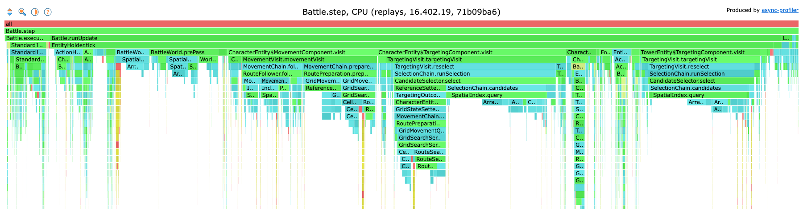
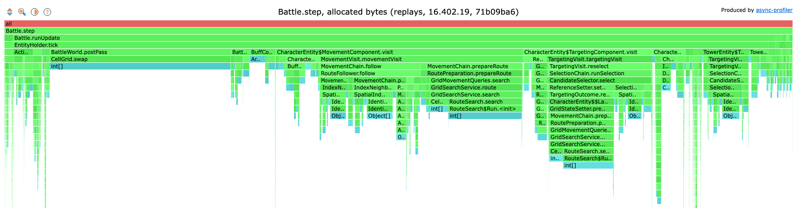

# Performance

How fast the battle core runs, headless, and the baseline later changes are measured against.

## The benchmark

`./gradlew :conformance:tickBenchmark -Pcrforge.references=<references folder>` runs `TickBenchmark` (`conformance/src/jmh`) with [JMH](https://github.com/openjdk/jmh). It reads the cases of a references folder as the reference tests do (the tables are the ones the build makes for `-Pcrforge.dataVersion`, which must be the references' version) and translates each case's scenario once. One operation builds the battle of the next case and steps it until it stops or reaches the case's horizon. Nothing is observed or compared, and nothing outside `core` and `conformance` is loaded: no window, no rendering. A case the battle core refuses is left out and counted.

Three workloads:

- `replays`: the replays of real battles alone (the cases whose scenario is a replay), on one thread. A whole battle with its commands, the closest to a real game.
- `allCases`: every case, replays and generated cases, on one thread. The generated cases are mostly short, targeted battles. They run in a fixed shuffled order, since an iteration covers only part of the list and the listing is grouped by corpus.
- `allCasesFourThreads`: every case on four threads: battles side by side. Four threads leave a shared machine room for its other work; more threads give at most proportionally more, as each thread shares the memory bandwidth and the garbage collector with the others (each step allocates).

Each workload runs in 3 fresh JVMs (forks), each with 3 warm-up and 5 measured iterations of 2 seconds, with JMH's allocation profiler (`-prof gc`). A full run takes about 4 minutes; the results are also written to `conformance/build/jmh/results.json`. `--args` replaces the default options with JMH's own, for example `--args="TickBenchmark.replays -f 1 -prof gc"`.

How to read the output:

| Result | Meaning |
|--------|---------|
| score (`ops/s`) | battles a second |
| `:ticks` | steps a second: the figure to compare, since battles differ in length |
| `:gc.alloc.rate.norm` | bytes allocated per battle; divided by the steps per battle, the bytes per step |
| `:gc.alloc.rate` | megabytes allocated a second |
| error | JMH's 99.9% confidence interval over the 15 measured iterations |

What it does not measure: the commands of a reference case are all known before the battle starts, so an agent choosing commands as the battle runs (and reading the battle to choose them) costs more than this.

Run it on a quiet machine: other processes on the same cores (a build, recordings) move the numbers far beyond the error JMH reports, the four-thread workload most of all. Compare runs on the same machine only.

## Profiling

Profile before changing anything for speed, and benchmark after: a flame graph shows where the steps spend their time and what they allocate, and the benchmark shows whether a change moved the steps a second. The benchmark runs with [async-profiler](https://github.com/async-profiler/async-profiler) through JMH (`brew install async-profiler` on macOS; on Linux the library is `libasyncProfiler.so`). One run records the CPU samples, one every millisecond, and the allocations of the replays into a JFR file:

```bash
./gradlew :conformance:tickBenchmark -Pcrforge.references=<references folder> \
  --args="TickBenchmark.replays -f 1 -prof async:libPath=$(brew --prefix async-profiler)/lib/libasyncProfiler.dylib;output=jfr;event=cpu;interval=1000000;alloc;dir=$PWD/conformance/build/profile"
```

`jfrconv`, which comes with async-profiler, turns the recording into the two flame graphs, interactive HTML pages:

```bash
J=$(find conformance/build/profile -name '*.jfr')
jfrconv --cpu "$J" conformance/build/profile/cpu.html
jfrconv --alloc "$J" conformance/build/profile/alloc.html
```

## Baseline (2026-10-10)

Source `battle_core` 71b09ba6 (the battle core as it was; the benchmark itself came after), data version 16.402.19 (450 of 451 cases run, 1 refused), Java 17.0.14 (Temurin), Apple M4 Pro (10 performance and 4 efficiency cores), 48 GB. JMH defaults as above; score and error as JMH prints them. The four-thread workload was run again on its own, as the machine was busy during its first run.

| Workload | Threads | ticks/s | battles/s | Allocated per battle | Allocated per tick |
|----------|---------|---------|-----------|----------------------|--------------------|
| `replays` | 1 | 58,622 +- 2,695 | 12.85 +- 0.60 | 185.8 MB | about 41 KB |
| `allCases` | 1 | 88,772 +- 3,770 | 59.90 +- 2.74 | 40.2 MB | about 27 KB |
| `allCasesFourThreads` | 4 | 370,143 +- 9,901 | 241.44 +- 8.49 | 40.8 MB | about 27 KB |

Read as:

- A real battle runs at about 58,600 steps a second on one thread, about 2,900 times the game's own 20 steps a second: a battle of about 4,560 steps in about 78 ms.
- Four threads give about 4.2 times one thread: linear within the error, so at four threads the threads do not yet hold each other back (9.2 GB allocated a second between them).
- Each step allocates tens of kilobytes, about 2.3 GB a second on one thread. The collector itself costs little (106 ms of collection over the 30 measured seconds of `replays`, under 0.5%): the cost is in making and filling the objects.

What the profile of the replays at this baseline shows (async-profiler, as above, about 9,600 CPU samples inside the steps):

| Share of step time | Where |
|--------------------|-------|
| 35% | choosing targets (`TargetingVisit.reselect`, `SelectionChain`), most of it in `SpatialIndex.query` |
| 28% | `SpatialIndex.query` (inside the above): a new result list and identity set per query, and the iteration over the buckets |
| 18% | preparing routes (`RoutePreparation`), 12% of it the route search |
| 8% | following routes |

Of the bytes allocated, 99% are allocated in the steps (building the battle is under 1%): the routing overlay's fresh, zeroed array at the end of every step (`CellGrid.swap`, from `BattleWorld.postPass`: about 23%), the route search's arrays, new for every search (`RouteSearch$Run`, `CellCostField.costField`: about 22%), and `SpatialIndex.query`'s result lists and identity sets (about 15%).

The flame graphs of that profile, cut to `Battle.step` (the benchmark's own frames left out, classes without their packages) and drawn root first: the width of a frame is its share of the step time or of the bytes allocated. The interactive pages come from the commands above.

CPU:



Allocated bytes:


