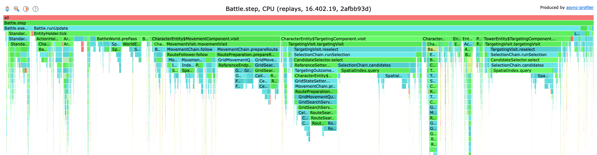
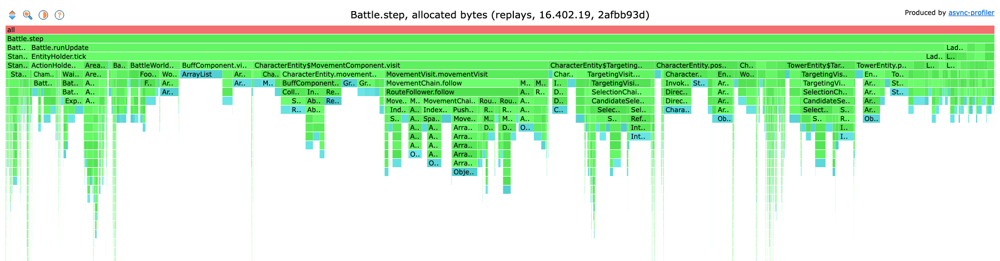

# Performance

How fast the battle core runs, headless, and the baseline later changes are measured against.

## The benchmark

`./gradlew :conformance:tickBenchmark -Pcrforge.references=<references folder>` runs `TickBenchmark` (`conformance/src/jmh`) with [JMH](https://github.com/openjdk/jmh). It reads the cases of a references folder as the reference tests do (the tables are the ones the build makes for `-Pcrforge.dataVersion`, which must be the references' version) and translates each case's scenario once. One operation builds the battle of the next case and steps it until it stops or reaches the case's horizon. Nothing is observed or compared, and nothing outside `core` and `conformance` is loaded: no window, no rendering. A case the battle core refuses is left out and counted.

Three workloads:

- `replays`: the replays of real battles alone (the cases whose scenario is a replay), on one thread. A whole battle with its commands, the closest to a real game.
- `allCases`: every case, replays and generated cases, on one thread. The generated cases are mostly short, targeted battles. They run in a fixed shuffled order, since an iteration covers only part of the list and the listing is grouped by corpus.
- `allCasesFourThreads`: every case on four threads: battles side by side. Four threads leave a shared machine room for its other work; more threads give at most proportionally more, as each thread shares the memory bandwidth and the garbage collector with the others (each step allocates).

Each workload runs in 3 fresh JVMs (forks), each with 3 warm-up and 5 measured iterations of 2 seconds, with JMH's allocation profiler (`-prof gc`). A full run takes about 4 minutes; the results are also written to `conformance/build/jmh/results.json`. `--args` replaces the default options with JMH's own, for example `--args="TickBenchmark.replays -f 1 -prof gc"`.

How to read the output:

| Result | Meaning |
|--------|---------|
| score (`ops/s`) | battles a second |
| `:ticks` | steps a second: the figure to compare, since battles differ in length |
| `:gc.alloc.rate.norm` | bytes allocated per battle; divided by the steps per battle, the bytes per step |
| `:gc.alloc.rate` | megabytes allocated a second |
| error | JMH's 99.9% confidence interval over the 15 measured iterations |

What it does not measure: the commands of a reference case are all known before the battle starts, so an agent choosing commands as the battle runs (and reading the battle to choose them) costs more than this.

Run it on a quiet machine: other processes on the same cores (a build, recordings) move the numbers far beyond the error JMH reports, the four-thread workload most of all. Compare runs on the same machine only.

## Profiling

Profile before changing anything for speed, and benchmark after: a flame graph shows where the steps spend their time and what they allocate, and the benchmark shows whether a change moved the steps a second. The benchmark runs with [async-profiler](https://github.com/async-profiler/async-profiler) through JMH (`brew install async-profiler` on macOS; on Linux the library is `libasyncProfiler.so`). One run records the CPU samples, one every millisecond, and the allocations of the replays into a JFR file:

```bash
./gradlew :conformance:tickBenchmark -Pcrforge.references=<references folder> \
  --args="TickBenchmark.replays -f 1 -prof async:libPath=$(brew --prefix async-profiler)/lib/libasyncProfiler.dylib;output=jfr;event=cpu;interval=1000000;alloc;dir=$PWD/conformance/build/profile"
```

`jfrconv`, which comes with async-profiler, turns the recording into the two flame graphs, interactive HTML pages:

```bash
J=$(find conformance/build/profile -name '*.jfr')
jfrconv --cpu "$J" conformance/build/profile/cpu.html
jfrconv --alloc "$J" conformance/build/profile/alloc.html
```

## Baseline (2026-10-11)

The baseline to measure the next change against. Source `battle_core` 8c51ccfb with the slot marks of the spatial index and the route search's cells priced as it reaches them (the second optimisations, below), data version 16.402.19 with the references at the commit `crforge-data.lock` names (544 of 544 cases run, 24 of them replays), Java 17.0.14 (Temurin), Apple M4 Pro (10 performance and 4 efficiency cores), 48 GB. JMH defaults as above; score and error as JMH prints them. Load average 4.1 to 6.3 during the run, the four-thread workload's own threads included.

| Workload | Threads | ticks/s | battles/s | Allocated per battle | Allocated per tick |
|----------|---------|---------|-----------|----------------------|--------------------|
| `replays` | 1 | 92,834 +- 1,086 | 20.40 +- 0.30 | 77.9 MB | about 17 KB |
| `allCases` | 1 | 158,199 +- 4,812 | 108.33 +- 4.15 | 17.0 MB | about 12 KB |
| `allCasesFourThreads` | 4 | 624,528 +- 11,867 | 422.89 +- 10.50 | 17.2 MB | about 12 KB |

Read as:

- A real battle runs at about 93,000 steps a second on one thread, about 4,600 times the game's own 20 steps a second: a battle of about 4,550 steps in about 49 ms.
- Four threads give 3.9 times one thread.

What the profile of the replays showed at 8c51ccfb, just before the second optimisations (async-profiler, as above, about 20,000 CPU samples inside the steps, on a busy machine: the shares hold, the speed does not):

| Share of step time | Where |
|--------------------|-------|
| 31% | choosing targets (`TargetingVisit.reselect`, `SelectionChain`) |
| 17% | `SpatialIndex.query` (inside the above, and the push and avoidance passes): 7% of it the look through its result for an entity already accepted, the walk over the buckets cheap since #482 |
| 22% | preparing routes (`RoutePreparation`): the route search 9%, the cost field priced for the whole arena before each search 5%, the scan for the cell to walk to (`ReferenceEndpoint`) 7% |
| 10% | following routes |

The bytes allocated are spread as at 2afbb93d: no site above 8%.

## The second optimisations (2026-10-11)

The changes the profile at 8c51ccfb pointed to, measured back to back against 8c51ccfb on the same references (544 cases): the full benchmark of each source in turn, then the replays alone again in the same order. Load average 2.4 to 8.0, the four-thread workload's own threads included.

| Source | `replays` ticks/s | `replays` again | `allCases` ticks/s | `allCasesFourThreads` ticks/s | Allocated per battle, `replays` | `allCases` |
|--------|-------------------|-----------------|--------------------|-------------------------------|---------------------------------|------------|
| before (8c51ccfb) | 81,692 +- 1,362 | 83,219 +- 1,069 | 145,533 +- 8,347 | 559,708 +- 15,915 | 78.3 MB | 17.0 MB |
| slot marks in the spatial index | 88,286 +- 1,451 (+8.1%) | 90,217 +- 923 (+8.4%) | 155,654 +- 4,408 (+7.0%) | 606,776 +- 9,557 (+8.4%) | 81.9 MB | 16.9 MB |
| and the cells priced as the search reaches them | 92,834 +- 1,086 (+13.6%) | 93,712 +- 1,060 (+12.6%) | 158,199 +- 4,812 (+8.7%) | 624,528 +- 11,867 (+11.6%) | 77.9 MB | 17.0 MB |

- Slot marks in the spatial index: each entity put in the index takes a slot and the buckets hold slots; a query marks the slots it has accepted in a word per 64 slots instead of looking through its result for every entry it meets.
- The cells priced as the search reaches them: the route search prices a cell from the cost lookup the first time it reads it, instead of all 2304 cells of the arena before every search. On top of the slot marks it adds about 4 to 5% on the replays; on all the cases, whose battles are mostly short, less than its error.

The bytes allocated did not move beyond the spread from run to run (about 4%): the changes save time, not objects.

## Baseline at 2afbb93d (2026-10-10)

The baseline after the first optimisations, kept with its profile. Source `battle_core` 2afbb93d, data version 16.402.19 with the references at the commit `crforge-data.lock` names (459 of 459 cases run, 24 of them replays), Java 17.0.14 (Temurin), Apple M4 Pro (10 performance and 4 efficiency cores), 48 GB. JMH defaults as above; score and error as JMH prints them. Load average 2.3 to 4.1 during the run.

| Workload | Threads | ticks/s | battles/s | Allocated per battle | Allocated per tick |
|----------|---------|---------|-----------|----------------------|--------------------|
| `replays` | 1 | 74,079 +- 1,058 | 16.30 +- 0.34 | 80.4 MB | about 18 KB |
| `allCases` | 1 | 123,433 +- 7,653 | 81.46 +- 8.86 | 18.1 MB | about 12 KB |
| `allCasesFourThreads` | 4 | 494,770 +- 10,458 | 320.26 +- 6.24 | 17.8 MB | about 12 KB |

Read as:

- A real battle runs at about 74,000 steps a second on one thread, about 3,700 times the game's own 20 steps a second: a battle of about 4,550 steps in about 61 ms.
- Four threads give 4.0 times one thread: linear.
- The collector costs 48 ms over the 30 measured seconds of `replays` (0.16%).

What the profile of the replays shows (async-profiler, as above, about 10,000 CPU samples inside the steps):

| Share of step time | Where |
|--------------------|-------|
| 34% | choosing targets (`TargetingVisit.reselect`, `SelectionChain`), most of it in `SpatialIndex.query` |
| 26% | `SpatialIndex.query` (inside the above): mostly its own walk over the buckets (14%) and the look through its result for an entity already accepted (5%) |
| 21% | preparing routes (`RoutePreparation`), 8% of it the route search |
| 8% | following routes |

Of the bytes allocated, 98% are allocated in the steps, and no one site holds more than 8% of them: small lists, their iterators, boxed integers, lambdas and streams across the step (`MovementChain.mark` 7.5%, `CharacterEntity`'s lambdas 5.2%, `SpatialIndex.query`'s result lists 4.5%, boxed integers in `ReferenceValidator.validate` 4.3%, `BuffComponent.visit`'s lists 4.3%).

The flame graphs of that profile, cut to `Battle.step` (the benchmark's own frames left out, classes without their packages) and drawn root first: the width of a frame is its share of the step time or of the bytes allocated. The interactive pages come from the commands above.

CPU:



Allocated bytes:



## The first optimisations (#478, #479, #480)

The three changes the first profile pointed to, each measured on its own and all three together, back to back against the source before them (81565a2e) on the same references (459 cases), single-thread workloads, load average 2.2 to 7.3:

| Source | `replays` ticks/s | `allCases` ticks/s | Allocated per battle, `replays` | `allCases` |
|--------|-------------------|--------------------|---------------------------------|------------|
| before (81565a2e) | 60,360 +- 1,956 | 95,087 +- 6,428 | 181.2 MB | 40.5 MB |
| #478: the routing overlay's two arrays rotated | 60,959 +- 2,095 | 93,659 +- 6,088 | 140.8 MB (-22%) | 26.3 MB (-35%) |
| #479: spatial queries without a set or iterators | 72,538 +- 1,004 (+20%) | 120,746 +- 8,139 (+27%) | 158.7 MB (-12%) | 36.5 MB (-10%) |
| #480: the route search's arrays kept | 59,814 +- 1,220 | 94,183 +- 6,045 | 144.1 MB (-20%) | 35.7 MB (-12%) |
| all three (2afbb93d) | 72,699 +- 1,133 (+20%) | 124,019 +- 6,959 (+30%) | 79.7 MB (-56%) | 17.8 MB (-56%) |

The speed came from the spatial queries; the other two cut the bytes allocated but not the time on one thread, where the collector was already cheap. Together they more than halved the bytes. On four threads the baseline above runs 494,770 steps a second against 370,143 in the first baseline below (+34%, on a slightly different set of references).

## First baseline (2026-10-10, 71b09ba6)

The baseline before the first optimisations, kept with its profile as the picture they started from.

Source `battle_core` 71b09ba6 (the battle core as it was; the benchmark itself came after), data version 16.402.19 on an earlier set of its references (450 of 451 cases run, 1 refused, 23 replays), Java 17.0.14 (Temurin), Apple M4 Pro (10 performance and 4 efficiency cores), 48 GB. JMH defaults as above; score and error as JMH prints them. The four-thread workload was run again on its own, as the machine was busy during its first run.

| Workload | Threads | ticks/s | battles/s | Allocated per battle | Allocated per tick |
|----------|---------|---------|-----------|----------------------|--------------------|
| `replays` | 1 | 58,622 +- 2,695 | 12.85 +- 0.60 | 185.8 MB | about 41 KB |
| `allCases` | 1 | 88,772 +- 3,770 | 59.90 +- 2.74 | 40.2 MB | about 27 KB |
| `allCasesFourThreads` | 4 | 370,143 +- 9,901 | 241.44 +- 8.49 | 40.8 MB | about 27 KB |

Read as:

- A real battle runs at about 58,600 steps a second on one thread, about 2,900 times the game's own 20 steps a second: a battle of about 4,560 steps in about 78 ms.
- Four threads give about 4.2 times one thread: linear within the error, so at four threads the threads do not yet hold each other back (9.2 GB allocated a second between them).
- Each step allocates tens of kilobytes, about 2.3 GB a second on one thread. The collector itself costs little (106 ms of collection over the 30 measured seconds of `replays`, under 0.5%): the cost is in making and filling the objects.

What the profile of the replays showed then (async-profiler, as above, about 9,600 CPU samples inside the steps):

| Share of step time | Where |
|--------------------|-------|
| 35% | choosing targets (`TargetingVisit.reselect`, `SelectionChain`), most of it in `SpatialIndex.query` |
| 28% | `SpatialIndex.query` (inside the above): a new result list and identity set per query, and the iteration over the buckets |
| 18% | preparing routes (`RoutePreparation`), 12% of it the route search |
| 8% | following routes |

Of the bytes allocated, 99% are allocated in the steps (building the battle is under 1%): the routing overlay's fresh, zeroed array at the end of every step (`CellGrid.swap`, from `BattleWorld.postPass`: about 23%), the route search's arrays, new for every search (`RouteSearch$Run`, `CellCostField.costField`: about 22%), and `SpatialIndex.query`'s result lists and identity sets (about 15%).

Its flame graphs, cut to `Battle.step` (the benchmark's own frames left out, classes without their packages) and drawn root first: the width of a frame is its share of the step time or of the bytes allocated. The interactive pages come from the commands above.

CPU:


Allocated bytes:


