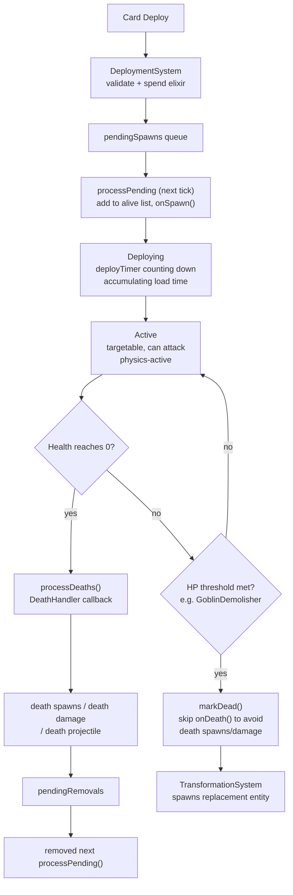

# Simulation Engine & Entities

> Part of the [Architecture Reference](architecture.md).

crforge runs a deterministic tick-based simulation at 30 FPS.

- `GameEngine.TICKS_PER_SECOND = 30`, `DELTA_TIME = 1/30f`
- All durations measured in frames; convert via `frames / 30` for seconds
- Deterministic for RL/AI training -- no wall-clock dependencies

---

## System Execution Order

Each call to `GameEngine.tick()` runs the following steps in order.
The method returns immediately if `!running`, `gameState.isGameOver()`, or `match.isEnded()`.

| Step | System Call                                       | Purpose                                                              |
|------|---------------------------------------------------|----------------------------------------------------------------------|
| 1    | `gameState.processPending()`                      | Flush pending spawns/removals, clear AOE events, rebuild alive cache |
| 2    | `match.update(deltaTime)`                         | Update player elixir regen and match timers                          |
| 3    | `elixirCollectionSystem.update(deltaTime)`        | Elixir Collector buildings generate elixir                           |
| 4    | `deploymentSystem.update(deltaTime)`              | Process queued card deployments (sync delay, stagger)                |
| 5    | `spawnerSystem.update(deltaTime)`                 | Periodic live spawning, bomb self-destruct, delayed death spawns     |
| 6    | `statusEffectSystem.update(gameState, deltaTime)` | Tick buff durations, compute multiplier stacking                     |
| 7    | `attachedUnitSystem.update(deltaTime)`            | Sync attached unit positions, propagate parent status effects        |
| 8    | `entity.update(deltaTime)` (loop)                 | Per-entity timers: deploy countdown, lifetime, combat cooldowns      |
| 9    | `areaEffectSystem.update(deltaTime)`              | Process AOE zones (one-shot, ticking, targeted, laser)               |
| 10   | `targetingSystem.updateTargets(aliveEntities)`    | Target acquisition and two-phase locking                             |
| 11   | `abilitySystem.update(deltaTime)`                 | Ability handlers (charge, dash, hook, etc.) before combat            |
| 12   | `combatSystem.update(deltaTime)`                  | Attacks, projectile movement, hit processing                         |
| 13   | `transformationSystem.update()`                   | HP-threshold entity replacement (e.g. GoblinDemolisher)              |
| 14   | `physicsSystem.update(aliveEntities, deltaTime)`  | Movement, collisions, bounds enforcement                             |
| 15   | `gameState.processDeaths()`                       | Death handlers, win condition checks                                 |
| 16   | `checkTimeLimit()`                                | Overtime/sudden death/draw resolution                                |
| 17   | `gameState.incrementFrame()`                      | Advance frame counter                                                |

---

## Entity Lifecycle



- `GameState` maintains `pendingSpawns` and `pendingRemovals` lists; structural changes are batched
  and applied once per tick in `processPending()` to prevent iterator invalidation
- `cachedAliveEntities` is rebuilt after every structural change for consistent iteration
- Entity state flags on `AbstractEntity`:
    - `spawned` -- set `true` by `onSpawn()` when entity enters the active list; controls
      targetability
    - `dead` -- set `true` by `onDeath()`; suppresses death handler re-entry
    - `invulnerable` -- prevents all damage
- `markDead()` sets `dead=true` without calling `onDeath()`, used when death handlers should be
  suppressed (e.g. transformations, bomb self-destruct)
- `isAlive()` = `!dead && health.isAlive()`; `isTargetable()` = `isAlive() && spawned`

**Key files:**

- `core/.../engine/GameEngine.java`
- `core/.../engine/GameState.java`
- `core/.../entity/base/AbstractEntity.java`

---

## System Dependencies

See [Architecture Overview -> System Dependencies](architecture.md#system-dependencies) for the full dependency graph between systems.

---

## Entity Hierarchy

CES architecture: entities are component containers; logic lives in systems.

```
Entity (interface)
  AbstractEntity (position, health, movement, combat, effects, level)
    Troop     -- deployable units with combat and abilities
    Building  -- structures with lifetime and optional hiding
      Tower   -- crown/princess towers with activation state
    AreaEffect -- AOE damage/buff zones
  Projectile   -- standalone objects (NOT in entity list), managed by ProjectileSystem
```

### Troop

Deployable combat units. Spawn with a deploy timer that counts down before the troop becomes
targetable and active.

- During deployment: only combat load time advances (enables pre-charging); entity cannot move,
  target, or be targeted
- `deployTimer <= 0` sets `spawned=true` making the troop targetable
- `lifeTimer` -- optional lifetime countdown (temporary forms, kamikaze units); auto-kills on expiry
- `clone` flag -- cloned units have 1 HP (and shield capped to 1)
- `jumping` / `tunneling` / `grounded` -- transient physics states
- `morphCard` -- building card to create when tunnel troop arrives at target
- `transformConfig` + `transformed` -- HP-threshold transformation (see [Spawning](spawning.md))
- `giantBuff` -- active BuffAlly buff state from nearby Giant Buffer
- `attached` -- `AttachedComponent` linking to parent entity (e.g. Ram Rider on Ram)
- Targetability: `isAlive() && spawned && !isDeploying()` (attached units are not independently
  targetable)

**Key file:** `core/.../entity/unit/Troop.java`

### Building

Static structures with finite lifetime.

- `lifetime` / `remainingLifetime` -- total and remaining lifetime in seconds
- Health decays linearly: `decayRate = maxHP / lifetime` per second, applied via fractional
  accumulator
- When `remainingLifetime <= 0`: building killed by depleting health
- `deployTimer` -- deployment countdown (same as Troop)
- `elixirCollector` -- optional `ElixirCollectorComponent` for passive elixir generation
- `ability` -- supports `HidingAbility` (Tesla) for underground state

**Key file:** `core/.../entity/structure/Building.java`

### Tower

Extends `Building`. Represents Crown and Princess Towers.

- `TowerType` enum: `CROWN`, `PRINCESS`
- Crown Tower starts **inactive** (`active=false`); activates on first damage with a 1.0s wake-up
  timer
- Princess Towers start active
- Destroying a Princess Tower activates the enemy King Tower and frees tower tiles for redeployment
- Tower stats scaled by `towerLevel` via `LevelScaling`:

| Stat            | Princess | Crown |
|-----------------|----------|-------|
| Range           | 7.5      | 7.0   |
| Sight range     | 9.5      | 7.0   |
| Attack cooldown | 0.8s     | 1.0s  |
| Load time       | 0.0      | 0.0   |

**Key file:** `core/.../entity/structure/Tower.java`

### Projectile

Not part of the entity list. Managed separately by `ProjectileSystem` via `GameState.projectiles`.

- **Entity-targeted**: homes to target's current position (homing) or captured fire-time position (
  non-homing)
- **Position-targeted**: flies to fixed arena coordinates (spells)
- **Piercing**: travels in fixed direction for `piercingRange`, hitting all enemies in path via
  `PiercingHitDetector`; tracks `hitEntities` to prevent double-hitting
- **Returning** (Executioner): piercing out, then homes back to source; clears `hitEntities` on
  return to allow re-hitting
- **Scatter** (Hunter): multiple pellets at 10-degree spread, each piercing with
  `checkCollisions=true` (stops on first hit)
- `delayFrames` -- volley delay for multi-projectile spells
- `DEFAULT_SPEED = 15f` tiles/second
- Hit detection: circle-based edge-to-edge collision (includes `collisionRadius`)

Advanced features:

- Chain lightning: `chainedHitCount` sub-projectiles spawned from primary impact, searching within
  `chainedHitRadius`
- Spawn-on-impact: sub-projectile (Log rolling), character (PhoenixFireball -> PhoenixEgg), area
  effect (Heal Spirit heal zone)
- Knockback: `pushback` distance, `pushbackAll` for radial vs. single-target

**Key files:**

- `core/.../entity/projectile/Projectile.java`
- `core/.../combat/ProjectileSystem.java`
- `core/.../combat/ProjectileFactory.java`
- `core/.../combat/ProjectileHitProcessor.java`
- `core/.../combat/PiercingHitDetector.java`

### AreaEffect

AOE damage/buff zones. Extends `AbstractEntity` but cannot be targeted (`isTargetable()` always
returns `false`).

- **One-shot** (`hitSpeed <= 0`): applies once on first tick (Zap, EWiz deploy effect)
- **Ticking** (`hitSpeed > 0`): applies damage/buff every `hitSpeed` seconds for `lifeDuration` (
  Poison, Earthquake, Freeze)
- **Targeted** (Vines): selects specific targets and applies DOT
- **Laser ball** (DarkMagic): scans enemies with escalating damage tiers
- `hitEntityIds` prevents duplicate targeting (Lightning selects distinct targets)
- Spawn mechanics: `spawnDelayAccumulator`, `nextSpawnIndex` for multi-spawn sequences (Graveyard
  spawns Skeletons over time)
- `controlsBuff` areas (Tornado): remove all matching buffs from entities when the effect expires
- `buildingDamagePercent`: bonus damage to buildings (Earthquake 350% = 4.5x)

`AreaEffectSystem` dispatches to specialized handlers:

- `oneShotHandler` -- Zap, deploy effects
- `tickingHandler` -- Poison, Earthquake
- `targetedEffectHandler` -- Vines DOT
- `laserBallHandler` -- DarkMagic laser scans
- `pullProcessor` -- Tornado pulling
- `spawnProcessor` -- Character spawning within AOE

**Key files:**

- `core/.../entity/effect/AreaEffect.java`
- `core/.../entity/effect/AreaEffectSystem.java`
