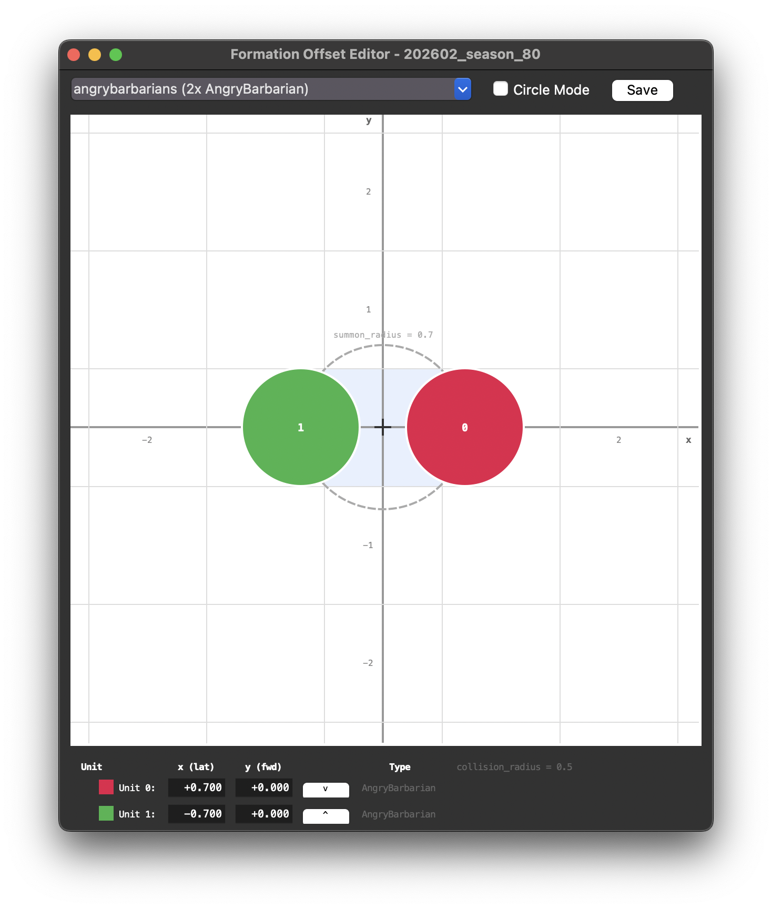
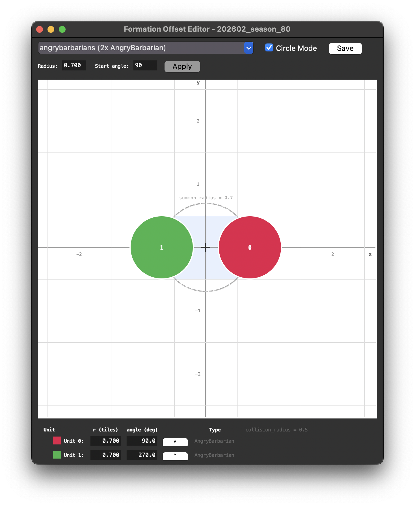
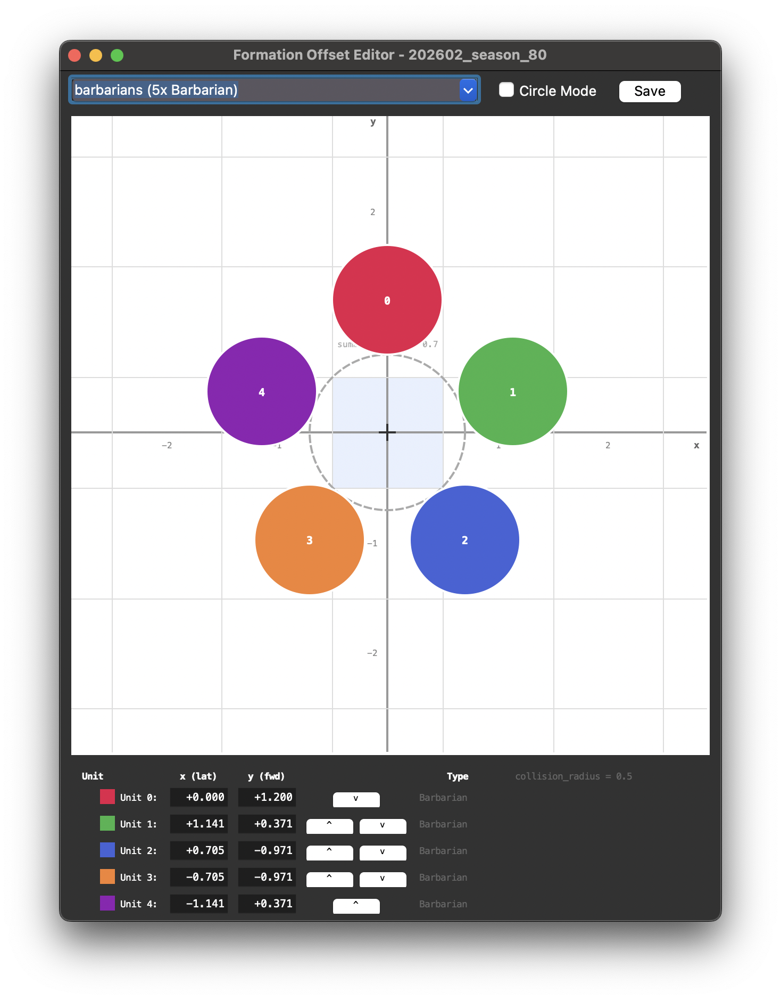
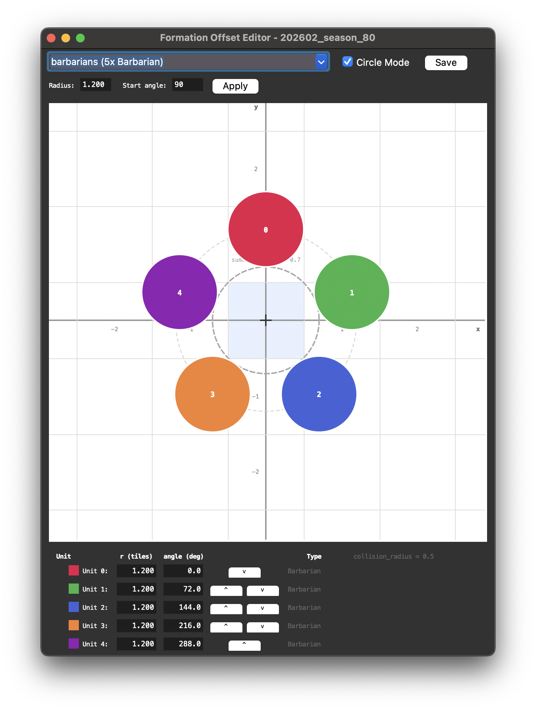
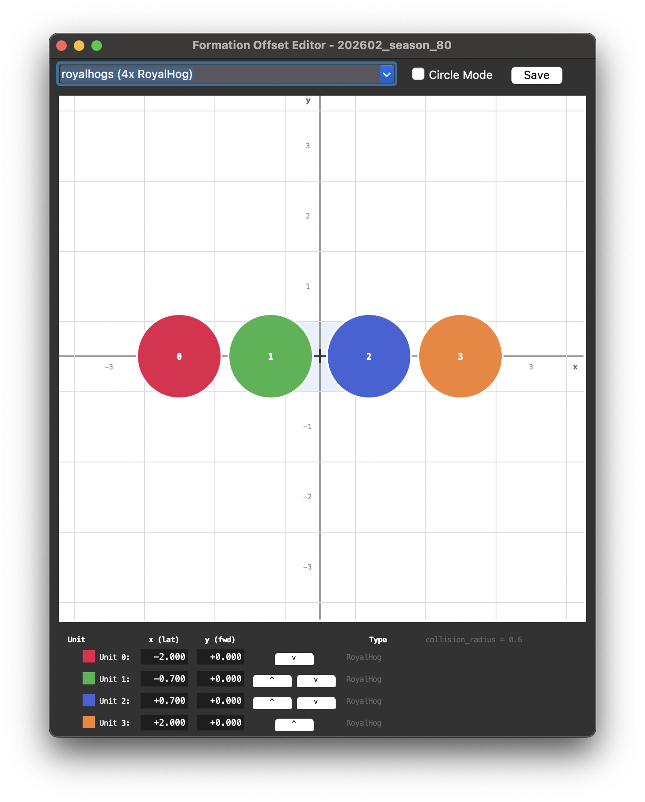
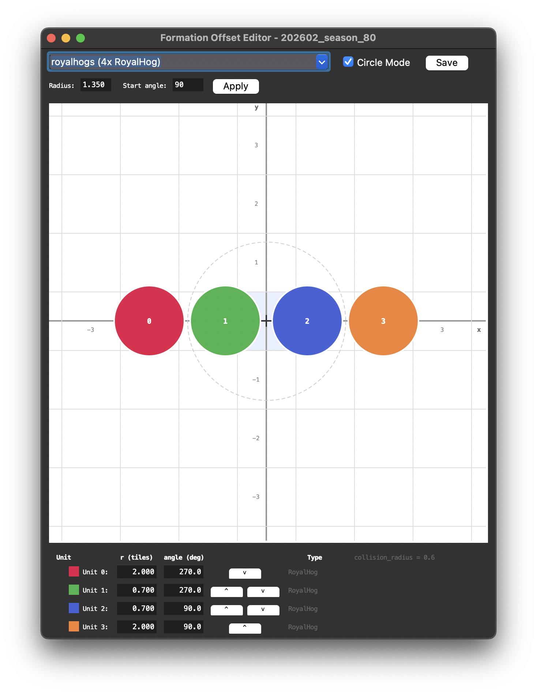
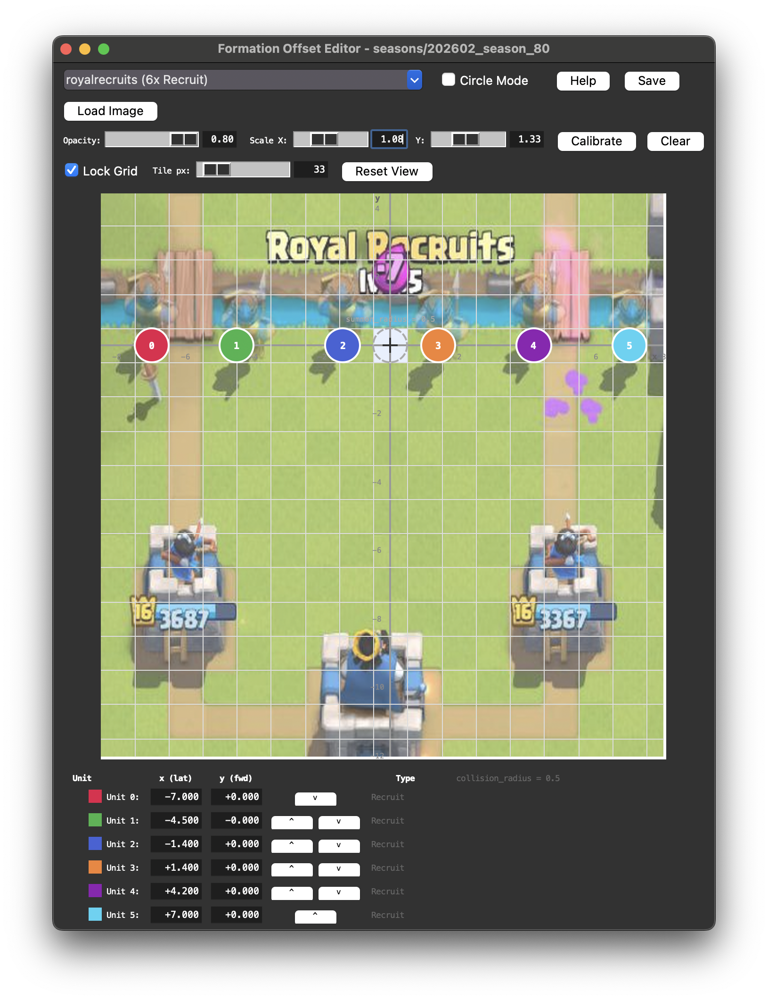

# Formation Offset Editor

Visual tool for viewing and editing `formation_offsets.json` spawn positions.

## Running

```bash
python tools/formation_visualizer/formation_visualizer.py <data_dir>
```

`data_dir` is the path to a directory containing `formation_offsets.json`, `cards.json`, and `units.json`.

## UI overview

- **Card selector** -- dropdown at the top listing all cards that have formation offsets (e.g. `archers (2x Archer)`)
- **Circle Mode** -- checkbox that switches the coordinate panel between cartesian (x/y) and polar (r/angle) mode
- **Canvas** -- tile grid with numbered, color-coded unit circles showing current spawn positions
- **Coordinate panel** -- below the canvas, editable x/y (normal) or r/angle (circle mode) entries for each unit
- **Reorder buttons** -- up/down buttons per unit row to swap positions within the same unit group

|                           Normal Mode                           |                           Circle Mode                           |
|:---------------------------------------------------------------:|:---------------------------------------------------------------:|
|  |  |
|        |        |
|        |        |

### Reference image overlay



## Controls

### Canvas

| Input              | Action                           |
|--------------------|----------------------------------|
| Left-click drag    | Move a unit circle               |
| Right/middle drag  | Pan the view                     |
| Shift + right drag | Move overlay image only          |
| Scroll wheel       | Zoom in/out (centered on cursor) |

### Top bar

| Control       | Action                          |
|---------------|---------------------------------|
| Card selector | Pick a card to edit             |
| Circle Mode   | Switch coordinates to r / angle |
| Save (Ctrl+S) | Write `formation_offsets.json`  |

### Overlay image

| Control     | Action                                                                                                    |
|-------------|-----------------------------------------------------------------------------------------------------------|
| Load Image  | Open a reference screenshot                                                                               |
| Opacity     | Blend amount (0.05 - 0.80)                                                                                |
| Scale X / Y | Resize the overlay independently                                                                          |
| Calibrate   | Draw a rectangle over known tiles, then enter tile dimensions to auto-scale the overlay to match the grid |
| Clear       | Remove the overlay image                                                                                  |

### Grid

| Control    | Action                                  |
|------------|-----------------------------------------|
| Lock Grid  | Keep tile_px fixed when switching cards |
| Tile px    | Manual tile size (only when locked)     |
| Reset View | Reset pan and zoom to defaults          |

### Coordinate panel

| Control           | Action                               |
|-------------------|--------------------------------------|
| x / y entries     | Edit unit position in tiles          |
| r / angle entries | Edit position in polar (circle mode) |
| ^ / v buttons     | Reorder units within their group     |

Supports math expressions in entries (e.g. `1/3`, `0.5*2`, `math.sin(math.pi/6)`).

## Axis mapping

The canvas maps game coordinates as follows:

- Game x (lateral) -> canvas right
- Game y (forward) -> canvas up

This matches the Java simulator convention where +x is right and +y is forward. The origin crosshair marks the deploy
point. Grid lines are drawn at tile boundaries (half-integer positions like +-0.5, +-1.5, ...) so that integer labels
mark tile centers, matching how deployment works in-game -- a card placed at (0,0) lands at the center of the
highlighted tile cell.

## Editing

**Drag**: click and drag unit circles on the canvas to reposition them. Coordinates update live in the panel below.

**Type values**: edit the x/y entries directly in the coordinate panel. Press Enter or click away to apply. Supports
math expressions using `math.sin`, `math.cos`, `round`, `abs`, etc.

**Reorder**: use the `^` and `v` buttons next to each unit to swap its position with the adjacent unit. Reordering is
constrained within unit groups -- primary and secondary units cannot be mixed.

Invalid inputs flash red and revert to the previous value.

## Circle Mode

Toggle the **Circle Mode** checkbox to switch the coordinate panel to polar coordinates (radius + angle). This is useful
for formations arranged in a circle (barbarians, bats, minions, etc.).

### Polar coordinate convention

Angles use standard math convention -- measured counter-clockwise from +x (right):

- 0 deg = right
- 90 deg = forward
- 180 deg = left
- 270 deg = behind

Conversion: `x = r * cos(angle)`, `y = r * sin(angle)`

### Distribute Evenly

When circle mode is on, a toolbar appears with:

- **Radius** -- shared radius for the distribution (pre-filled with the mean radius of current offsets)
- **Start angle** -- angle of the first unit in degrees (default: 90, i.e. first unit forward)
- **Apply** -- distributes units evenly around the circle

For dual-unit cards (e.g. GoblinGang), primary and secondary unit groups are distributed independently -- each group
gets its own even spacing using the same radius and start angle.

### Guide circle

A faint dashed circle is drawn on the canvas at the mean radius of the current offsets, giving visual feedback for the
distribution radius.

## Saving

- Click **Save** or press **Ctrl+S**
- Writes `formation_offsets.json` to the data directory specified via the CLI argument
- Prompts to save unsaved changes on close

## Deriving circle formation offsets

For formations arranged in a circle (e.g. Skeleton Army, Goblin Gang), use **Circle Mode** and the **Distribute Evenly**
feature. Set the desired radius and start angle, click Apply, and all units are placed automatically.

For manual derivation, the polar-to-cartesian conversion is:

```
x_i = r * cos(angle_i)
y_i = r * sin(angle_i)
```

where angle is measured counter-clockwise from +x (right). With `n` units evenly spaced starting at `start_angle`:

```
angle_i = start_angle + i * (360 / n)
```

### Example: Barbarians (5 units, radius 1.2, first unit forward)

Using Circle Mode: set radius to `1.2`, start angle to `90`, and click Apply. The tool computes angles 90, 162, 234,
306, 378 (=18) degrees and places each unit accordingly.

For non-uniform formations (e.g. two rows, diamond shapes), manually place units or combine multiple smaller circles.

## Features

- Auto-scaling canvas -- zooms to fit the largest offset or summon radius
- Dashed summonRadius overlay circle when the card has a `summonRadius`
- Circle mode with polar coordinate entries (r/angle) and guide circle overlay
- Distribute Evenly -- batch-place units in a circle with configurable radius and start angle
- Unit reorder buttons (up/down) constrained within primary/secondary unit groups
- Unit collision radius shown in the coordinate panel header (`r = 0.2`, etc.)
- 15 distinct unit colors for identifying individual units
- Formula input in coordinate entries (`math.sin(math.pi/6)`, `round(1/3, 3)`, etc.)
